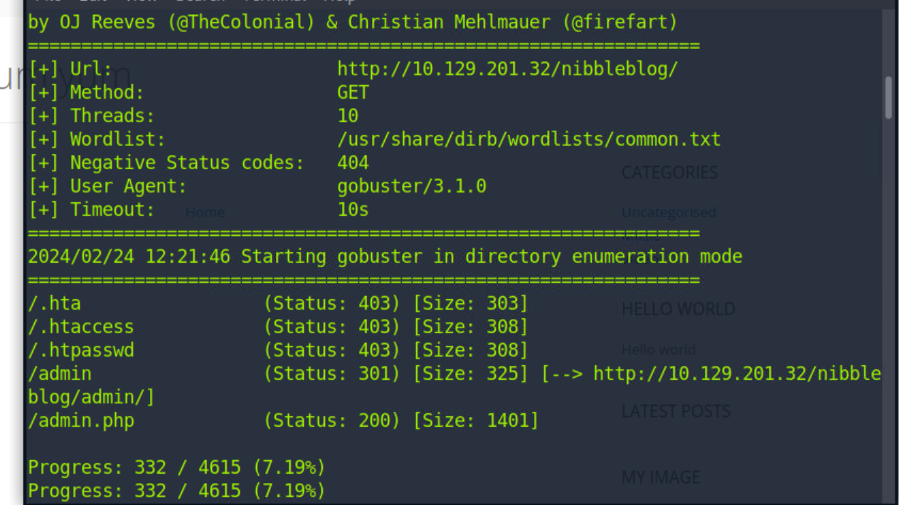

# 2024-2-24

## nibbles

我们先扫描一下目标网站，没有发现有用的东西

然后curl查看一下网站代码，发现注释有提示

我们可以看见相关的PHP，JQuery，Nibblelog等

访问一下发现就是单纯一个界面，没什么反应

gobuster爆破一下目录，发现有个admin.php应该是登陆界面

查看一下确实是管理员登陆界面

查看一下README看看有没有相关信息

可以发现它使用的框架是Nibbleblog框架

查询一下相关漏洞发现存在文件上传漏洞![9](C:\Users\wn\Desktop\2024-2-24\images\9.png

接着查看其他目录

找到了一个user.xml应该是跟登录有关

这里显示了管理员的账户是admin，我们继续寻找密码

我们在另一个目录找到一个配置文件，可以看到管理员的邮箱和标题都是nibbles，尝试一下当作密码

成功登录

找到一处文件上传位置，我们上传一下php，成功的显示了出来

成功上传webshell的php文件，但网站给的htb-box没法监听到反向shell，明天改进一下