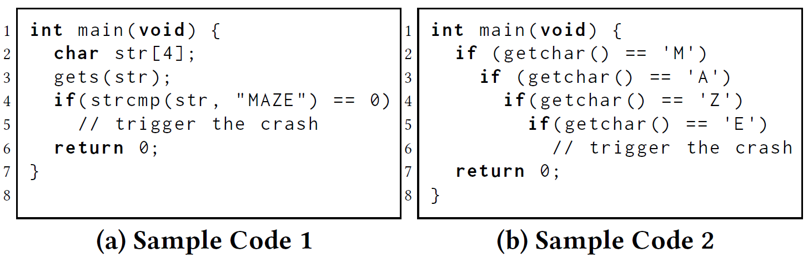
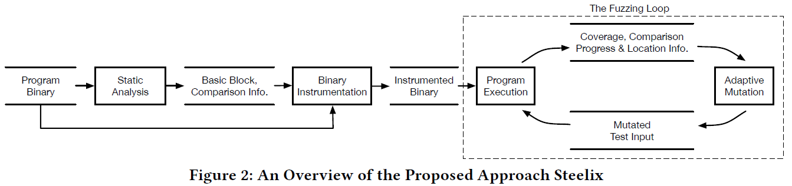
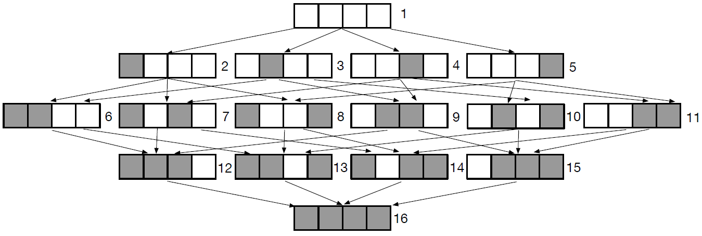
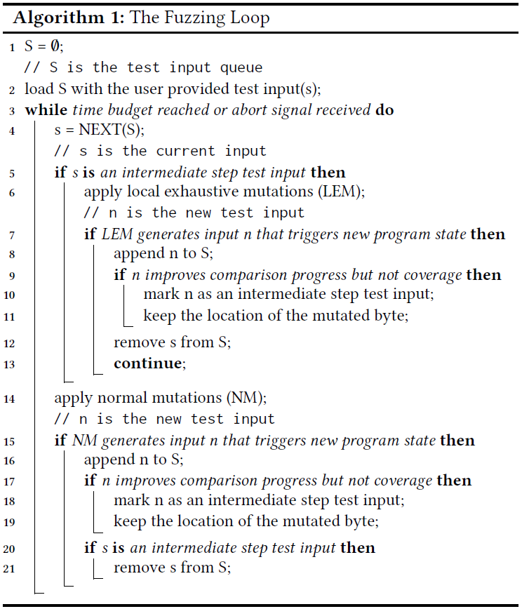
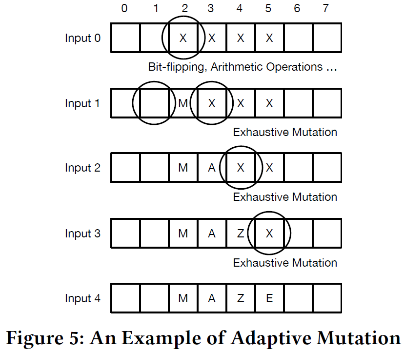
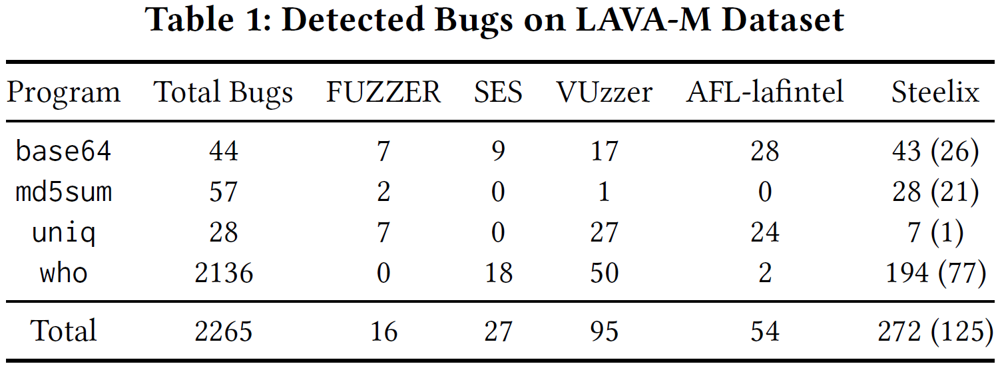
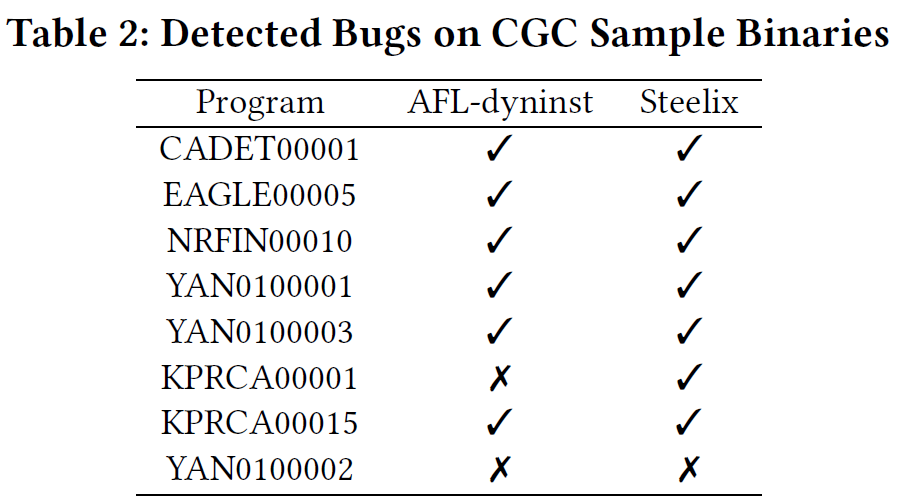
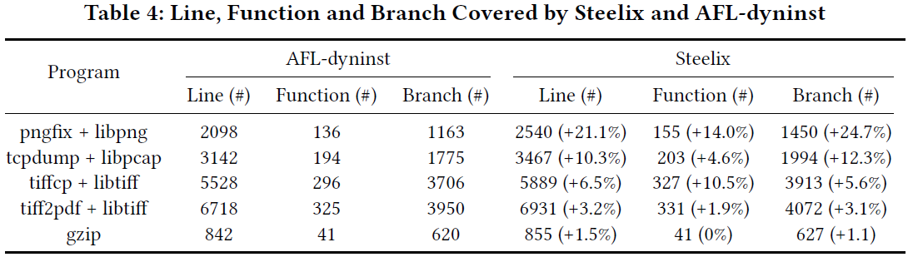
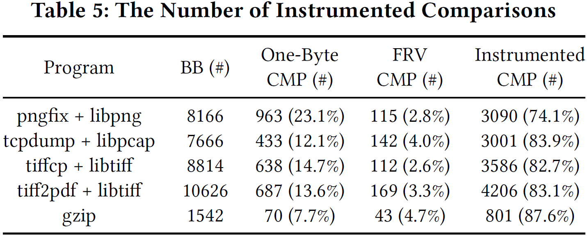
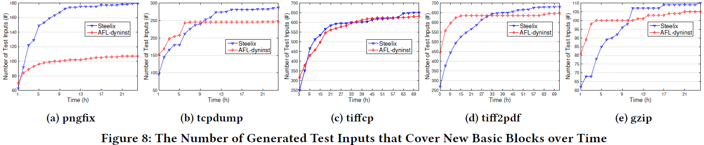

# 2024-2-13

# Steelix: Program-State Based Binary Fuzzing

## 1 介绍

模糊测试分类方法：

1. 根据PUT的结构知识如何应用分类
   - 白盒：白盒fuzzers常常使用重量级的程序分析，例如符号执行
   - 灰盒
   - 黑盒
2. 根据测试用例如何生成分类
   - 基于生成：一开始没有测试用例，从已有知识构建结构化或符合语法的测试输入(比如：XML)
   - 基于变异：从已有的测试用例上根据生成策略生成新的测试用例

本文专注于灰盒基于变异的fuzzing。一个最成功的技术就是基于覆盖的fuzzing，使用轻量级的插桩提取覆盖信息来确定哪些测试用例需要保留下来。如果输入出发了一个新的基本块，那么它就被认为是"interesting"被保留下来；否则就被弃用。基于覆盖的fuzzers通过增量方式探索PUT的执行路径。

但是基于覆盖的fuzzing渗透能力有限，很难执行到被*magic bytes*比较保护的路径。

上面的例子中(a)最多需要变异2 4 ∗ 8 2^{4*8}24∗8次，而(b)最多只需要变异4 ∗ 2 8 4*2^84∗28次。

假如上述(b)中的输入有1000字节，但是*magic bytes*只有其中4个字节，AFL也很难执行到这条路径因为不知道定位在哪里而不能很有效率地进行变异。

本文方法有两个假设：

1. 可以在开源和闭源程序上都适用
2. 汇编代码中的比较操作数丢失了类型信息，整数、浮点数或者字符串/缓冲都编程了字节的比较，更明确直接

上图给出了*Steelix*的三个主要构件：*static analysis*，*binary instrumentation*，*the fuzzing loop*

首先接收二进制程序作为输入然后反汇编，对汇编代码基于几条规则过滤不敢兴趣的比较，提取感兴趣的比较和基本块信息，告诉插桩工具哪里要插桩和插啥桩。

然后静态提取出来的信息会和二进制程序一起，传入插装工具。这个二进制插桩工具主要关注两点：

1. 记录比较的信息，记录在共享内存里，有空间限制（64KB）
2. 插桩程序得到比较操作数的值，然后在fuzzing过程中生成比较信息

最后就是进入fuzzing loop，在fuzz过程中会得到覆盖和比较过程的反馈信息，推导出magic bytes的位置信息。覆盖，比较过程和位置信息会有目的地指导变异，比如选择合适的变异操作。

## 3 方法

该方法对x86 32-bit汇编插桩，在x86里面的比较可以用cmp/test指令或函数调用。

`test ebx`会检验`ebx`的值是否为0，若是就把*Zero Flag*置为1。

cmp就是比较两个操作数，比如`cmp dword ptr [ebp-4], 9`就会在[ebp-4]为9时将ZF置为1。

这个比较的值可以是1，2，4字节。

同时该方法会过滤不感兴趣的比较

感兴趣的cmp/test插桩是哪些操作数对于Steelix来说有意义的。接下来就给出一些不感兴趣插桩的规则：

- 单字节比较不插桩。这种比较可以简单地通过已有变异方法实现
- 函数返回的插桩不插桩

接下来会抽取比较信息，在过滤不感兴趣的比较之后，Steelix通过静态分析扫描汇编生成两个列表的比较信息

第一个列表保存感兴趣的cmp和test插桩。列表里的实体结构如下：`instruction_address: operand1_info: operand2_info`

第二个列表保存`strcmp`，`strncmp`或者`memcmp`函数调用的信息。每个实体保存结构如下：`function_call_instruction_address: functinon_name`

比较信息，和覆盖信息都记录在共享内存中，大小限制为64KB。定义比较过程（comparison progress）为多少个连续字节，一共有多少个字节的信息等信息。

举个栗子，上图四字节的比较有16个不同的状态，根据定义，使用1 → 2 → 6 → 12 → 16 和1 → 5 → 11 → 15 → 16 来表示比较过程

使用者两条路径的原因是可以确切地知道fuzzer应该变异那个字节

加下来正式进行比较信息的获取

- 首先，比较操作数的实际值可以在运行时提取出来，对于一个寄存器操作数，它的值可以直接通过寄存器名获取。对于内存应用操作数，可以计算内存地址获取。
- 然后，操作数用来生成比较过程信息
- 接着，fuzzer通过共享内存获取比较信息

最后，插桩帮助fuzzer保留可以触发程序状态改变的输入，允许fuzzer一个字节一个字节地匹配magic bytes。再举个栗子，有一个n字节的比较，如果完整地匹配n个字节，那么搜索空间是 $2^{8*n}$，但是如果一个字节一个字节地匹配，那么复杂度就降到了 $n*2^8$ 。

而为了得到magic bytes的位置信息，最合适的方法是使用污染分析

本文中使用插桩的反馈信息定位magic bytes。在Steelix中，在fuzzer变异之后，如果插桩反馈在匹配magic bytes上有了新的进展，那么就会保留新的测试用例，同时也会保留变异字节的位置信息。当fuzzer尝试变异新的测试输入时，就会尝试临近的两个字节。

上图给了一个简单的例子。这个对于magic bytes有个启发式的假设就是这些magic bytes常常在输入中聚在一块儿。但是有可能magic bytes的比较使用了输入的不同部分，在这种情况下，Steelix在LEM（local exhaustive mutations）以后就不会有新的progress了，Steelix会保留intermediate step input并进行变异，而不是把这些输入移出队列

## 4 实现和评价

**评价数据集。** 使用了广泛使用的benchmarks：LAVA-M和DARPA CGC sample binaries，还有5个实际程序（tiff2pdf，tiffcp，pngfix，gzip和tcpdump）。

**State-of-the-art工具。** 实验选择了三种比较工具：AFL-dyninst，VUzzer和AFL-lafintel

- AFL只在提供了源码的程序上有效
- VUzzer是最近发布的fuzzer，它解决了magic bytes比较的问题
- AFL-lafintel也需要PUT的源代码

**研究问题。** 然后就是设计了三个研究问题：

- RQ1：Steelix的bug检测能力如何？
- RQ2：Steelix的代码覆盖率如何？
- RQ3：Steelix在fuzzing loop中的负载如何？

**LAVA-M数据集上的结果（RQ1）**

上表报告了这些工具在LAVA-M数据集上发现的bug数。可以看出Steelix性能远好于SES和AFL-dyninst（发现0个bug，没写在表中）。在3个项目上比FUZZER，VUzzer和AFL-lafintel的效果好。这样的结果解释如下：

- 许多注入的bug都被magic bytes比较保护。然后统计了一下通过局部彻底的变异直接找到的bug数，报告在Steelix这一列的括号里。然后发现局部彻底的变异找到了46%的bug。这说明比较过程指导的局部彻底变异能够很好地生成能够通过magic bytes保护的语句
- 和VUzzer比较，Steelix平衡执行速度和渗透能力。Steelix平均比VUzzer多执行了645倍的测试用例，Steelix能够执行更多的测试用例。另一方面Steelix可以处理任意操作数类型的cmp/test指令，而VUzzer只能处理立即数的。80%的比较包含立即数，也就是说VUzzer遗漏了20%的比较
- 与AFL-lafintel相比，Steelix有magic bytes的位置信息，而AFL-lafintel不知道哪里变异测试输入。而且Steelix过滤了不感兴趣的比较。AFL-lafintel在`who`上插桩了99,866个，但是AFL的共享内存只有65,536个实体，阻碍了AFL-lafintel检测PUT的覆盖率变化，Steelix只需要插桩4,833个比较过程和6,385个基本块，用到大概25,000个共享内存实体。

然后还可以发现Steelix在`uniq`上与VUzzer和AFL-lafintel相比效果差。和VUzzer相比，Steelix使用的变异操作对于`uniq`的测试输入（输入是包含ASCII字符串的文本文件）太细粒度了。Steelix中在字节级别上彻底的变异能能够很快地在文件上有很大的变化。VUzzer使用遗传算法进行交叉变异来生成新的测试用例，这允许在`uniq`中快速地大幅度改变字符串。和AFL-lafintel比较，本文的插桩是通过二进制重写来添加，比AFL-lafintel的在编译时插桩慢。在5个小时的实验时间里，AFL-lafintel执行了32.6m个测试，而AFL-dyninst和Steelix只执行了5.3m和4.5m个测试。尽管依赖于源代码，速度的优势能够让AFL-lafintel在5小时的时间段内在`uniq`程序上找到更多bug。

**CGC Sample Binaries上的结果（RQ1）**

运行Steelix和AFL-dyninst三小时，下表展示了实验的总体结果，Steelix比AFL-dyninst多找一个。

两个fuzzer都没找到YAN0100002，这个bug只在输入能够导致程序进行百万次浮点运算时触发，这bug不是magic bytes相关的。

KPRCA00001这个bug，如果给定的输入可以触发encoding函数，则AFL-dyninst和Steelix都可以在8分钟时找到bug。但是，如果初始化输入不触发encoding函数，那么AFL-dyninst很难在3小时时间内发现这个bug，但是Steelix可以在10分钟时发现这个bug。

从这个实验结果中可知，给定好的初始化输入，AFL-dyninst和Steelix都能有效的发现bug，但是当初始化输入不是很理想的时候，Steelix由于有更强的渗透能力，所以更可能找到bug，该方法发现了10个之前未知的Bug，其中一个被确认为CVE。

**覆盖率分析**

结果如上表，总体上来说，Steelix比AFL-dyninst在parsing工具（pngfix，tcpdump，tiffcp）上在代码行覆盖，函数覆盖和分支覆盖上提升了12.7%，9.7%和11.4%。tiff2pdf和gzip相对来说改进较少，这是因为parser程序经常包含很多magic bytes比较，Steelix能够比较好的渗透解决这些magic bytes

**代价评价（RQ3）**

AFL-dyninst插桩了每一个基本块（BB），Steelix插桩了基本块和比较。Steelix大概多了40%的插桩。

然后比较执行测试用例的数目，可以看出Steelix比AFL-dyninst执行稍慢。

多了40%的插桩数，只导致了11.5%执行测试用例数的减少，但是能覆盖更多的代码和找到更多bug。这个代价是比较小而且可接受的。

主要了说明Steelix也不能完全有效处理所有magic bytes的比较，也不能代替符号执行和污染分析。但是提供了较为轻量级的解决方案。

## 5 相关工作

 fuzzing改进

- 种子选择算法和fuzzing调度策略来最大化bug检测能力
- AFLFast集中关注*low-frequency paths*
- skyfire利用已有用例的知识生成高度结构化的输入
- 还有工作在机器码上变异，而不是在已有规整的输入上（？）
- AFL-lafintel使用LLVM IR级别的程序表达形式把magic bytes比较转化到嵌套的one-byte比较。这样的转换可以帮助fuzzer在比较表达式上改进。AFL-lafintel在源代码级别上工作，Steelix直接在二进制级别上工作。AFL-lafintel不能得到magic bytes的定位，限制了它的性能。

## 6 结论

- 提出了基于程序状态的二进制fuzzing方法 – Steelix
- 程序状态不仅包含覆盖信息，还包含了比较过程的信息，可以通过轻量级的静态分析和二进制插桩得到
- 在比较过程的指导下，Steelix可以渗透这些magic bytes比较，执行的代价在较低的层次
- 最后实现了Steelix的原型并进行评价，发现大大改进了它检测bug和代码覆盖的能力