# 2024-2-17

## 1

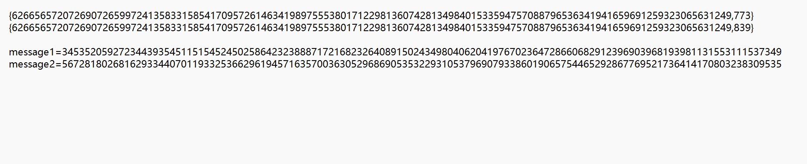

我们打开附件之后发现有两个不同的e和c，并且这一对的n是一样的，我们可以利用rsa的共模攻击来进行解密

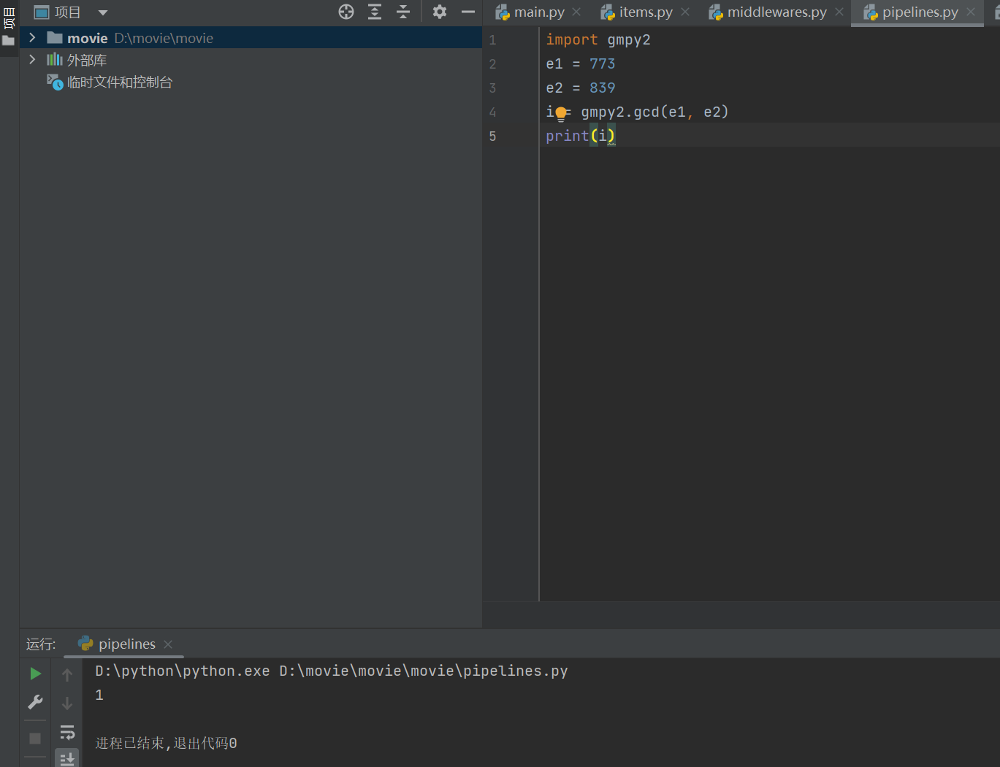

经过计算我们可以发现两个e是互质的

我们根据共模攻击原理（$c_1^{e_1}*c_2^{e_2}$）%n=m

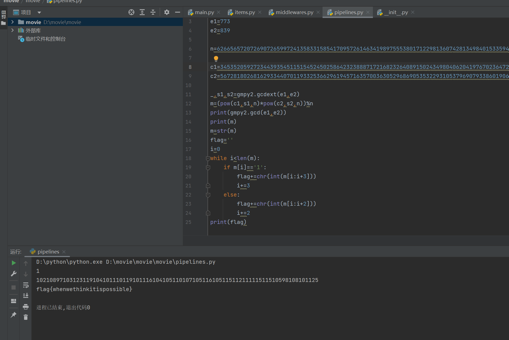

然后根据原理我们写出脚本代码，将其转换为ascii码之后就能得到flag

```python
import gmpy2

e1=773
e2=839

n=6266565720726907265997241358331585417095726146341989755538017122981360742813498401533594757088796536341941659691259323065631249

c1=3453520592723443935451151545245025864232388871721682326408915024349804062041976702364728660682912396903968193981131553111537349#c1
c2=5672818026816293344070119332536629619457163570036305296869053532293105379690793386019065754465292867769521736414170803238309535#c2

_,s1,s2=gmpy2.gcdext(e1,e2)
m=(pow(c1,s1,n)*pow(c2,s2,n))%n
print(gmpy2.gcd(e1,e2))
print(m)
m=str(m)
flag=''
i=0
while i<len(m):
    if m[i]=='1':
        flag+=chr(int(m[i:i+3]))
        i+=3
    else:
        flag+=chr(int(m[i:i+2]))
        i+=2
print(flag)
```

## 2

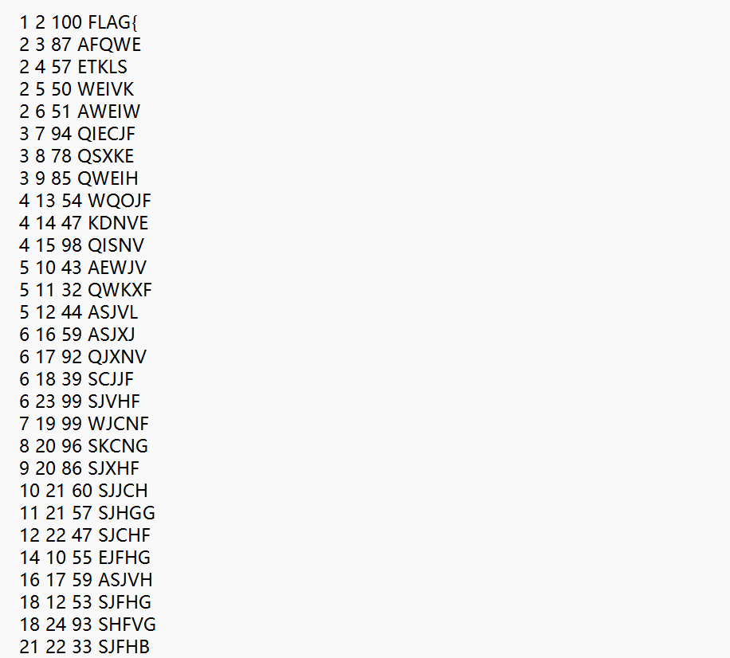

打开附件后是很多行字母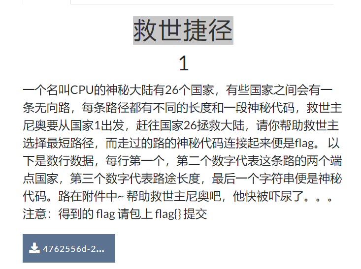

查看提示后发现是让我们找一条最短路径，很明显的dijstra算法，首先找到和顶点1直连的顶点，找到这些顶点中距离顶点1最短的一个顶点，将该顶点加入“已经确定的集合“，遍历该顶点的邻接顶点，更新顶点1到各个邻接顶点的最短距离。再找到现在与顶点1距离最短的顶点，再去遍历该顶点的邻接顶点，更新顶点1到这些邻接顶点的最短距离，从中找到距离最短的顶点加入“已经确定的集合”，再遍历该顶点的邻接顶点，更新这些顶点与顶点1的最短距离，找到与顶点1距离最短的顶点……以此循环直至所有顶点都加入“确定的集合”。
我们直接给出解密脚本。

```python
graph=[]
for i in range(27):
    graph.append([]) 
for i in range(27):
    for j in range(27):
        graph[i].append(0xffff) 
f=open('./Downloads/dij.txt','r').readlines()  
li=[]
for x in f:
    li.append(x.strip().split(' ')) 
#print(li)
for x in li:
    graph[int(x[0])][int(x[1])]=int(x[2])
    graph[int(x[1])][int(x[0])]=int(x[2])

def try_dijstra():
    min_d=[0xffff for i in range(27)]  
    route=[1 for i in range(27)] 
    isSure=[0 for i in range(27)] 
    for i in range(2,27):
        min_d[i]=graph[i][1]
    min_d[1]=0
    isSure[1]=1

    for i in range(26):
        min=0xfffff
        temp=-1
        for j in range(2,27): 
            if isSure[j]==0 and min>min_d[j]:
                min=min_d[j]
                temp=j
        isSure[temp]=1
        for j in range(2,27):
            if min_d[j]>min_d[temp]+graph[temp][j]:
                min_d[j]=min_d[temp]+graph[temp][j]
                route[j]=temp
    return (route,min_d)

route,min_d=try_dijstra()
print(min_d[26]) 
print(route)
passv=[] 
for i in range(27):
    passv.append([]) 
for i in range(27):
    for j in range(27):
        passv[i].append(0)
for x in li:
    passv[int(x[0])][int(x[1])]=x[3]
    passv[int(x[1])][int(x[0])]=x[3]

y=26
l=[]
while y!=1:
    print(y)
    l.append(passv[y][route[y]]) 
    y=route[y]
print()
l=l[::-1]
for i in range(len(l)):
    print(l[i],end='')

```

## 3

打开附件后发现有两个公钥和两个flag，我们解析一下两个公钥

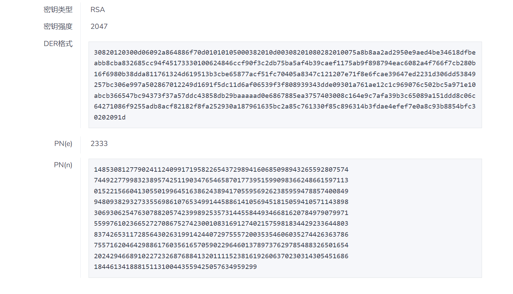

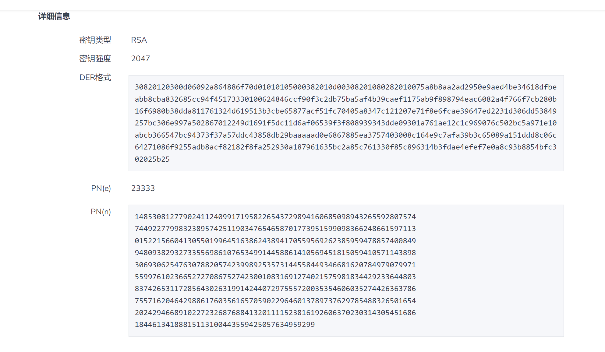

然后我们发现两个公钥的n是一样的，应该是共模攻击

```
R3Noy6r3WLItytAmb4FmHEygoilucEEZbO9ZYXx5JN03HNpBLDx7fXd2fl+UL5+11RCs/y0qlTGURWWDtG66eNLzGwNpAKiVj6I7RtUJl2Pcm3NvFeAFwI9UsVREyh7zIV6sI9ZP8l/2GVDorLAz5ULW+f0OINGhJmZm8FL/aDnlfTElhQ87LPicWpXYoMtyr6WrxjK6Ontn8BqCt0EjQ7TeXZhxIH9VTPWjDmFdmOqaqdVIT+LZemTgLNESwM5nn4g5S3aFDFwj1YiDYl0/+8etvKfOrfoKOwR0CxsRHagwdUUTES8EcHLmMGCxCkDZn3SzmmA6Nb3lgLeSgG8P1A==

O+rRCXI3aTB6P1rYIOPUdalUp6ujpwEq4I20CoWA+HIL8xxGtqY6N5gpr0guZv9ZgOEAMFnBxOqMdVNnB9GgnhmXtt1ZWydPqIcHvlfwpd/Lyd0XSjXnjaz3P3vOQvR71cD/uXyBA0XPzmnTIMgEhuGJVFm8min0L/2qI7wg/Z7w1+4mOmi655JIXeCiG23ukDv6l9bZuqfGvWCa1KKXWDP31nLbp0ZN2obUs6jEAa1qVTaX6M4My+sks+0VvHATrAUuCrmMwVEivqIJ/nS6ymGVERN6Ohnzyr168knEBKOVj0FAOx3YLfppMM+XbOGHeqdKJRLpMvqFXDMGQInT3w==
```

然后我们查看两个flag，我们可以发现这是base64编码，我们先将他解码后转换成unicode编码,然后再转换成数，然后利用我们的共模攻击脚本来进行解密

```python
import gmpy2
import base64
e1=2333
e2=23333
flag1='R3Noy6r3WLItytAmb4FmHEygoilucEEZbO9ZYXx5JN03HNpBLDx7fXd2fl+UL5+11RCs/y0qlTGURWWDtG66eNLzGwNpAKiVj6I7RtUJl2Pcm3NvFeAFwI9UsVREyh7zIV6sI9ZP8l/2GVDorLAz5ULW+f0OINGhJmZm8FL/aDnlfTElhQ87LPicWpXYoMtyr6WrxjK6Ontn8BqCt0EjQ7TeXZhxIH9VTPWjDmFdmOqaqdVIT+LZemTgLNESwM5nn4g5S3aFDFwj1YiDYl0/+8etvKfOrfoKOwR0CxsRHagwdUUTES8EcHLmMGCxCkDZn3SzmmA6Nb3lgLeSgG8P1A=='
flag2='O+rRCXI3aTB6P1rYIOPUdalUp6ujpwEq4I20CoWA+HIL8xxGtqY6N5gpr0guZv9ZgOEAMFnBxOqMdVNnB9GgnhmXtt1ZWydPqIcHvlfwpd/Lyd0XSjXnjaz3P3vOQvR71cD/uXyBA0XPzmnTIMgEhuGJVFm8min0L/2qI7wg/Z7w1+4mOmi655JIXeCiG23ukDv6l9bZuqfGvWCa1KKXWDP31nLbp0ZN2obUs6jEAa1qVTaX6M4My+sks+0VvHATrAUuCrmMwVEivqIJ/nS6ymGVERN6Ohnzyr168knEBKOVj0FAOx3YLfppMM+XbOGHeqdKJRLpMvqFXDMGQInT3w=='

n=14853081277902411240991719582265437298941606850989432655928075747449227799832389574251190347654658701773951599098366248661597113015221566041305501996451638624389417055956926238595947885740084994809382932733556986107653499144588614105694518150594105711438983069306254763078820574239989253573144558449346681620784979079971559976102366527270867527423001083169127402157598183442923364480383742653117285643026319914244072975557200353546060352744263637867557162046429886176035616570590229646013789737629785488326501654202429466891022723268768841320111152381619260637023031430545168618446134188815113100443559425057634959299

c1=c1=Crypto.Util.number.bytes_to_long(base64.b64decode(flag1))
c2=c1=Crypto.Util.number.bytes_to_long(base64.b64decode(flag2))

_,s1,s2=gmpy2.gcdext(e1,e2)
m=(pow(c1,s1,n)*pow(c2,s2,n))%n
print(gmpy2.gcd(e1,e2))
print(m)
m=str(m)
flag=''
i=0
while i<len(m):
    if m[i]=='1':
        flag+=chr(int(m[i:i+3]))
        i+=3
    else:
        flag+=chr(int(m[i:i+2]))
        i+=2
print(flag)
```

## 4

```
key1:security
key2:information

密文啊这是，骚年加油：zhnjinhoopcfcuktlj
```

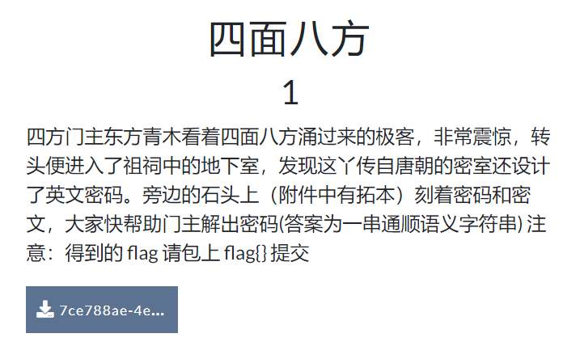

我们打开提示和附件发现有可能是四方密码，因为密码中没有重复的字母，我们将其补全为securityabdfghklmnopqvwxz和informatbcdeghklpqsuvwxyz进行解密

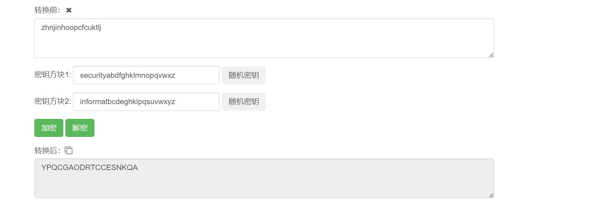

可以发现并不通顺，我们用脚本随机组合一下得到flag youngandsuccessful

```python
import random
fake_flag=[YPQCGAODRTCCESNKQA]
list = list(range(18))
slice = random.sample(list, 18)  #从list中随机获取18个元素，作为一个片断返回  
for i in slice:
    flag+=fake_flag[i]
print(flag)
```

## 5

我们打开附件得到密文

2559659965656A9A65656996696965A6695669A9695A699569666A5A6A6569666A59695A69AA696569666AA6

还有一张提示图

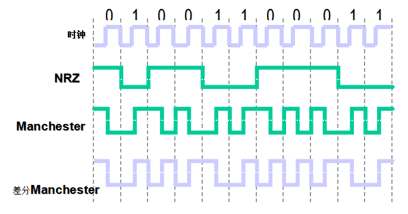

可以看出是三种编码方式，我们尝试这三种编码进行解码，发现只有曼彻斯特编码可以成功解码，直接上脚本

```python
import  binascii
def Manchester_encode(str):
    encode_str=''
    for i in range(0, len(str), 2):
        s1 = str[i:i + 2]
        if s1 == "10":
            encode_str += "1"
        elif s1 == "01":
            encode_str += "0"
    return encode_str

flag=0x2559659965656A9A65656996696965A6695669A9695A699569666A5A6A6569666A59695A69AA696569666AA6
encode_flag=hex(int(Manchester_encode(bin(flag)[2:]),2))
print(encode_flag)
x=binascii.unhexlify(encode_flag[2:])
print(x)
```

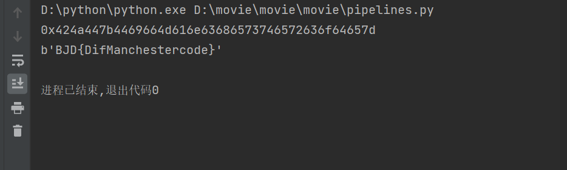