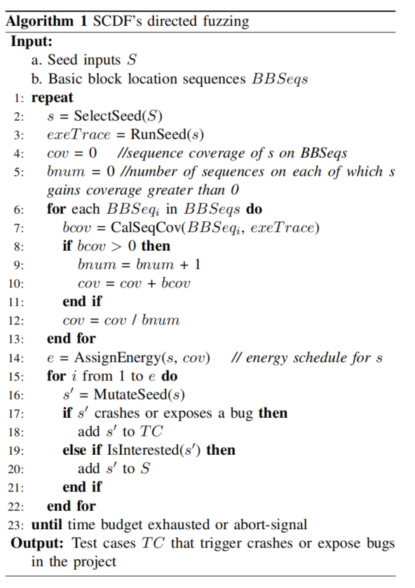
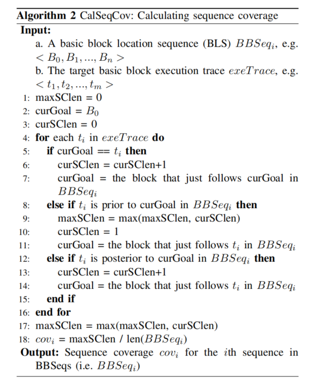
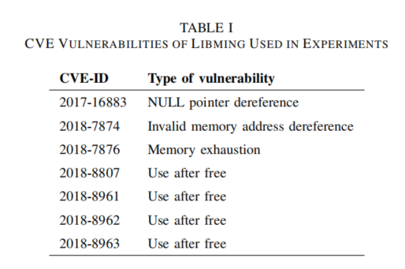
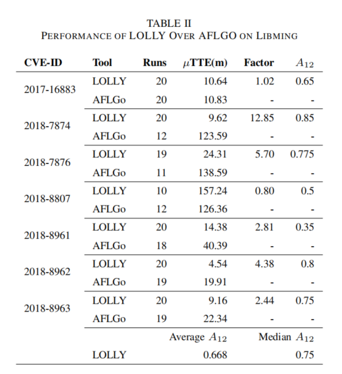
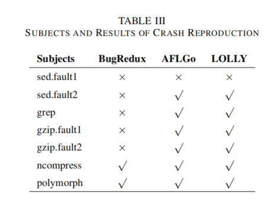
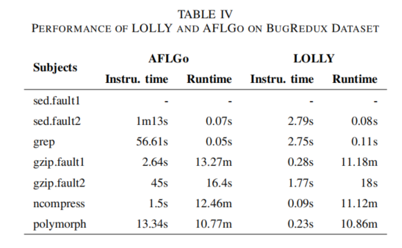
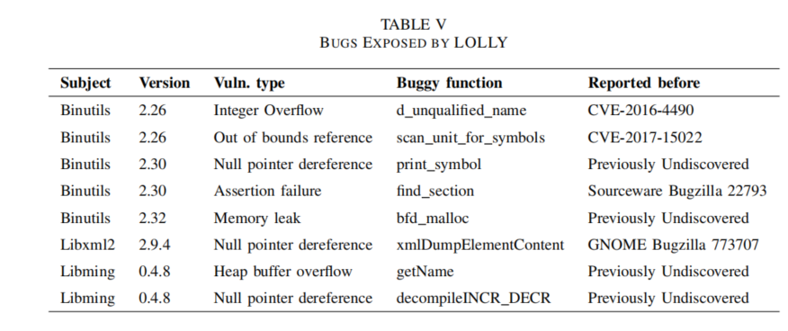

# Sequence Coverage Directed Greybox Fuzzing

## 简介

现有的定向模糊测试不足够高效。定向符号执行，比如BugRedux，花很多时间在很重的程序分析和约束求解上。定向模糊测试，比如AFLGo，在运行时做得很好。但是插桩过程中的距离计算花费了很大的开销。

这篇文章提出了一种序列覆盖率的定向模糊测试，能够按顺序到达目标行。并且和AFLGo和BugRedux这两个工具进行了对比实验。

## 背景

fuzzing是一种高效的挖漏洞的技术。但是fuzzing会花费很多时间在和bug不相关的代码上。因此，有定向fuzzing这样的技术来专门针对某块代码区域进行测试。然而目前大多数的定向fuzzer都是基于符号执行的白盒fuzzer。他们把可达问题转换为迭代式的约束求解问题，花费了很多运行时间在重量级的程序分析和约束求解上。因此虽然有效，但是不高效。灰盒fuzzer，像AFLGo这样的，把可达性问题转化为优化问题。

然而，AFLGo为了提高运行时的效率，把很多程序分析都放在了插桩部分，导致插桩部分比较耗时。如果用户的计算资源比较有限，这个开销就会成为问题。所以，本文提出了一种轻量级的定向fuzzing技术。包括在插桩部分也更加的轻量级。

## 方法

- SS：statement sequence（语句序列）
- BLS：basic block location sequence（转化为基本块位置序列）
- TBBET：target basic block execution trace

在每个目标基本块的入口，会添加如下指令：

- 获取共享内存的指针$M$

- 读取$M_0$的值，并为其加1
- 将当前基本块的ID存入$M_i$
- 把第二步得到的值再存入$M_0$

在fuzz的过程中，当种子探索到目标基本块的时候，插桩的代码就会执行，因此，基本块的Trace就会被存储在共享内存中。

fuzzing的算法如下，主要分为两个部分，计算序列覆盖率（2-13行）和能量调度（14-22行）。

计算序列覆盖率的算法如下，它的主要思想是要找到种子执行的Trace和预设的序列的最长公共子序列。

其中变量maxSClen记录最大的序列覆盖率的长度。

遍历动态执行的trace的每个基本块$t_i$，如果$t_i$等于当前的目标，curSClen+=1

举个例子，BLS：<b0,b1,b3,b5> , TBBET：<b0,b5,b0,b1,b5>，上面计算序列覆盖率的算法其实就是找最长公共子序列。最后的序列覆盖率为3/4，3为TBBET按顺序覆盖BLS基本块的数目，4为BLS集合中的基本块数目。

种子能量调度：用的模拟退火算法来做

温度$T$初始值为$T_0 = 1$，然后以指数降温。

$T = T_{0} \times \alpha^{k} $

其中$α$是在0.8到0.99之间的常数。$k$是温度循环。温度的阈值$T_k$被设为0.05。也就是说，如果Tk大于0.05，属于exploration stage，也就是探索阶段。这一阶段SCDF会去尽可能地生成更多随机的输入。反之，就是进入exploitation stage，会去尽可能地生成更多高序列覆盖率的输入。

由于fuzzing的限制是时间，时间会被用来调整温度循环k：

$k / k_x = t / t_x  $

其中$k_x$和$t_x$是当温度到达了$T_k$的温度循环和时间。

然后根据k的关系，可以推导出温度T和时间的关系。

$T_k = 0.05 = α^{k_x}$

$T = α^k = α^{ \frac{t}{t_x} × \frac{log(0.05)}{log(α)}}=20^{-\frac{t}{t^x}}$

和AFLGo的模拟退火算法类似，给定一个种子s，它的序列覆盖率是seqcov，那么它覆盖给定行号序列的能力是：

$c a p c o v = s e q c o v ∗ ( 1 − T ) + 0.5 ∗ T$

最后的能量就为：

$Lenergy = energy * 2.0^{(capcov-0.2)*10}$

## 结果

用clang static analyzer跑了下libming 0.4.8的几个CVE。

实验部分主要涉及三个方面的应用效果，并且和AFLGo和BugRedux这两个工具进行了对比：

- True positives verification

- Crash reproduction
- Bug exposure

### True positives verification

在软件开发周期里，开发者和测试人员通常都会用分析工具来发现bugs或者漏洞。静态分析是一种很热门的分析技术来找到结构化的错误和安全漏洞。由于静态分析并不执行程序，所以会有比较高的误报，需要人工去验证分析结果。由于定向执行的特性，定向模糊测试技术可以用来自动验证bugs。具体来说，静态分析器产生的结果都是一些程序里潜在的bugs或者漏洞，这些可以转化为定向模糊测试的目标语句，然后用定向fuzzing技术去生成测试样例去验证。

作者实验使用了libming 0.4.8，一个处理SWF文件的C语言库。然后用clang static analyzer（CSA）去分析libming，获取一些目标行号。然后把这些行号送给AFLGo和Lolly。在实验过程中，CSA的结果没用特意的去过滤，所以静态器给的结果里可能会有很多误报和不可达路径的结果。

为了评估两个fuzzer的有效性，使用相同的目标行号喂给定向fuzzer，然后看能否触发相同的CVE漏洞。并且统计两个fuzzer的插桩时间和运行时间，重复实验二十次，取平均值。

实验用的CVE如下：

插桩时间的话，AFLGo用了近2个小时，而lolly只用了40多秒，AFL只需要39秒。

运行过程中，设定运行5个小时。结果如下表。TTE表示发现给定漏洞所需的时间。Factor是AFLGo的TTE与lolly的比值。A12是衡量随机算法的一个指标。给定一个性能衡量的指标如TTE，A12能够测量lolly得到好的TTE的值的概率比AFLGo高。

### Crash reproduction

现在软件系统里因为各种原因可能有潜在的bug或者漏洞。当用户使用软件遇到崩溃时，可以提假崩溃报告到开发者。一个崩溃报告通常包含崩溃的信息，比如memory dumps或者调用栈。定向模糊测试可以利用这些信息来复现crash。这里将lolly和AFLGo和BugRedux进行对比。BugRedux是基于KLEE实现的白盒定向fuzzer。给定一个程序的目标行号，BugRedux可以生成测试样例，按顺序执行这些目标。

这个实验用的测试程序都是BugRedux使用的。设定运行时间为24h，如果工具能够复现bug，就标记为✔，反之就标记为×。sed.fault1这个crash需要同时fuzz两个输入文件，这是AFLGo和Lolly都做不到的。其他的测试程序里，AFLGo和lolly都可以复现。

然后进一步对比了AFLGo和Lolly的插桩时间和运行时间。

### Bug exposure

然后用clang去分析Binutils，libxml和libming这些软件。发现了如下漏洞。

## 总结

文章是一种相比AFLGo更轻量级的定向模糊测试，节省了更多的插桩开销时间。同时也考虑了给定行号的顺序关系。后续作者在此基础上又进行了优化，文章名为：Sequence Directed Hybrid Fuzzing