# 2024-2-21

## 渗透测试

该问题提供了我们需要渗透的IP和具体端口，并告知了我们需要获取到文件。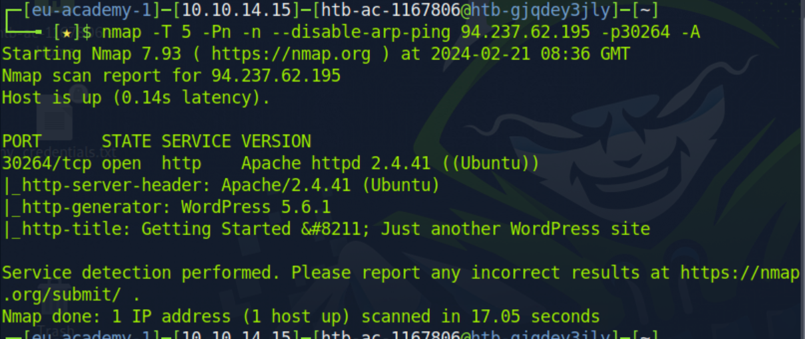

我们使用nmap来扫描具体端口并获取具体服务版本，我们可以发现该端口运行的服务是WordPress 5.6.1 框架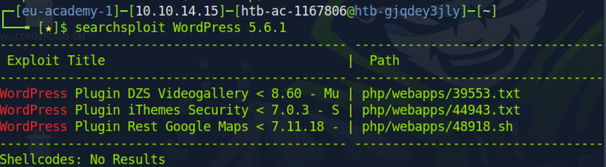

我们使用searchsploit搜索该版本可能存在的漏洞

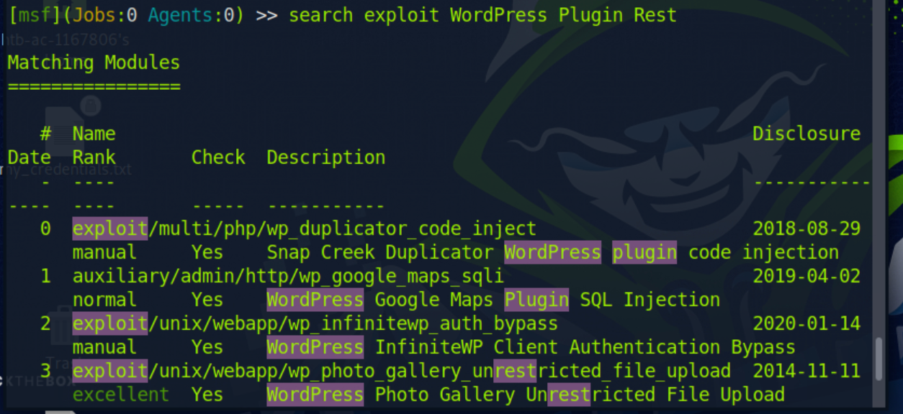

启动msfconsole搜索可用漏洞，找到了一个

使用一下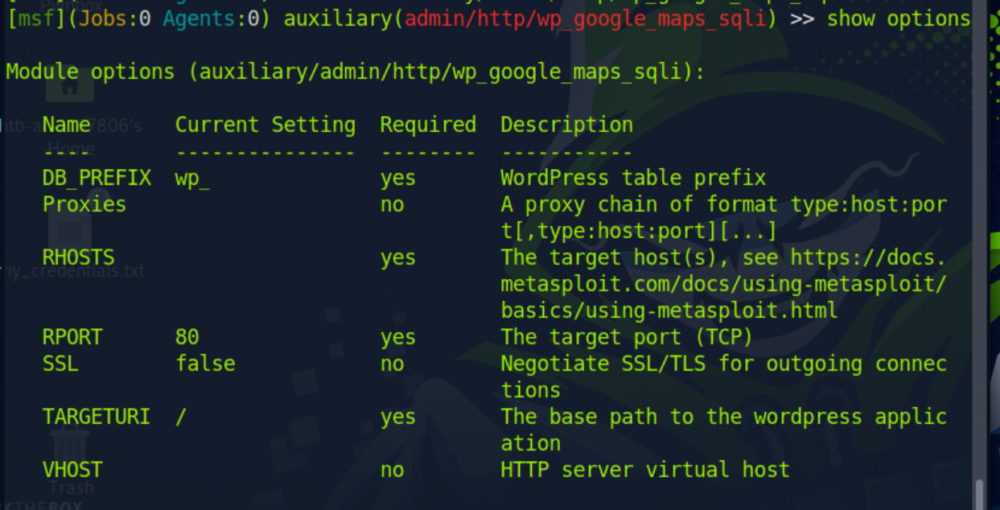

查看漏洞相关配置

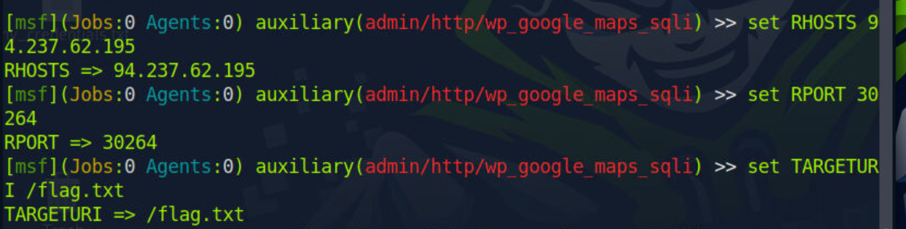

设置端口，IP等配置

但经过check检查后发现不行

我们查看一下对应目标端口的内容，发现他提示了我们一个漏洞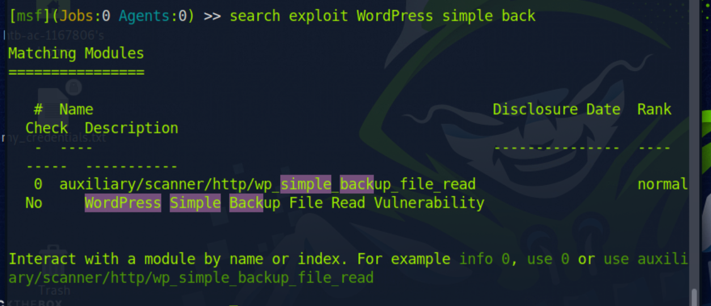

我们发现在漏洞库可以找到这个漏洞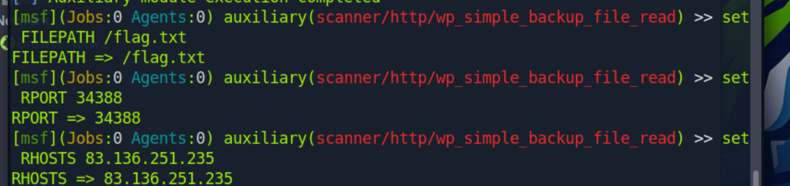

设置一下这个漏洞的相关配置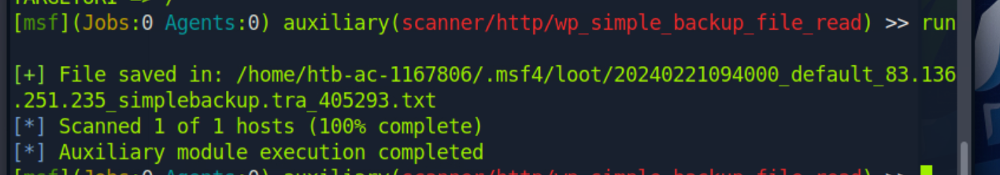

攻击显示成功了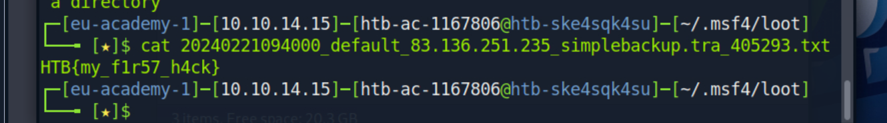

拿到了flag

# Favocado:Fuzzing the Binding Code of JavaScriptEngines Using Semantically Correct TestCase

### 背景

JavaScript是由JS引擎解释的动态高级编程语言。作为经常被用作交互式网页、浏览器以及其他许多软件的通用编程语言，JS有很多低级功能不能直接实现（如内存管理和文件访问）。因此为了实现这些功能，JS运行时系统包括一些专门的编程接口，称为绑定层（binding layers），绑定层通过在不同类型之间转换数据，在JS和不安全的低级语言(如C和C++)之间转换数据表示。发现在绑定层中的bug也是至关重要的，作者认为现有的fuzz工具都不能适用于非浏览器环境中的绑定代码（binding code）fuzzing，也不能很好的处理绑定代码，于是提出了Facocado，针对JS运行时系统的绑定层fuzzing。

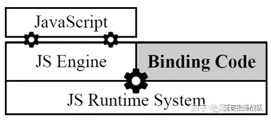

### 挑战

1. 生成语法和语义正确的测试用例。语法错误的测试用例在处理之前就会被发现不能运行，语法正确而语义错误的测试用例会在运行时引发系统错误。
2. 减少fuzz时的输入空间。在Chromium中有大于1000个DOM对象，每个对象可能有许多方法和属性难以填入，这也会增加生成测试用例的时间，阻碍fuzz的能力。

### 方法

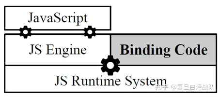

JS引擎为了执行JS代码会首先通过语法分析器解析源代码，生成抽象语法树(AST)。如果代码的语法不正确，它将不会生成AST或执行源代码。然后，JS引擎开始在控制代码范围并包含有关当前程序状态的最新信息的执行上下文中执行代码。

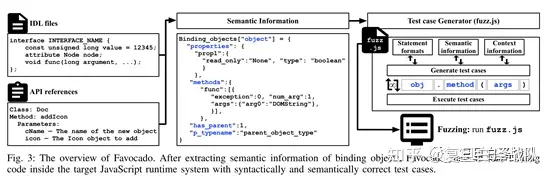

如上图所示，Favocado首先解析来自接口定义语言（Interface Definition Language, IDL）的文件或是API引用的语义信息。为了构造目标绑定代码的完整语义信息，Favocado在有源代码时会解析IDL文件。如果没有源代码，Favocado会使用API参考手册。通过解析IDL文件或API引用，Favocado能获得绑定对象的语义信息（方法、参数、属性等），其中包括确切的类型和可能的值。提取的语义信息可以直接用于生成测试用例。

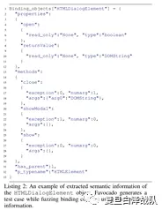

然后，Favocado使用绑定代码的语义信息生成一个JS文件（测试用例生成器），并通过在目标JS运行时系统上执行刚刚生成的JS文件进行Fuzzing。测试用例生成器会在预定义的语句格式中随机选择JS语句格式，这些预定义语句格式包括定义对象、调用方法、为属性赋值等，如下图。然后，它使用绑定代码的语义信息和fuzzing过程的上下文信息（例如，测试用例的运行时语义，如前面定义的变量及其类型的列表）来完成语句，防止意外的运行时错误。例如，当Favocado构造诸如car.drive(man)这样的语句时，Favocado会检查是否正确定义了man对象。此外，即使Favocado知道该对象已经被预先定义，它也会检查该对象是否仍然是活动的和可访问的。例如，当语句在调用释放对象（如removecchild）的方法后访问对象时，可能会发生运行时错误。如果该对象被这些方法释放，Favocado将再次创建该对象并执行所构造的语句，从而避免运行时错误。它还记得指向新定义的对象的变量名，以便以后使用。这些措施有效的解决了挑战一。

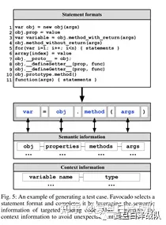

为了解决挑战二，也就是减少输入空间，作者将整个输入空间划分为多个等价类。作者举出了例子，Favocado定义两个对象（object）之间的关系为，一个绑定对象把另一个绑定对象当作属性或者方法参数时成立的关系，利用不同DOM对象之间的相对隔离关系（除非存在对象关系，不然在测试逻辑上是无关的，比如spell.check()和Net.http.request，拼写模块和网络模块之间是独立的，二者测试的顺序和上下文联系很可能不会影响到找到bug）将输入空间划分为不同等价类，在同一等价类中进行fuzzing，减少输入空间。