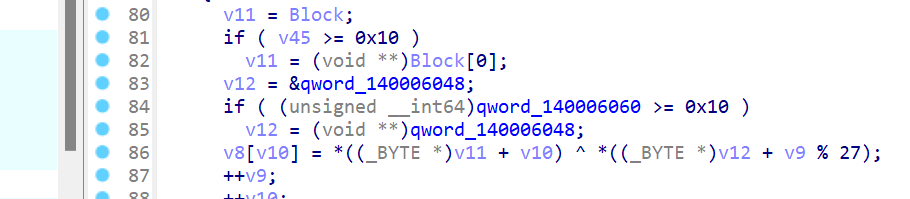

# 2024-2-23

## 1

首先观察程序运行状况，根据显示的字符找到我们到程序中寻找相应位置


找到主函数后我们从后往前看，根据下面的判断我们可以分析出flag字符串存在Block之中接着我们寻找相关参数


利用脚本解v20的值

```python
 from z3 import *

x,y,z,w=BitVecs('x y z w',64)

s=Solver()

s.add((~x)&z==1176889593874)
s.add(((z&~x)|(x&y)|(z&(~y))|(x&(~y)))^w==4483974543195470111)
s.add(((z&~y)&x|z&((x&y)|y&~x|~(y|x)))==577031497978884115)
s.add(((z&~x)|(x&y)|(z&~y)|(x&~y))==4483974544037412639)
s.add(((z&(~x)) | (x&y) | y & z) == (((~x)& z)|864693332579200012))

s.check()
m = s.model()
for i in m:
    print("%s = 0x%x"%(i,m[i].as_long()))

```


v20里的数据来自v13-v16,而这些数据的值又跟v19和v17有关，我们继续找b19和v17

程序一开始会输出提示语，会让我们输入数据存储在block中，并且我们根据长度判断条件可以看出flag长度为25，然后会将我们输入的数据进行异或，但是异或的值是0，接着动调一下发现该参数会被初始化，我们追踪一下该参数



追踪qword_140006048


然后我们找到对其赋值的函数，这里将i_will_check_is_debug_or_not拷贝到了其中

```python
from z3 import *

x,y,z,w=BitVecs('x y z w',64)

s=Solver()

s.add((~x)&z==1176889593874)
s.add(((z&~x)|(x&y)|(z&(~y))|(x&(~y)))^w==4483974543195470111)
s.add(((z&~y)&x|z&((x&y)|y&~x|~(y|x)))==577031497978884115)
s.add(((z&~x)|(x&y)|(z&~y)|(x&~y))==4483974544037412639)
s.add(((z&(~x)) | (x&y) | y & z) == (((~x)& z)|864693332579200012))

s.check()
m = s.model()
for i in m:
    print("%s = 0x%x"%(i,m[i].as_long()))

w = [0x32,0x31,0x06]
z = [0x08,0x02,0x07,0x17,0x15,0x3E,0x30,0x13]
y = "e!P0or_a"
x = [0x3e,0x3a,0x46,0x05,0x33,0x28,0x6f,0x0d]
Dst = 'i_will_check_is_debug_or_noi_wil'

flag=[0x3E,0x3A,0x46,0x05,0x33,0x28,0x6F,0x0D,0x8C,0x00,0x8A,0x09,0x78,0x49,0x2C,0xAC,0x08,0x02,0x07,0x17,0x15,0x3E,0x30,0x13,0x32,0x31,0x06]
s=''
for i in range(len(flag)):
    s+=chr(ord(Dst[i]) ^ flag[i])
    #s+=chr(flag[i])
print(s)

b=""
for i in range(len(x)):
    b+=chr(ord(Dst[i]) ^ x[i])
print(b)

```

使用脚本解下方程即可

## 2

打开题目，获得一个压缩包和一个文件，这个文件有很多空行猜测是零宽加密


解密获得压缩包密码


解压后得到一大堆字符串


并且最后有一串特殊的字符，我们尝试凯撒密码，发现先可以解出，我们将所有字符进行凯撒解密，然后根据提示进行base64，然后作为密码字典爆破flag即可

```python
import base64

lst = ['71132E', '328051N', '248199O'... ] 

def encrypt_string(string):
    encoded_bytes = base64.b64encode(string.encode('utf-8'))
    return encoded_bytes.decode('utf-8') 

with open('output.txt', 'w') as file:
    for value in lst:
        encrypted_value = encrypt_string(value)
        file.write(encrypted_value + '\n')
```

