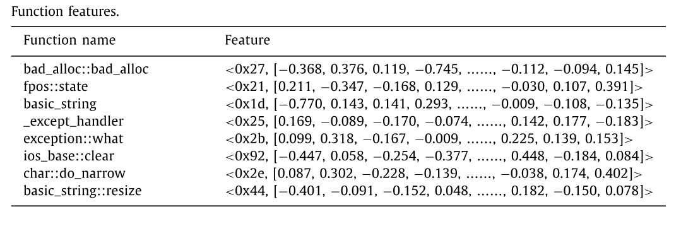
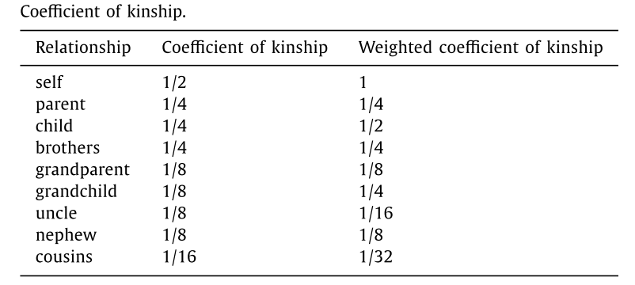
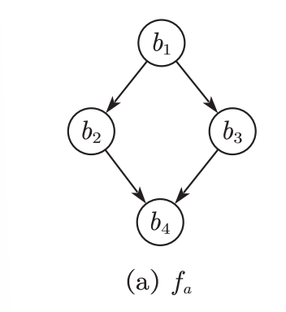
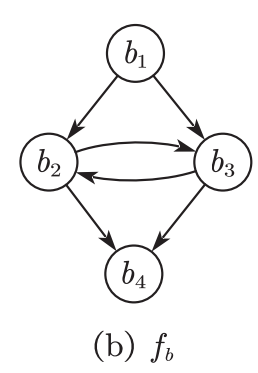
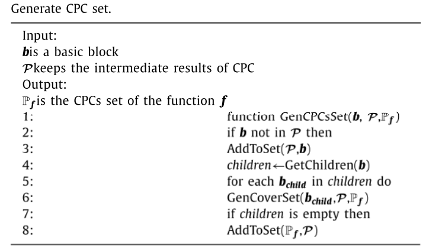
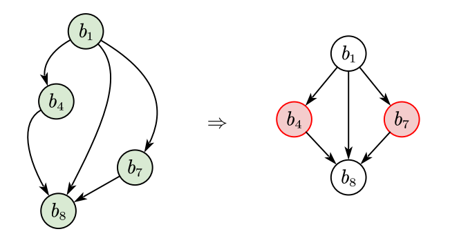
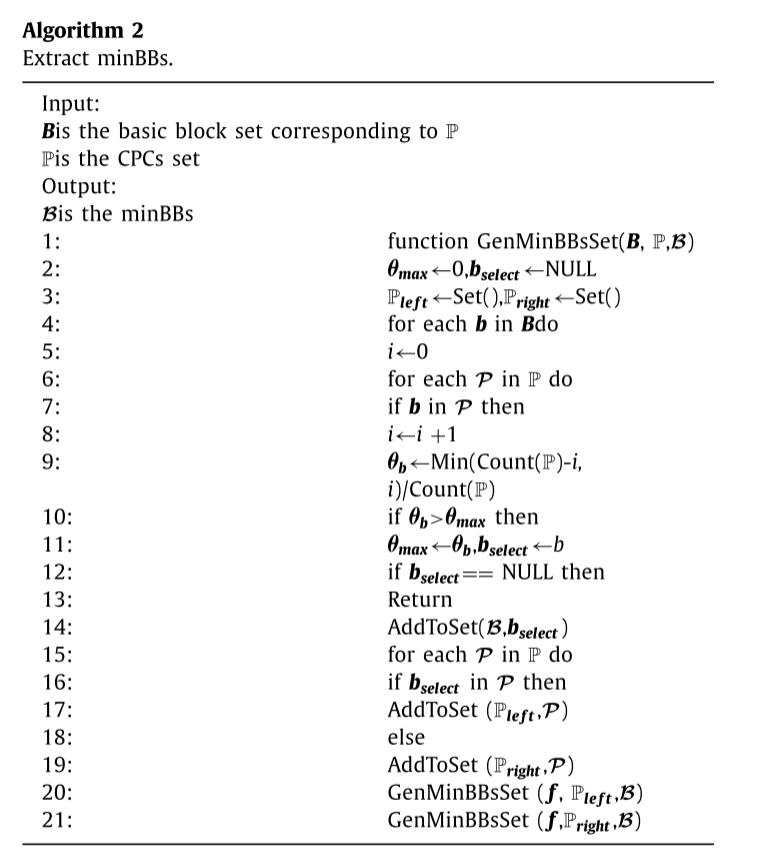
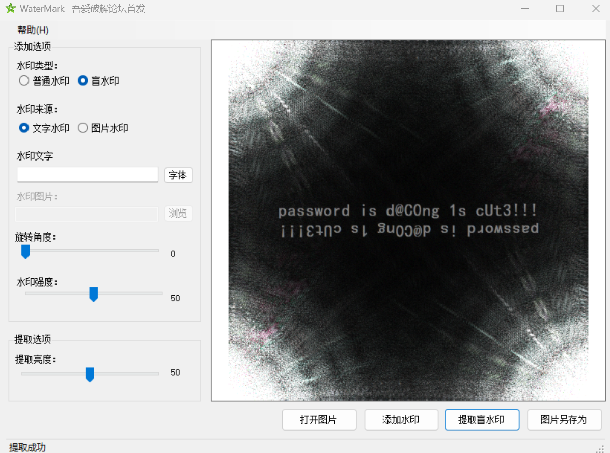
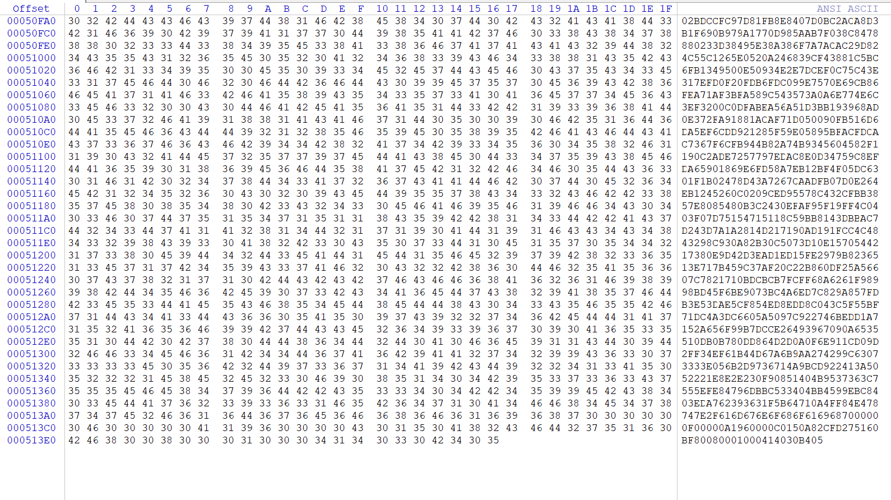
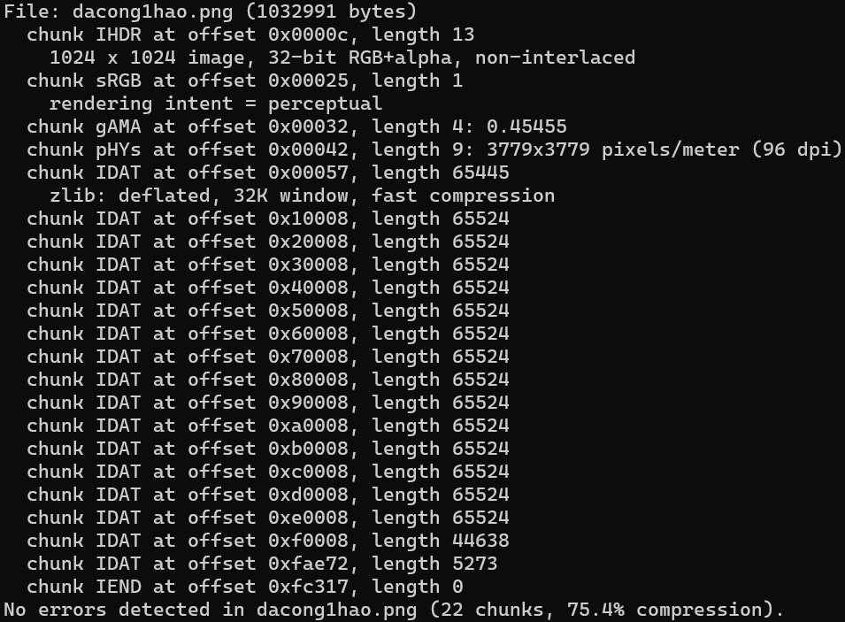

# MinSIB: Minimized static instrumentation for fuzzing binaries

## 工作摘要

该论文的主要思路是通过减少插桩点来提升Fuzz的效率

首先提出了三种优化方法来减少要插桩的基本块数量

1. 选择特定的函数
2. 生成最优代码路径覆盖
3. 提取最小化基本块

接着提出了MiniSIB算法进一步减少了插桩点，并且实现了一种稳定、可靠、高效的二进制重写方法。

## 论文思路

### 选择特定的函数

首先使用Asm2vec模型提取函数的特征向量，对检测项目中的函数进行特征匹配。同时为了针对大型函数特征数据库做出了优化，将所有函数按大小排序，然后使用二分法加块匹配速度。



提取函数的特征向量后首先会过滤掉标准库的函数，然后就是选取感兴趣的函数。

为此本文以一个或多个函数为起点函数将与之有关联的函数进行标记作为感兴趣的函数。函数之间的调用或被调用的关系即为函数之间的关联，所以，如果函数之间存在调用关系，则可以将函数视为一个组。通过将每个函数$f$记录为$FCG$中的一个节点，可以将调用关系视为$FCG$中的一条有向边。因此，$FCG$可以定义为：$FCG =（V,\vec{E}）$，顶点集$V$包含所有函数，边集$\vec{E}$指示它们的调用关系。

调用关系可以分为三种，分别为祖先、子孙、兄弟关系。本研究在原始值的基础上确定了各种亲属关系的加权系数。对于指定的起点函数，可以以较低的成本计算其他函数的亲属系数，并且可以通过选择不同的阈值来容易地控制感兴趣的函数的数量。



### 生成最优代码覆盖路径

该生成算法由两个阶段组成：提取BBoI（兴趣基本块）和通过CFG生成OptCPC（最优代码覆盖路径）

#### 提取BBoI

以为Fuzz主要针对内存漏洞，因此该方法根据指令类型和指令的地址类型构建了指令与内存相关性的评估表，以此来得到指令的内存相关分数，并根据基本块所有指令的分数和阈值$\tau$来决定是否标记为BBoI，计算基本块内存相关分数的计算公式如下：


$$
\lambda=\sum_{k=1}^{|b|}Score(in_k)
$$


即基本块的最终得分是所有指令的总和。

函数$f$的兴趣基本块被定义为：


$$
B_f^*=\lbrace b|b∈B_f\wedge\lambda_b\geq\tau\rbrace
$$


$B_f$表示函数f的基本块的集合，并且$\tau$表示兴趣的阈值。函数的其余基本块，称为非兴趣的基本块，定义为：


$$
B_f^-=B_f-B_f^*
$$


#### 通过CFG生成OptCPC

执行路径$p$包含一组按顺序排列的基本块。如下图所示，函数$f_a$具有两个执行路径： $p_1 = \lbrace{b_1 → b_2 → b_4 }\rbrace$  和  $p_1 = \lbrace{b_1 → b_3 → b_4 }\rbrace$ 。 



但是当CFG中存在循环时执行路径的数量在理论上就是无限的。CPC是对于一个函数执行路径的扩展，就是为了解决循环路径而提出的，它将路径定义为一组离散的点，CPC被定义为


$$
\mathcal{P}=\lbrace b|b∈p\rbrace
$$


如下图所示，循环路径可以定义为一个CPC：$\mathcal{P}_b=\lbrace{b_1,b_2,b_3,b_4}\rbrace$。



所有可能的CPC构成的CPC集合定义为：


$$
\mathbb{P}_f=\lbrace\mathcal{P}_p|p∈f\rbrace
$$


生成CPC集合的算法如下图所示



感兴趣的基本块的集合 $B_f^*$ 的CPC即OptCPCs被定义为：


$$
\mathbb{P}_{opt}=\lbrace\mathcal{P}|\mathcal{P}∈\mathbb{P}_f\wedge\mathcal{P}\subseteq B_f^*\rbrace
$$

#### 提取最小化的基本块

如下图所示存在三个CPC $\mathcal{P}_1=\lbrace{b_1,b_4,b_8}\rbrace,\mathcal{P}_2=\lbrace{b_1,b_8}\rbrace,\mathcal{P}_3=\lbrace{b_1,b_7,b_8}\rbrace$



本文则需要找到一个最小的基本块集来表示所有CPC即 $\lbrace b_4,b_7\rbrace$，使用 $b^0,b^1$ 来表示基本块是否在CPC中，三个CPC可以表示为 $\mathcal{P}_1=\lbrace{b_1,b_4,b_8}\rbrace,\mathcal{P}_2=\lbrace{b_1,b_8}\rbrace,\mathcal{P}_3=\lbrace{b_1,b_7,b_8}\rbrace$，本文将最小的基本块集定义为：


$$
\mathcal{B}_f=\lbrace b|b∈f\wedge cond\rbrace
$$
条件表达式cond定义为：


$$
\forall p∈ f,\lbrace b^s|b∈\mathcal{B} \wedge s=[[b∈p]]\rbrace\Rightarrow\mathcal{P}_p
$$
其中[[·]]是恒等函数。如果这个函数中的表达式被评估为真，那么输出1;否则，输出0。$\Rightarrow$ 表示左集合唯一的标识右侧的CPC。

为了确定是否将某个基本块添加到最小基本块集，本位提出了路径可区分性PD来表示基本块区分CPC的能力，PD可以被定义为：


$$
\theta_b=\frac{1}{k}.min(k-\sum^k_{i=1}[[b∈\mathcal{P}_i]]),k=|\mathbb{P}_f|
$$


$|\mathbb{P}_f|$ 表示函数 $f$的CPC数量，$\sum^k_{i=1}[[b∈\mathcal{P}_i]]$表示包含基本块 $b$的CPC数量，生成最小基本块集算法如下图所示：



#### 插装和二进制重写

为了节省调用开销，本文选择将插桩代码直接插入原始代码中而不是进行调用，避免了额外的调用开销，但插入额外代码会影响程序的相对引用，所以要先收集所有jmp指令，并进行重新计算相对值，并利用PELib进行二进制文件重写

# Datalog项目

## 参考

该项目参考The Eye of Horus: Spotting and Analyzing Attacks on Ethereum Smart Contracts所实现的基于Datalog的区块链漏洞分析。

该项目将整个流程分为三个步骤，分别是提取、分析和追踪

（1）提取：将区块链中的与执行相关的信息并将其存储为Datalog中的Facts。

（2）分析：Facrs输入经过提前设置好的Datalog的Realtions和Queries进行处理最后得到Result并输出。

（3）追踪：追踪阶段检索通过分析获得的攻击者帐户列表，并获取与这些帐户相关的所有交易。之后，创建一个图形数据库，该数据库捕获了来自这些账户的资金流。此外，可以用标记帐户列表来扩充数据库，以增强对被盗资产的追踪。

由于该项目的第三步追踪与本项目无关，所以本项目将借鉴该项目的前两步来完成程序执行相关信息的提取和漏洞分析

### 提取

call_flow_analysis.py

```python
#!/usr/bin/env python3
# -*- coding: utf-8 -*-

from utils.utils import normalize_32_byte_hex_address

class CallFlowAnalysis:
    def __init__(self, transaction):
        self.call_stack = []
        self.call_id = -1
        self.call_branch = -1
        self.call_stack.append(transaction["to"])//将调用的交易添加入调用栈中

    def get_caller(self):
        return self.call_stack[-1]

    def get_call_id(self):
        return self.call_id

    def get_call_branch(self):
        return self.call_branch

    def analyze_call_flow(self, step, max_step, trace):
        if step < len(trace)-1://如果步数小于总步数则进行判断
            # Handle call braches
            if len(self.call_stack) - trace[step]["depth"] > 1://因为将调用的目标函数加入调用栈中，如果添加多个调用的目标函数则证明有调用分支
                self.call_branch += 1
            elif trace[step]["depth"] == 1://如果调用深度是1的话，调用栈为空，但总步数大于当前步数，证明还有分支
                self.call_branch += 1

            # Handle call stack
            if trace[step]["depth"] < trace[step+1]["depth"]:
                if trace[step]["op"] in ["CREATE", "CREATE2"]:
                    i = step + 1
                    while i < max_step and trace[step]["depth"] < trace[i]["depth"]:
                        i += 1//如果当前调用深度比后一步低，并且当前进行创造合约命令，就找到回到原合约的命令
                    self.call_stack.append(normalize_32_byte_hex_address(hex(int(trace[i]["stack"][-1], 16))))//将新合约加入栈中
                elif trace[step]["op"] in ["CALL", "CALLCODE", "DELEGATECALL", "STATICCALL"]:
                    self.call_stack.append(normalize_32_byte_hex_address(hex(int(trace[step]["stack"][-2], 16))))//如果调用的其他合约的，将其他合约加入栈中
            while trace[step]["depth"] < len(self.call_stack):
                self.call_stack.pop()//如果添加了额外的调用就pop出去

            # Handle call ids
            if len(self.call_stack) == 1:
                self.call_id += 1
```

# Misc

打开压缩包后是一幅图片和一个压缩包


根据四周的阴影和压缩包的加密以及尝试我们可以发现这是一个盲水印图片，提取盲水印得到

获得压缩包密码后解密得到一个图片，用winhex打开，发现最后一长串16进制字符，并且最后明显是PK的逆序ascii码



将其复制逆序一下得到一个zip


然后检查第一个图片发现了多个IDAT，使用 pngcheck 对文件进行分析



将除最后一个 IDAT 之外的全部 IDAT 部分删除,然后CRC爆破长宽得到密码wH1T3_r0cckEt_sh00ter，解压第二个zip得到

xiaohongmao.txt，内容是很多行base64编码后的数据，然后进行base64解密得到隐写密码：m1ku_1s_sha_fufu123，接下来需要使用工具 JPHS for WIndows

将 dacong2hao.jpg 中的 flag 提取出来