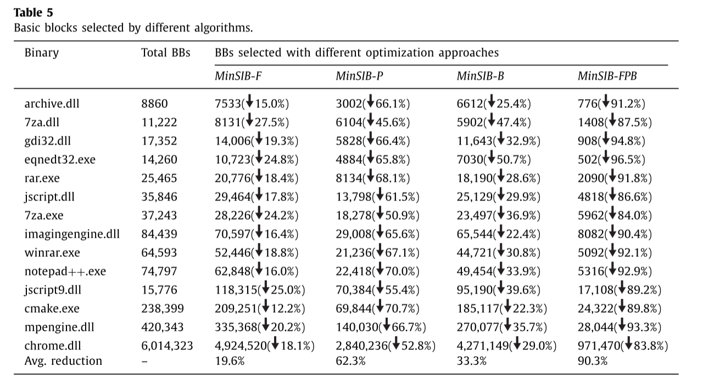
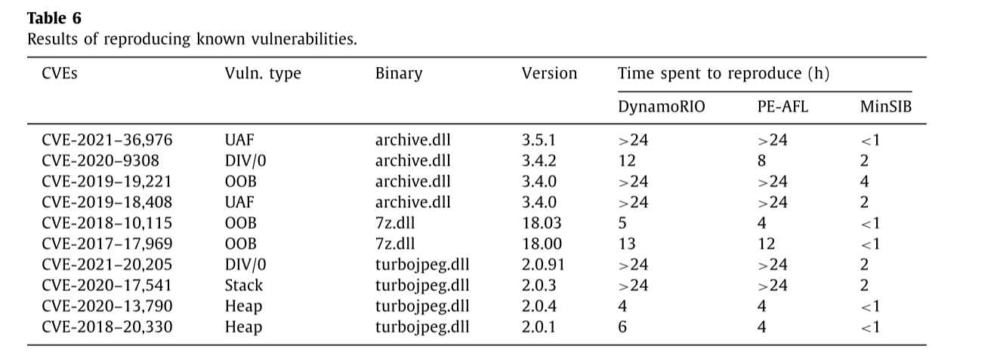

# 2024-2-7

# MinSIB: Minimized static instrumentation for fuzzing binaries

## 工作摘要

该论文的主要思路是通过减少插桩点来提升Fuzz的效率

提出了三种优化方法来减少要插桩的基本块数量

1. 选择特定的函数
2. 生成最优代码路径覆盖
3. 提取最小化基本块

## 论文思路

### 选择特定的函数

首先使用Asm2vec模型提取函数的特征向量，对检测项目中的函数进行特征匹配。同时为了针对大型函数特征数据库做出了优化，将所有函数按大小排序，然后使用二分法加块匹配速度。


提取函数的特征向量后首先会过滤掉标准库的函数，然后就是选取感兴趣的函数。

为此本文以一个或多个函数为起点函数将与之有关联的函数进行标记作为感兴趣的函数。函数之间的调用或被调用的关系即为函数之间的关联，所以，如果函数之间存在调用关系，则可以将函数视为一个组。通过将每个函数$f$记录为$FCG$中的一个节点，可以将调用关系视为$FCG$中的一条有向边。因此，$FCG$可以定义为：$FCG =（V,\vec{E}）$，顶点集$V$包含所有函数，边集$\vec{E}$指示它们的调用关系。

调用关系可以分为三种，分别为祖先、子孙、兄弟关系。本研究在原始值的基础上确定了各种亲属关系的加权系数。对于指定的起点函数，可以以较低的成本计算其他函数的亲属系数，并且可以通过选择不同的阈值来容易地控制感兴趣的函数的数量。


### 生成最优代码覆盖

该生成算法由三个阶段组成：提取BBoI（兴趣基本块）和通过CFG生成OptCPC（最优代码覆盖路径）以及最小化基本块的提取

#### 提取BBoI

以为Fuzz主要针对内存漏洞，因此该方法根据指令类型和指令的地址类型构建了指令与内存相关性的评估表，以此来得到指令的内存相关分数，并根据基本块所有指令的分数和阈值$\tau$来决定是否标记为BBoI，计算基本块内存相关分数的计算公式如下：


$$
\lambda=\sum_{k=1}^{|b|}Score(in_k)
$$


即基本块的最终得分是所有指令的总和。

函数$f$的兴趣基本块被定义为：


$$
B_f^*=\lbrace b|b∈B_f\wedge\lambda_b\geq\tau\rbrace
$$


$B_f$表示函数f的基本块的集合，并且$\tau$表示兴趣的阈值。函数的其余基本块，称为非兴趣的基本块，定义为：


$$
B_f^-=B_f-B_f^*
$$


#### 通过CFG生成OptCPC

执行路径$p$包含一组按顺序排列的基本块。如下图所示，函数$f_a$具有两个执行路径： $p_1 = \lbrace{b_1 → b_2 → b_4 }\rbrace$  和  $p_1 = \lbrace{b_1 → b_3 → b_4 }\rbrace$ 。 


但是当CFG中存在循环时执行路径的数量在理论上就是无限的。CPC是对于一个函数执行路径的扩展，就是为了解决循环路径而提出的，它将路径定义为一组离散的点，CPC被定义为


$$
\mathcal{P}=\lbrace b|b∈p\rbrace
$$


如下图所示，循环路径可以定义为一个CPC：$\mathcal{P}_b=\lbrace{b_1,b_2,b_3,b_4}\rbrace$。


所有可能的CPC构成的CPC集合定义为：


$$
\mathbb{P}_f=\lbrace\mathcal{P}_p|p∈f\rbrace
$$


生成CPC集合的算法如下图所示


感兴趣的基本块的集合 $B_f^*$ 的CPC即OptCPCs被定义为：


$$
\mathbb{P}_{opt}=\lbrace\mathcal{P}|\mathcal{P}∈\mathbb{P}_f\wedge\mathcal{P}\subseteq B_f^*\rbrace
$$

#### 提取最小化的基本块

如下图所示存在三个CPC $\mathcal{P}_1=\lbrace{b_1,b_4,b_8}\rbrace,\mathcal{P}_2=\lbrace{b_1,b_8}\rbrace,\mathcal{P}_3=\lbrace{b_1,b_7,b_8}\rbrace$


本文则需要找到一个最小的基本块集来表示所有CPC即 $\lbrace b_4,b_7\rbrace$，使用 $b^0,b^1$ 来表示基本块是否在CPC中，三个CPC可以表示为 $\mathcal{P}_1=\lbrace{b_1,b_4,b_8}\rbrace,\mathcal{P}_2=\lbrace{b_1,b_8}\rbrace,\mathcal{P}_3=\lbrace{b_1,b_7,b_8}\rbrace$，本文将最小的基本块集定义为：


$$
\mathcal{B}_f=\lbrace b|b∈f\wedge cond\rbrace
$$
条件表达式cond定义为：


$$
\forall p∈ f,\lbrace b^s|b∈\mathcal{B} \wedge s=[[b∈p]]\rbrace\Rightarrow\mathcal{P}_p
$$
其中[[·]]是恒等函数。如果这个函数中的表达式被评估为真，那么输出1;否则，输出0。$\Rightarrow$ 表示左集合唯一的标识右侧的CPC。

为了确定是否将某个基本块添加到最小基本块集，本位提出了路径可区分性PD来表示基本块区分CPC的能力，PD可以被定义为：


$$
\theta_b=\frac{1}{k}.min(k-\sum^k_{i=1}[[b∈\mathcal{P}_i]]),k=|\mathbb{P}_f|
$$


$|\mathbb{P}_f|$ 表示函数 $f$的CPC数量，$\sum^k_{i=1}[[b∈\mathcal{P}_i]]$表示包含基本块 $b$的CPC数量，生成最小基本块集算法如下图所示：


#### 插桩和二进制重写

为了节省调用开销，本文选择将插桩代码直接插入原始代码中而不是进行调用，避免了额外的调用开销，但插入额外代码会影响程序的相对引用，所以要先收集所有jmp指令，并进行重新计算相对值，并利用PELib进行二进制文件重写

## 性能评估

本文将评估MinSIB的插桩性能和运行时开销的减少，还测试了MinSIB对Fuzz二进制文件能力的增强。

本测试中使用的目标二进制文件包括解压缩软件、文本编辑器、脚本引擎、图像库、防病毒软件、系统库和Web浏览器。


### 插桩与运行性能

本文提出了三种优化方法来减少仪器点的数量：感兴趣的函数（-F），OptCPCs（-P）和minBBs（-B）。为了测试每种优化方法设计了三种工具：MinSIB-F，MinSIB-P和MinSIB-B来分别测试他们的贡献，下图显示了采用不同方法选择插桩的基本块的数量。当MinSIB采用所有优化方法时，基本块的数量平均减少了90.3%。

在此测试中，archive.dll、7z.dll、jscript.dll和turbojpeg.dll被用作目标二进制文件。它们由MinSIB用不同的优化方法进行仪表化。PE-AFL是传统静态插桩方法的代表，DynamoRIO是动态插桩方法的代表。如下图所示，本文的方法可以显著降低二进制文件的运行时开销。当所有的优化方法被使用时，MinSIB的开销平均降低到4.86%。


### Fuzz能力提升

接下来选择了四个二进制文件来评估fuzz速度：archive. dll，7za. dll，jscript. dll和turbojpeg. dll。通过观察一定时间内的执行的样本数来比较模糊器之间的fuzz速度。下图展示了不同插桩方法的fuzz速度。可以看出，MiniSIB性能最好;其fuzz速度比PE-AFL快48.6%至146.7%，比DynamoRIO快127.4%至359.8%


探测已知漏洞本研究评估了MinSIB发现已知漏洞的能力，这是Fuzzer的一个重要功能。如下图所示几个公共CVE被用作已知漏洞。结果表明，MinSIB在发现已知漏洞方面比现有工具快4到24倍。

探测测未知漏洞为了评估MinSIB检测未知漏洞的能力，本文选择了7zip、libjpeg-turbo、bzip 2等作为测试样例。下图示MinSIB可以检测未知漏洞，如OOB读写、空点引用、栈溢出和堆溢出。


# 代码复现

```
import os
import glob
import binascii
from PIL import Image
import scapy.all as scapy
from tqdm import tqdm
import numpy as np
import tkinter as tk
from tkinter import filedialog

def makedir(path):
    try:
        os.mkdir(path)
    except Exception as E:
        pass

def read_5hp_list(pcap_dir):
    packets = scapy.rdpcap(pcap_dir)#解析数据包;读入pcap文件
    data = []
    for packet in packets:
        header = (binascii.hexlify(bytes(packet['IP']))).decode()#将流量包的IP转换为十六进制数据
        try:
            payload = (binascii.hexlify(bytes(packet['Raw']))).decode()#提取流量包的载荷
            header = header.replace(payload, '')
        except:
            payload = ''
        if len(header) > 160:
            header = header[:160]
        elif len(header) < 160:
            header += '0' * (160 - len(header))#填充
        if len(payload) > 480:
            payload = payload[:480]
        elif len(payload) < 480:
            payload += '0' * (480 - len(payload))#填充
        data.append((header, payload))
        if len(data) >= 5:#只填充六行
            break
    if len(data) < 5:
        for i in range(5-len(data)):#行数不足进行填充
            data.append(('0'*160, '0'*480))
    final_data = ''
    for h, p in data:
        final_data += h
        final_data += p
    return final_data

def MFR_generator(flows_pcap_path, output_path):
    flows = glob.glob(flows_pcap_path + "/*/*/*.pcap")#返回所有匹配的文件路径列表。
    makedir(output_path)
    makedir(output_path + "/train")
    makedir(output_path + "/test")#分别创建训练和检验目录
    classes = glob.glob(flows_pcap_path + "/*/*")
    for cla in tqdm(classes):
        makedir(cla.replace(flows_pcap_path,output_path))
    for filename in tqdm(filenames):
        content = read_5hp_list(filename)
        content = np.array([int(content[i:i + 2], 16) for i in range(0, len(content), 2)])
        fh = np.reshape(content, (40, 40))#将提取的数据重塑为40*40的矩阵
        fh = np.uint8(fh)#将数据类型转换为0-255
        im = Image.fromarray(fh)#把数据转换为图像
        im.save(filename.replace('.pcap','.png').replace(flows_pcap_path,output_path))


filename = filedialog.askopenfilename()
print(filename)
content = read_5hp_list(filename)
content = np.array([int(content[i:i + 2], 16) for i in range(0, len(content), 2)])
fh = np.reshape(content, (40, 40))#将提取的数据重塑为40*40的矩阵
fh = np.uint8(fh)#将数据类型转换为0-255
im = Image.fromarray(fh)#把数据转换为图像
im.save(filename.replace('.pcapng','.png'))
```


使用代码提取attach.pcapng后得到流量图


# Re

首先根据提示我们知道该文件是一个驱动文件，那么我们就去找驱动文件入口点DriverEntry

然后我们找到主函数，可以看见flag是从flag.txt进行读入，然后放入了P，最后在sub_140001560函数进行比较，在比较前进行了加密


进入两个函数内部我们可以发现sub__1400011F0是一个修改的RC4算法


sub__140001360进入之后发现有一个表很容易发现是修改的base64


然后我们根据加密函数逆推出脚本

```python
import struct
byte1400 = [i for i in range(64)]
def keyinit():
    global byte1400
    key = 'the_key_'
    for i in range(64):
        byte1400[i] = i
    
    keybox = [0 for i in range(64)]
    for i in range(64):
        keybox[i] = ord(key[i%8])
    temp = 0
    for i in range(64):
        temp = (keybox[i] + byte1400[i] + temp) % 64
        byte1400[i], byte1400[temp] = byte1400[temp], byte1400[i]

def enFunc(buf):
    global byte1400
    temp = 0
    ta = 0
    for i in range(len(buf)):
        temp = (temp + 1) % 64
        ta = (byte1400[temp]+ta) % 64
        byte1400[temp], byte1400[ta] = byte1400[ta], byte1400[temp]
        buf[i] ^= ((ta ^ temp) & byte1400[(((ta ^ temp) + byte1400[temp] + byte1400[ta]) % 64)])

def deBase64(buf):
    res = []
    table = '4KBbSzwWClkZ2gsr1qA+Qu0FtxOm6/iVcJHPY9GNp7EaRoDf8UvIjnL5MydTX3eh'
    if len(buf) % 4 == 0:
        for i in range(0, len(buf), 4):
            strbin = ''
            for k in range(3, -1, -1):
                if buf[i+k] == '=':
                    continue
                strbin += bin(table.index(buf[i+k]))[2:].zfill(6)
            dwordValue = int(strbin, 2)
            res.append(dwordValue)
    return res


def main(): 
    buf = '6zviISn2McHsa4b108v29tbKMtQQXQHA+2+sTYLlg9v2Q2Pq8SP24Uw='
    endata = deBase64(buf)
    endata = b''.join(struct.pack("<I", i) for i in endata)
    endata = struct.unpack('<{}B'.format(len(endata)), endata)
    endata = list(endata)
    endata = [value for index, value in enumerate(endata) if (index + 1) % 4 != 0]
    keyinit()
    enFunc(endata)
    print(''.join(chr(i) for i in endata)) #D0g3{608292C4-15400BA4-B3299A5C-704C292D}

if __name__ == '__main__':
    main()
```

