# 2024-2-8

## Reverse

### 1

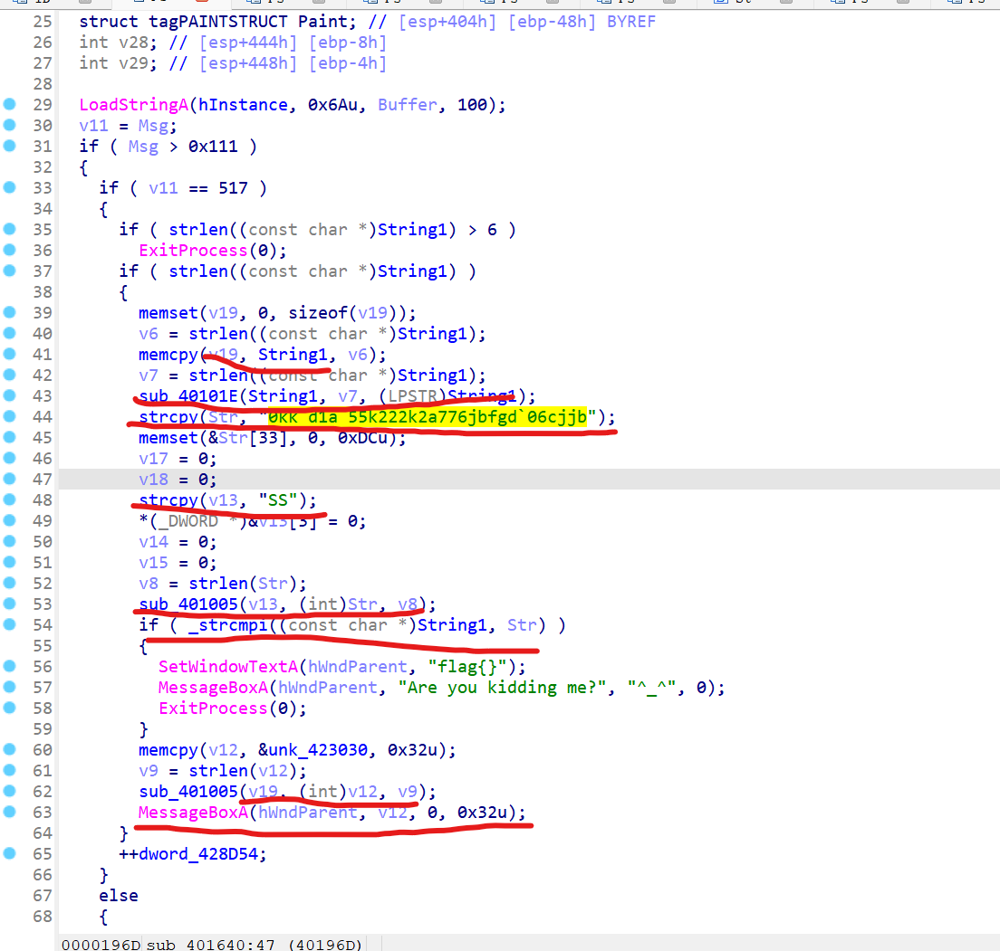

 最后的v12是被v19异或后的字符串，v19是最初的String1，String被hash过后与被SS异或过的Str相同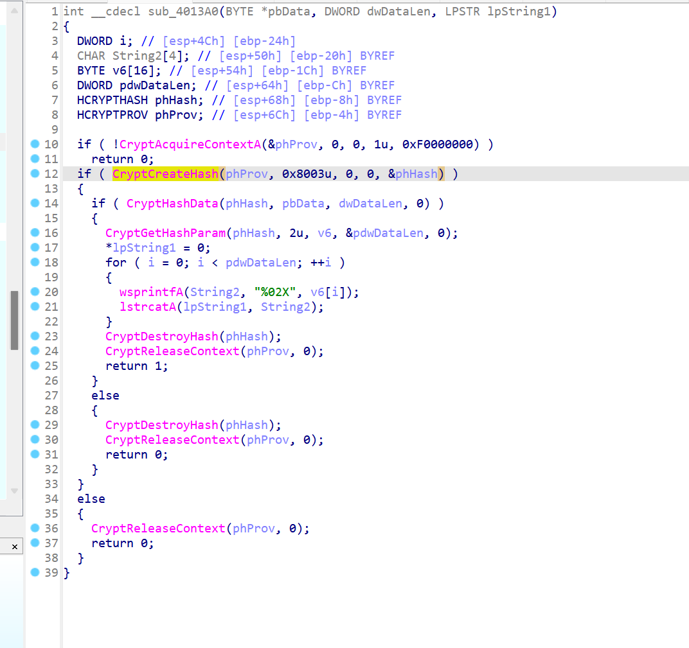

0x8003是md5

```python
import hashlib
ida =[0x57,0x5E,0x52,0x54,0x49,0x5F,0x1,0x6D,0x69,0x46,0x2,0x6E,0x5F,0x2,0x6C,0x57,0x5B,0x54,0x4C]
Str = '0kk`d1a`55k222k2a776jbfgd`06cjjb'
v13 = 'SS'
new = ''
for i in range(len(Str)):
    new += chr(ord(Str[i]) ^ ord('S'))
string1 = '123321'
new_new = ''
for i in range(len(ida)):
    ida[i] ^= ord(string1[i%6])
    new_new += chr(ida[i])
print(new_new)
```

### 2

该题是python字节码形式，python通过栈虚拟机来运行

```
  4           0 LOAD_CONST               0 (3)
              3 LOAD_CONST               1 (37)
              6 LOAD_CONST               2 (72)
              9 LOAD_CONST               3 (9)
             12 LOAD_CONST               4 (6)
             15 LOAD_CONST               5 (132)
             18 BUILD_LIST               6
             21 STORE_NAME               0 (en)

  5          24 LOAD_CONST               6 (101)
             27 LOAD_CONST               7 (96)
             30 LOAD_CONST               8 (23)
             33 LOAD_CONST               9 (68)
             36 LOAD_CONST              10 (112)
             39 LOAD_CONST              11 (42)
             42 LOAD_CONST              12 (107)
             45 LOAD_CONST              13 (62)
             48 LOAD_CONST               7 (96)
             51 LOAD_CONST              14 (53)
             54 LOAD_CONST              15 (176)
             57 LOAD_CONST              16 (179)
             60 LOAD_CONST              17 (98)
             63 LOAD_CONST              14 (53)
             66 LOAD_CONST              18 (67)
             69 LOAD_CONST              19 (29)
             72 LOAD_CONST              20 (41)
             75 LOAD_CONST              21 (120)
             78 LOAD_CONST              22 (60)
             81 LOAD_CONST              23 (106)
             84 LOAD_CONST              24 (51)
             87 LOAD_CONST               6 (101)
             90 LOAD_CONST              25 (178)
             93 LOAD_CONST              26 (189)
             96 LOAD_CONST               6 (101)
             99 LOAD_CONST              27 (48)
            102 BUILD_LIST              26
            105 STORE_NAME               1 (output)

  7         108 LOAD_CONST              28 ('welcome to GWHT2020')
            111 PRINT_ITEM          
            112 PRINT_NEWLINE       

  9         113 LOAD_NAME                2 (raw_input)
            116 LOAD_CONST              29 ('please input your flag:')
            119 CALL_FUNCTION            1
            122 STORE_NAME               3 (flag)

 10         125 LOAD_NAME                3 (flag)
            128 STORE_NAME               4 (str)

 12         131 LOAD_NAME                5 (len)
            134 LOAD_NAME                4 (str)
            137 CALL_FUNCTION            1
            140 STORE_NAME               6 (a)

 13         143 LOAD_NAME                6 (a)
            146 LOAD_CONST              30 (38)
            149 COMPARE_OP               0 (<)
            152 POP_JUMP_IF_FALSE      173

 14         155 LOAD_CONST              31 ('lenth wrong!')
            158 PRINT_ITEM          
            159 PRINT_NEWLINE       

 15         160 LOAD_NAME                7 (exit)
            163 LOAD_CONST              32 (0)
            166 CALL_FUNCTION            1
            169 POP_TOP             
            170 JUMP_FORWARD             0 (to 173)

 17     >>  173 LOAD_NAME                8 (ord)
            176 LOAD_NAME                4 (str)
            179 LOAD_CONST              32 (0)
            182 BINARY_SUBSCR            //数组取下标，栈顶为下标
            183 CALL_FUNCTION            1
            186 LOAD_CONST              33 (2020)
            189 BINARY_MULTIPLY     	 //乘法
            190 LOAD_NAME                8 (ord)
            193 LOAD_NAME                4 (str)
            196 LOAD_CONST              34 (1)
            199 BINARY_SUBSCR       //数组取下标，栈顶为下标
            200 CALL_FUNCTION            1
            203 BINARY_ADD          //加法
            204 LOAD_CONST              33 (2020)
            207 BINARY_MULTIPLY     //乘法
            208 LOAD_NAME                8 (ord)
            211 LOAD_NAME                4 (str)
            214 LOAD_CONST              35 (2)
            217 BINARY_SUBSCR       //数组取下标，栈顶为下标
            218 CALL_FUNCTION            1
            221 BINARY_ADD          //加法
            222 LOAD_CONST              33 (2020)
            225 BINARY_MULTIPLY     //乘法
            226 LOAD_NAME                8 (ord)
            229 LOAD_NAME                4 (str)
            232 LOAD_CONST               0 (3)
            235 BINARY_SUBSCR       //数组取下标，栈顶为下标
            236 CALL_FUNCTION            1
            239 BINARY_ADD          //加法
            240 LOAD_CONST              33 (2020)
            243 BINARY_MULTIPLY     
            244 LOAD_NAME                8 (ord)
            247 LOAD_NAME                4 (str)
            250 LOAD_CONST              36 (4)
            253 BINARY_SUBSCR       //数组取下标，栈顶为下标
            254 CALL_FUNCTION            1
            257 BINARY_ADD          	//加法
            258 LOAD_CONST              37 (1182843538814603)
            261 COMPARE_OP               2 (==)
            264 POP_JUMP_IF_FALSE      275

 18         267 LOAD_CONST              38 ('good!continue\xe2\x80\xa6\xe2\x80\xa6')
            270 PRINT_ITEM          
            271 PRINT_NEWLINE       
            272 JUMP_FORWARD            15 (to 290)

 20     >>  275 LOAD_CONST              39 ('bye~')
            278 PRINT_ITEM          
            279 PRINT_NEWLINE       

 21         280 LOAD_NAME                7 (exit)
            283 LOAD_CONST              32 (0)
            286 CALL_FUNCTION            1
            289 POP_TOP             

 23     >>  290 BUILD_LIST               0
            293 STORE_NAME               9 (x)

 24         296 LOAD_CONST              40 (5)
            299 STORE_NAME              10 (k)

 25         302 SETUP_LOOP             128 (to 433)
            305 LOAD_NAME               11 (range)
            308 LOAD_CONST              41 (13)
            311 CALL_FUNCTION            1
            314 GET_ITER            
        >>  315 FOR_ITER               114 (to 432)
            318 STORE_NAME              12 (i)

 26         321 LOAD_NAME                8 (ord)
            324 LOAD_NAME                4 (str)
            327 LOAD_NAME               10 (k)
            330 BINARY_SUBSCR       
            331 CALL_FUNCTION            1
            334 STORE_NAME              13 (b)

 27         337 LOAD_NAME                8 (ord)
            340 LOAD_NAME                4 (str)
            343 LOAD_NAME               10 (k)
            346 LOAD_CONST              34 (1)
            349 BINARY_ADD          
            350 BINARY_SUBSCR       
            351 CALL_FUNCTION            1
            354 STORE_NAME              14 (c)

 28         357 LOAD_NAME               14 (c)
            360 LOAD_NAME                0 (en)
            363 LOAD_NAME               12 (i)
            366 LOAD_CONST               4 (6)
            369 BINARY_MODULO       
            370 BINARY_SUBSCR       
            371 BINARY_XOR          
            372 STORE_NAME              15 (a11)

 29         375 LOAD_NAME               13 (b)
            378 LOAD_NAME                0 (en)
            381 LOAD_NAME               12 (i)
            384 LOAD_CONST               4 (6)
            387 BINARY_MODULO       
            388 BINARY_SUBSCR       
            389 BINARY_XOR          
            390 STORE_NAME              16 (a22)

 30         393 LOAD_NAME                9 (x)
            396 LOAD_ATTR               17 (append)
            399 LOAD_NAME               15 (a11)
            402 CALL_FUNCTION            1
            405 POP_TOP             

 31         406 LOAD_NAME                9 (x)
            409 LOAD_ATTR               17 (append)
            412 LOAD_NAME               16 (a22)
            415 CALL_FUNCTION            1
            418 POP_TOP             

 32         419 LOAD_NAME               10 (k)
            422 LOAD_CONST              35 (2)
            425 INPLACE_ADD         
            426 STORE_NAME              10 (k)
            429 JUMP_ABSOLUTE          315
        >>  432 POP_BLOCK           

 33     >>  433 LOAD_NAME                9 (x)
            436 LOAD_NAME                1 (output)
            439 COMPARE_OP               2 (==)
            442 POP_JUMP_IF_FALSE      453

 34         445 LOAD_CONST              38 ('good!continue\xe2\x80\xa6\xe2\x80\xa6')
            448 PRINT_ITEM          
            449 PRINT_NEWLINE       
            450 JUMP_FORWARD            15 (to 468)

 36     >>  453 LOAD_CONST              42 ('oh,you are wrong!')
            456 PRINT_ITEM          
            457 PRINT_NEWLINE       

 37         458 LOAD_NAME                7 (exit)
            461 LOAD_CONST              32 (0)
            464 CALL_FUNCTION            1
            467 POP_TOP             

 39     >>  468 LOAD_NAME                5 (len)
            471 LOAD_NAME                4 (str)
            474 CALL_FUNCTION            1
            477 STORE_NAME              18 (l)

 40         480 LOAD_NAME                8 (ord)
            483 LOAD_NAME                4 (str)
            486 LOAD_NAME               18 (l)
            489 LOAD_CONST              43 (7)
            492 BINARY_SUBTRACT     
            493 BINARY_SUBSCR       
            494 CALL_FUNCTION            1
            497 STORE_NAME              19 (a1)

 41         500 LOAD_NAME                8 (ord)
            503 LOAD_NAME                4 (str)
            506 LOAD_NAME               18 (l)
            509 LOAD_CONST               4 (6)
            512 BINARY_SUBTRACT     
            513 BINARY_SUBSCR       
            514 CALL_FUNCTION            1
            517 STORE_NAME              20 (a2)

 42         520 LOAD_NAME                8 (ord)
            523 LOAD_NAME                4 (str)
            526 LOAD_NAME               18 (l)
            529 LOAD_CONST              40 (5)
            532 BINARY_SUBTRACT     
            533 BINARY_SUBSCR       
            534 CALL_FUNCTION            1
            537 STORE_NAME              21 (a3)

 43         540 LOAD_NAME                8 (ord)
            543 LOAD_NAME                4 (str)
            546 LOAD_NAME               18 (l)
            549 LOAD_CONST              36 (4)
            552 BINARY_SUBTRACT     
            553 BINARY_SUBSCR       
            554 CALL_FUNCTION            1
            557 STORE_NAME              22 (a4)

 44         560 LOAD_NAME                8 (ord)
            563 LOAD_NAME                4 (str)
            566 LOAD_NAME               18 (l)
            569 LOAD_CONST               0 (3)
            572 BINARY_SUBTRACT     
            573 BINARY_SUBSCR       
            574 CALL_FUNCTION            1
            577 STORE_NAME              23 (a5)

 45         580 LOAD_NAME                8 (ord)
            583 LOAD_NAME                4 (str)
            586 LOAD_NAME               18 (l)
            589 LOAD_CONST              35 (2)
            592 BINARY_SUBTRACT     
            593 BINARY_SUBSCR       
            594 CALL_FUNCTION            1
            597 STORE_NAME              24 (a6)

 46         600 LOAD_NAME               19 (a1)
            603 LOAD_CONST               0 (3)
            606 BINARY_MULTIPLY     
            607 LOAD_NAME               20 (a2)
            610 LOAD_CONST              35 (2)
            613 BINARY_MULTIPLY     
            614 BINARY_ADD          
            615 LOAD_NAME               21 (a3)
            618 LOAD_CONST              40 (5)
            621 BINARY_MULTIPLY     
            622 BINARY_ADD          
            623 LOAD_CONST              44 (1003)
            626 COMPARE_OP               2 (==)
            629 POP_JUMP_IF_FALSE      807

 47         632 LOAD_NAME               19 (a1)
            635 LOAD_CONST              36 (4)
            638 BINARY_MULTIPLY     
            639 LOAD_NAME               20 (a2)
            642 LOAD_CONST              43 (7)
            645 BINARY_MULTIPLY     
            646 BINARY_ADD          
            647 LOAD_NAME               21 (a3)
            650 LOAD_CONST               3 (9)
            653 BINARY_MULTIPLY     
            654 BINARY_ADD          
            655 LOAD_CONST              45 (2013)
            658 COMPARE_OP               2 (==)
            661 POP_JUMP_IF_FALSE      807

 48         664 LOAD_NAME               19 (a1)
            667 LOAD_NAME               20 (a2)
            670 LOAD_CONST              46 (8)
            673 BINARY_MULTIPLY     
            674 BINARY_ADD          
            675 LOAD_NAME               21 (a3)
            678 LOAD_CONST              35 (2)
            681 BINARY_MULTIPLY     
            682 BINARY_ADD          
            683 LOAD_CONST              47 (1109)
            686 COMPARE_OP               2 (==)
            689 POP_JUMP_IF_FALSE      804

 49         692 LOAD_NAME               22 (a4)
            695 LOAD_CONST               0 (3)
            698 BINARY_MULTIPLY     
            699 LOAD_NAME               23 (a5)
            702 LOAD_CONST              35 (2)
            705 BINARY_MULTIPLY     
            706 BINARY_ADD          
            707 LOAD_NAME               24 (a6)
            710 LOAD_CONST              40 (5)
            713 BINARY_MULTIPLY     
            714 BINARY_ADD          
            715 LOAD_CONST              48 (671)
            718 COMPARE_OP               2 (==)
            721 POP_JUMP_IF_FALSE      801

 50         724 LOAD_NAME               22 (a4)
            727 LOAD_CONST              36 (4)
            730 BINARY_MULTIPLY     
            731 LOAD_NAME               23 (a5)
            734 LOAD_CONST              43 (7)
            737 BINARY_MULTIPLY     
            738 BINARY_ADD          
            739 LOAD_NAME               24 (a6)
            742 LOAD_CONST               3 (9)
            745 BINARY_MULTIPLY     
            746 BINARY_ADD          
            747 LOAD_CONST              49 (1252)
            750 COMPARE_OP               2 (==)
            753 POP_JUMP_IF_FALSE      798

 51         756 LOAD_NAME               22 (a4)
            759 LOAD_NAME               23 (a5)
            762 LOAD_CONST              46 (8)
            765 BINARY_MULTIPLY     
            766 BINARY_ADD          
            767 LOAD_NAME               24 (a6)
            770 LOAD_CONST              35 (2)
            773 BINARY_MULTIPLY     
            774 BINARY_ADD          
            775 LOAD_CONST              50 (644)
            778 COMPARE_OP               2 (==)
            781 POP_JUMP_IF_FALSE      795

 52         784 LOAD_CONST              51 ('congraduation!you get the right flag!')
            787 PRINT_ITEM          
            788 PRINT_NEWLINE       
            789 JUMP_ABSOLUTE          795
            792 JUMP_ABSOLUTE          798
        >>  795 JUMP_ABSOLUTE          801
        >>  798 JUMP_ABSOLUTE          804
        >>  801 JUMP_ABSOLUTE          807
        >>  804 JUMP_FORWARD             0 (to 807)
        >>  807 LOAD_CONST              52 (None)
            810 RETURN_VALUE 
```

反编译出源码

```python
en = [3,37,72,9,6,132]
output = [101,96,23,68,112,42,107,62,96,53,176,179,98,53,67,29,41,120,60,106,51,101,178,189,101,48]

flag = input()
str = flag
if (len(flag)<38):
    print('error')


if(ord(str[0])+ord(str[1])*2020+ord(str[2])*2020+ord(str[3])*2020+ord(str[4])*2020==1182843538814603):
    print('right')

x=[]
k=5
for i in range(13):
    b = ord(str[k])
    c = ord(str[k+1])
    a11 = c ^ en[i%6]
    a22 = b ^ en[i%6]
    x.append(a11)
    x.append(a22)
    k+=2

if x == output:
    print('good!continue\xe2\x80\xa6\xe2\x80\xa6')
l = len(str)
a1 = ord(str[l - 7])
a2 = ord(str[l - 6])
a3 = ord(str[l - 5])
a4 = ord(str[l - 4])
a5 = ord(str[l - 3])
a6 = ord(str[l - 2])
if a1 * 3 + a2 * 2 + a3 * 5 == 1003:
    if a1 * 4 + a2 * 7 + a3 * 9 == 2013:
        if a1 + a2 * 8 + a3 * 2 == 1109:
            if a1 * 3 + a5 * 2 + a6 * 5 == 671:
                if a4 * 4 + a5 * 7 + a6 * 9 == 1252:
                    if a4 + a5 * 8 + a6 * 2 == 644:
                        print('congraduation!you get the right flag!')

```

利用z3进行脚本解密

```python
import z3
s = z3.Solver()

en = [3, 37, 72, 9, 6, 132]
output = [101, 96, 23, 68, 112, 42, 107, 62, 96, 53, 176, 179,
          98, 53, 67, 29, 41, 120, 60, 106, 51, 101, 178, 189, 101, 48]

flag = [z3.Int(f'a{x}') for x in range(45)]
t1 = flag[0] * 2020 + flag[1]
t2 = t1 * 2020 + flag[2]
t3 = t2 * 2020 + flag[3]
t4 = t3 * 2020 + flag[4]
s.add(t4 == 1182843538814603)

for i in range(5):
    s.add(flag[i] > 0)
    s.add(flag[i] < 128)

k = 5
for i in range(13):
    s.add(flag[k+1] == output[2*i] ^ en[i % 6])
    s.add(flag[k] == output[2*i+1] ^ en[i % 6])
    k += 2

l = len(flag)
a1 = flag[l - 7]
a2 = flag[l - 6]
a3 = flag[l - 5]
a4 = flag[l - 4]
a5 = flag[l - 3]
a6 = flag[l - 2]
s.add((a1 * 3 + a2 * 2 + a3 * 5) == 1003)
s.add((a1 * 4 + a2 * 7 + a3 * 9) == 2013)
s.add((a1 + a2 * 8 + a3 * 2) == 1109)
s.add((a4 * 3 + a5 * 2 + a6 * 5) == 671)
s.add((a4 * 4 + a5 * 7 + a6 * 9) == 1252)
s.add((a4 + a5 * 8 + a6 * 2) == 644)

for i in flag:
    s.add(i > 0)
    s.add(i < 128)

c = s.check()
if c == z3.unsat:
    print('fail')
else:
    model = s.model()
    result = {}
    for x in model:
        key = int(str(x).replace('a', ''))
        result[key] = model[x]
    flag_result = [result[x].as_long() for x in sorted(result)]
    flag_result = [chr(x) for x in flag_result]
    print(''.join(flag_result))
    # GWHT{cfa2b87b3f746a8f0ac5c5963faeff73

```

### 3

进入程序可以看见一开始需要我们输入flag，然后对flag进行了操作

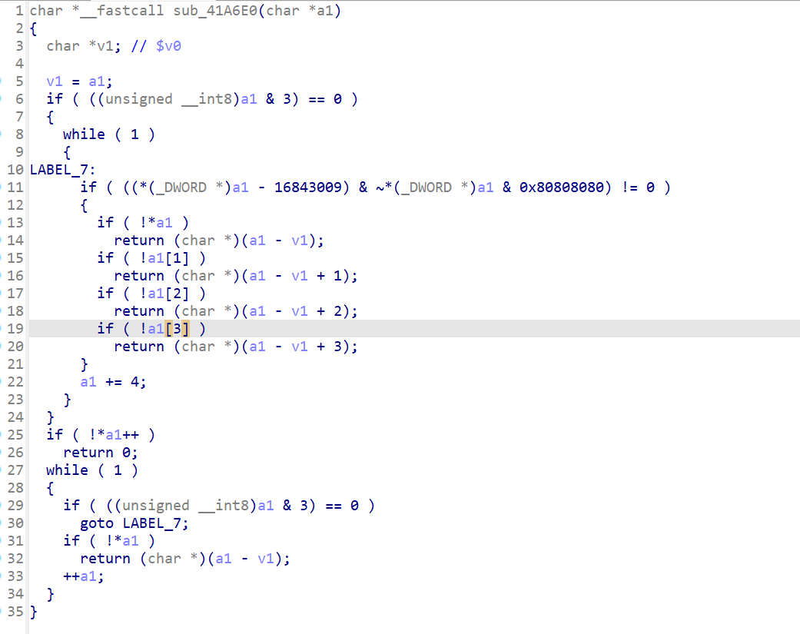

可以看出是strlen函数

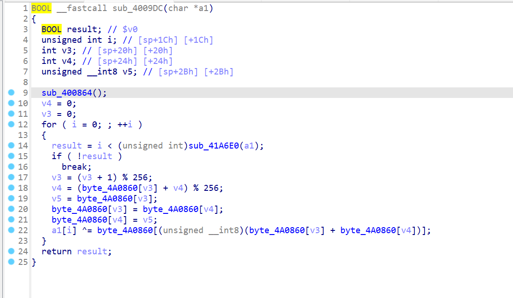

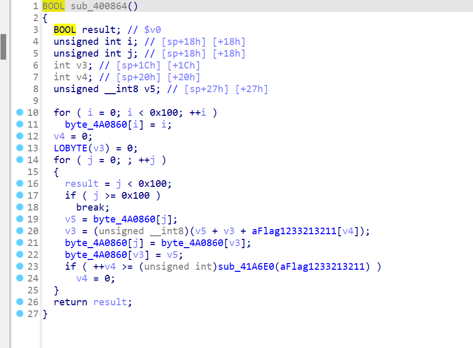

RC4加密，可以看到两个 256 的 for 循环（十六进制的 0x100 就是十进制的 256）
并且第一个 for 循环仅赋值，第二个 for 循环有 swap 操作
再结合 `sub_4009DC()` 后面部分的一个 for 循环、余 256、一个 swap 操作和一个异或操作

可以明显得知这是 RC4 算法的特征
`sub_400864()` 做 s 盒的初始化操作，即 rc4_init
`sub_4009DC()` 做加解密操作，即 rc4_crypt

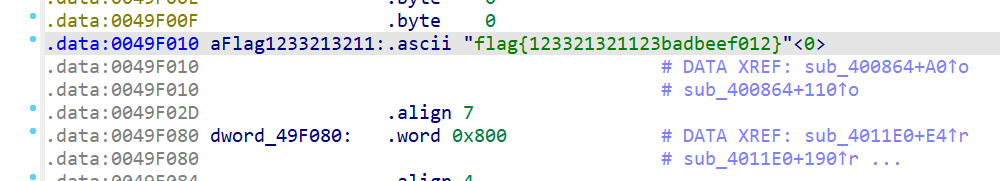

RC4的key

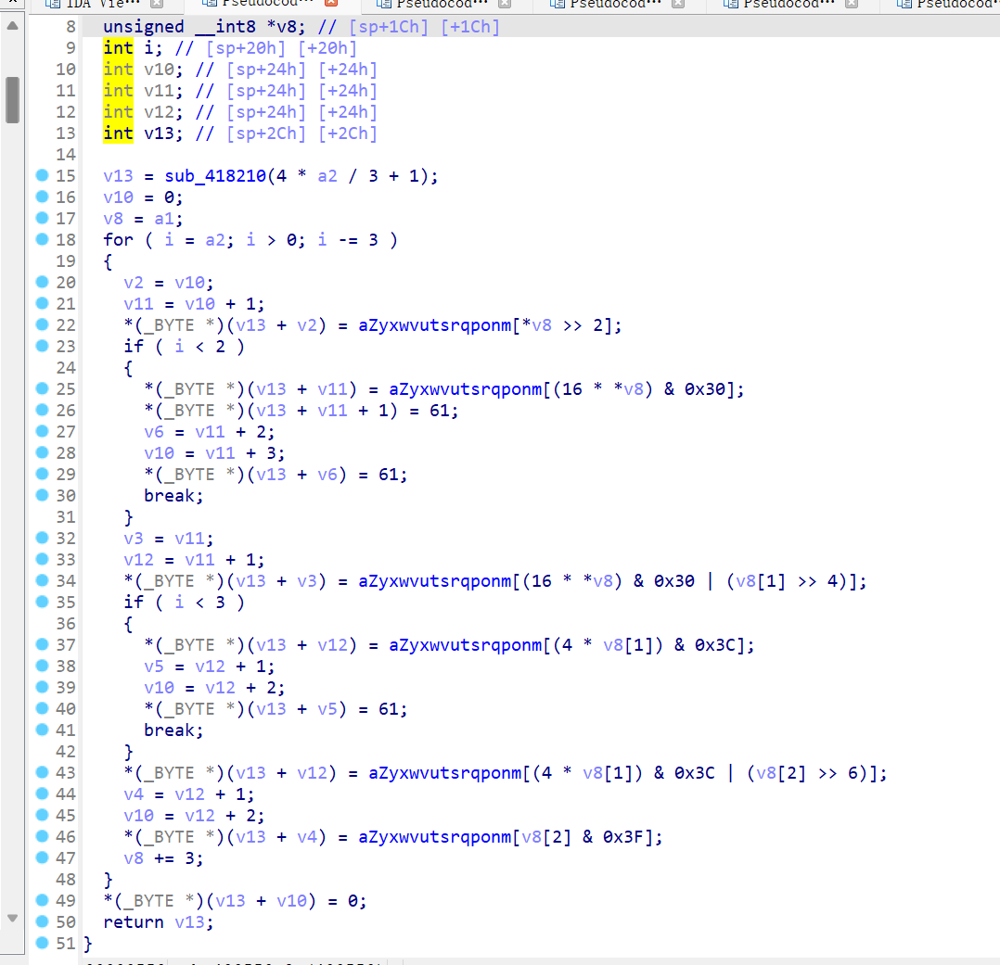

现多次对数组 `aZyxwvutsrqponm[]` 的索引操作，且 `aZyxwvutsrqponm[]` 的内容类似base64编码表，所以可以确定是base64换表加密

在 `i < 2` 的条件下，存在两次赋值 ‘=’ 的操作 **（61 是 ‘=’ 的 ASCii 码）**
这些都是 Base64 加密的特点，可以推知函数 `sub_400550()` 是一个更换了原始码表的 Base64 算法

也就是说，本题是将 flag 进行 RC4 加密后，再进行更换码表的 Base64 加密。

```python
import base64
from Crypto.Cipher import ARC4

key = "ScDZC1cNDZaxnh/2eW1UdqaCiJ0ijRIExlvVEgP43rpxoxbYePBhpwHDPJ=="
string1 = "ZYXWVUTSRQPONMLKJIHGFEDCBAabcdefghijklmnopqrstuvwxyz/+9876543210"  # string1表示更换后的码表
string2 = "ABCDEFGHIJKLMNOPQRSTUVWXYZabcdefghijklmnopqrstuvwxyz0123456789+/"  # string2表示原始码表
Str = base64.b64decode(key.translate(str.maketrans(string1, string2)))  # Base64解密，bytes型

aFlag1233213211 = "flag{123321321123badbeef012}"
flag = ARC4.new(bytes(aFlag1233213211, encoding='utf-8')).decrypt(Str)
print(flag)
```

## Misc

### 1


打开压缩包后我们发现有一张图片和一个压缩包，压缩包中有着一张相同的图片，我们可以通过明文攻击得出压缩包密码sv@1v3z，解压后可以看出admin.txt是mimikatz输出结果，找到admin的hash解密得到54231

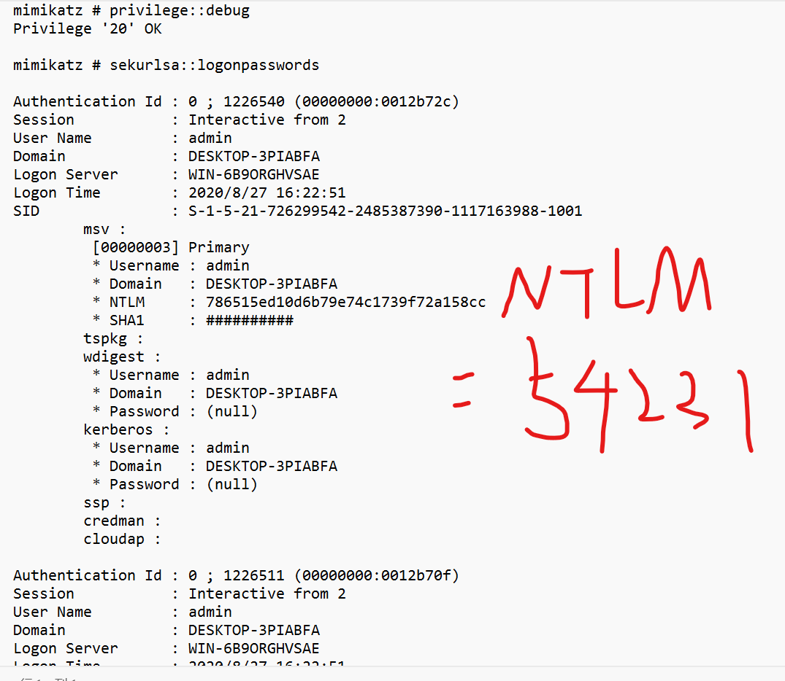

而cookie是sqlite文件,并且flag被加密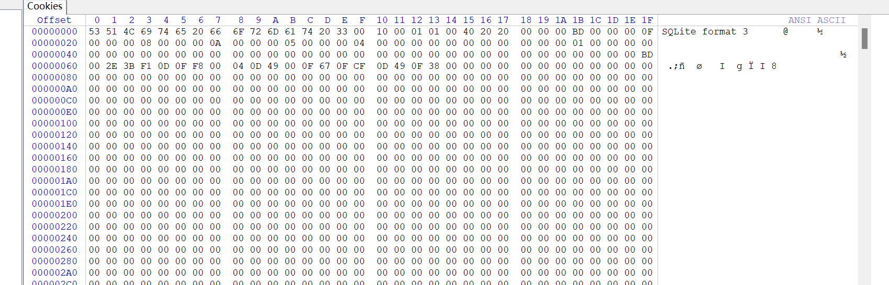

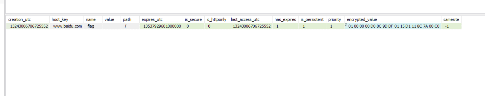

 然后利用mimikatz来对Master Key file解密得到Master Key

```
dpapi::masterkey /in:.\e5f8e386-7041-4f16-b02d-304c71040126 /sid:S-1-5-21-726299542-2485387390-1117163988-1001 /password:54231 /protected
```

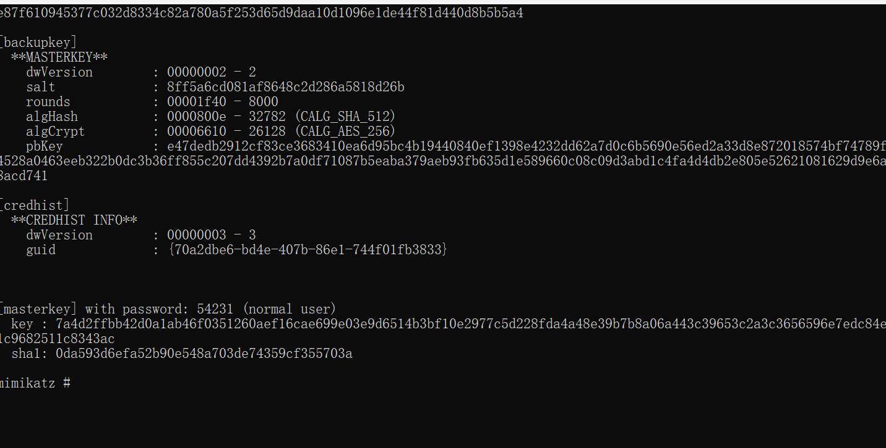

然后利用MasterKey解密Chrome的Cookies

```
dpapi::chrome /in:./Cookies /masterkey: 7a4d2ffbb42d0a1ab46f0351260aef16cae699e03e9d6514b3bf10e2977c5d228fda4a48e39b7b8a06a443c39653c2a3c3656596e7edc84e1c9682511c8343ac
```

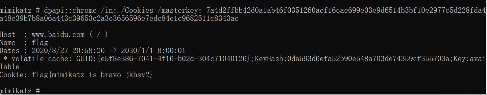